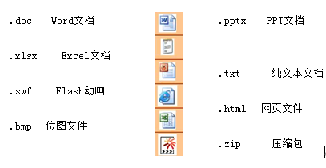
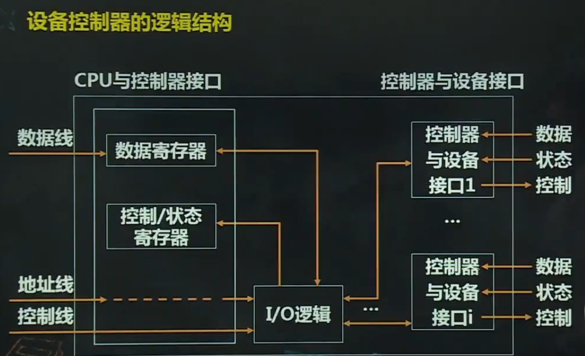

# 操作系统概论

# 第一章 操作系统简介

## 1、操作系统的概念

> 操作系统（Operating System，OS）是一种复杂的**系统软件**，是不同程序代码、数据结构、数据初始化软件的集合，可执行。例如 常用的Linux、Windows 7和Windows 10

1. 操作系统提供计算机用户与计算机硬件之间的接口，并**管理计算机软件和硬件资源**

2. 操作系统本身并不向用户提供可直接使用的功能，一台仅装有操作系统的计算机对于用户而言几乎是没有用的，**但是它为用户可直接使用的应用程序的运行提供了环境，并为应用程序的开发提供平台，使应用程序的开发变得简单、高效。**

3. 操作系统是覆盖在裸机上的第一层软件，编译程序、数据库管理系统及其他应用程序都运行在操作系统之上，操作系统为这些软件提供运行环境

   

### 1.1 用户与硬件之间的接口

操作系统必须完成的两个目标：

1. 与硬件部分相互作用，为包含在硬件平台上的所有底层可编程部件提供服务

   例如，要使用显示器，必须为驱动显示器工作的一些寄存器赋值，以便让显示器“知道自己要以什么样的背景颜色和前景颜色显示什么内容”

2. 为运行在计算机系统上的应用程序（所谓用户程序）提供执行环境

   高级语言的应用程序是不能在裸机上运行的，必须运行在操作系统上，由操作系统为应用软件的执行分配必要的软件和硬件资源，并对这些资源进行有效的管理。

### 1.2 资源的管理者

现代计算机系统的**一个重要特点就是支持多任务**，即允许在同一个系统内同时驻留多个应用程序。多个应用程序共同使用计算机硬件和软件资源时，就需要操作系统对这些资源进行有效的管理。**一方面保证用户程序的顺利执行**，**另一方面使计算机系统资源得到尽可能高效的利用，保证计算机系统的高性能**。

**操作系统所管理的资源主要包括处理机、内存、设备和文件，在网络操作系统中还包括网卡、带宽等**。下面对操作系统的主要功能进行说明。

1. **处理机功能**

   本书讲述的是**多任务操作系统**的实现原理。由于程序的执行必须依靠处理机，任意时刻**处理机都只能执行一个程序流**。因此，**在单处理机系统中执行多个程序流，必须由操作系统的处理机调度程序来管理处理机的分配（调度顺序执行）**，以使多个程序共享处理机，从宏观上看多个程序能同时顺利执行。在多处理机系统中，也需要操作系统对多个处理机在多任务的情况下进行有效的管理。

2. **内存管理**

   在多任务系统中，内存不再是独占资源，而是可能**被多个应用程序共同占用**。

   操作系统内存管理程序要完成的功能：

   1. **多个应用程序分配内存并使不同应用程序的地址空间互不干扰**
   2. **程序执行完毕后回收其所占内存**
   3. **完成逻辑地址到物理地址的转换**

3. **设备管理**

   设备管理主要完成

   1. **接受用户的I/O请求**
   2. **为用户分配I/O设备**
   3. **管理I/O缓存和驱动I/O缓存设备**

4. **文件管理**

   计算机系统**把大量需要长时间保留的数据信息以文件的形式存放在外存储设备中**（如硬盘、光盘、磁带和U盘），操作系统通过自己的文件管理程序完成外存空间的分配、回收、文件的按名存取、文件的组织、共享与保护等功能。

## 2、操作系统的发展

> 操作系统的发展从时间顺序上经历了从**无操作系统、单道批处理系统、多道程序系统（多道批处理系统、分时系统）**的发展过程

随着计算机应用领域的扩大、计算机体系结构的多样化，又出现了**微机操作系统、网络操作系统、实时操作系统、嵌入式操作系统和物联网操作系统**

### 2.1 无操作系统

第一代计算机（1945～1955年）使用**电子管**作为主要的电子器件，用插件板上的硬连线或穿孔卡片表示程序，没有用来存储程序的内存，**无操作系统**。
 　以1946年诞生于宾夕法尼亚大学的第一台实用电子计算机“埃尼阿克”（**ENIAC**）为例，它没有真正的内存，只有20个字节的寄存器用来存储数字。**无法支持存储程序**。一个用户程序进入计算机和退出计算机系统都需要人工干预，计算机无法自动完成程序的加载和卸载。因此，整个计算机系统处于运行——因等待人工操作暂停——运行，这样一种**不能连续自动工作**的状态。

### 2.2 单道批处理系统

第二代计算机（1955～1965年）使用的主要电子器件是**晶体管**，开始使用磁性存储设备，内外存容量增加，计算机运算速度提高，出现了早期的单道批处理系统。
 　在本书中，将用户程序及程序处理的数据统称为作业。
 　这一时期的操作系统是**单道批处理系统，内存中只能驻留一道用户作业，CPU和内存资源被用户作业独占。程序是指令的集合，程序的执行是CPU依次、逐条执行指令的过程。**
 　**吞吐量是指单位时间内计算机系统处理的作业量。**

### 2.3 多道程序系统（多道批处理系统+分时系统）

随着电子技术的发展，计算机开始采用**集成电路芯片**作为主要的电子器件，**IBM 360**是第一个采用小规模集成电路芯片的主流机型。**OS/360**是IBM 开发的第一个多道程序系统。

多道程序系统的最初想法是将内存分成几个部分，每一部分存放不同的作业，如下图所示。当一个作业等待输入/输出操作完成时，另一个作业可以使用CPU。任何时刻，当一个作业运行完毕，操作系统会自动从外存装入另一个作业到空闲的内存区域。从理论上讲，如果内存中可以同时存放足够多的作业，则CPU利用率可以接近100%。

| 操作系统 |
| :------: |
|   Job1   |
|   Job2   |
|   Job3   |
|   Job4   |

早期的多道程序系统**不具有交互功能**，被称为**多道批处理系统**。程序员提交作业后，在作业运行结束、输出结果之前，无法观察和控制作业的运行。程序员提交作业后可能等待很长的时间，得到的却可能是因为一个小小的语法错误而造成的错误结果。解决这一问题的需求非常迫切，于是出现了**分时操作系统**

在分时操作系统的支持下，**多个用户可以同时通过不同的终端使用主机**，主机可以快速响应常用命令，如程序调试命令。使终端用户感觉自己独占计算机资源，并且**实现用户与主机的及时交互**。在分时系统中同时登录系统的多个用户提交的作业轮流执行，每个作业都是运行一小段时间就把主机资源让给另一个作业运行一段时间，**多个作业交替执行，分时使用主机资源。**

**第一个通用分时系统CTSS**是麻省理工学院于1962年在一台改装过的IBM 7094上开发成功的，后续又出现了 **MULTICS、UNIX、Linux和Windows**等著名的**既支持多道批处理功能、又支持分时功能的多道程序系统。**


### 2.4 微机操作系统

随着个人计算机的出现，微机操作系统应运而生。**第一个微机操作系统是Intel公司的顾问Gary Kildall编写的CP/M系统**。这是一个磁盘操作系统，用于Intel 8080。
 　 一直与IBM有联系的比尔·盖茨向一家计算机制造商购买了 DOS操作系统。后来，经过对DOS的修改，形成了新的DOS版本MS-D0S。以后，比尔·盖茨的微软公司采取了将MS-DOS与硬件捆绑销售的策略。随着CPU的不断升级，微软及时更新MS-DOS，使之日臻完善，成为微机操作系统的主流。

　　受到Macintosh的影响，**1985年微软开始构建Windows操作系统**。时至今日，虽然面临各种挑战，Windows操作系统依然是微机操作系统的主流。目前，除**Windows系列的微机操作系统**之外，还有**Linux、Chrome OS和Mac OS等一些支持个人计算机的操作系统。**

### 2.5 实时操作系统

随着计算机被广泛应用于各种工业现场的自动控制、智能机器人、海底探测和航空航天等领域，出现了各种实时系统。**实时系统是支持实时计算的系统**。实时计算的正确性不仅依赖于**系统计算的逻辑结果**，还依赖于**产生正确结果的时间**。

例如，**锅炉温度和压力自动控制系统、重病监测系统等都属于实时系统**

实时系统可以使用操作系统，也可以不用操作系统。在高端的实时系统中通常都有高可靠性和支持实时资源调度的实时操作系统（RTOS）。**VxWorks操作系统是美国WindRiver公司于1983年设计开发的一种嵌入式实时操作系统**； C/OS-II是一种被广泛应用于微处理器、微控制器和数字信号处理器的开源实时多任务操作系统内核；Linux系统也支持实时性。

### 2.6 批处理系统、分时系统、实时系统的特点

1. **单道批处理系统的特点**

   单道批处理系统内存中只有一道作业，可以自动成批处理作业，其特点如下。

   1. **自动性**

      单道批处理系统使计算机能够在操作系统控制下，自动地将作业从外存装入内存运行。当作业运行完毕后，自动撤销已运行完毕的作业，并依次从外存装入下一个作业，使之运行。

   2. **顺序性**

      存放在外存中的作业按顺序依次被装入内存运行，先进入内存的作业先运行完毕

   3. **单道性**

      任何时刻内存中只有一道作业。即操作系统每次只能从外存装入一个作业进入内存。只有当该作业正常或异常结束，才能将下一个作业装入内存。

   单道批处理系统与无操作系统的计算机系统相比而言，减少了等待人工操作的时间。但是单道批处理系统中，由于作业独占CPU和内存，当作业进行I/O时，CPU只能等待I/O完成而无事可做，使得CPU资源不能得到充分利用。

2. **多道批处理系统的特点**

   在多道批处理系统中，用户所提交的作业都先存放在外存中并排成一个队列，该队列被称为“**后备作业队列**”。由操作系统的作业调度程序按一定策略从后备作业队列中选择若干个作业调入内存，使它们共享CPU和系统中的各种资源，以达到提高资源利用率和系统吞吐量的目的。与单道批处理系统相比，多道批处理系统支持多道程序驻留内存，CPU可以不再空闲等待I/O。

   1. **多道性**

      在内存中可同时驻留多道程序，当在CPU上运行的作业提出I/O请求后，该CPU可以执行其他作业，从而有效地提高了系统资源的利用率和吞吐量。

   2. **无序性**

      多个作业完成的先后顺序与它们进入内存的顺序之间没有严格的对应关系。同时驻留在内存中的作业，其获得CPU的顺序和执行的进度无法预知，先进入内存的作业不一定先被调度，也不一定先执行完。

   3. **调度性**

      多道程序系统必须具有作业调度和进程调度功能。作业调度用来从后备作业队列中选择一个或多个要被装入内存的作业。进程调度程序用来从内存中选择一个（单CPU系统）或多个（多CPU系统）进程，使其在CPU上运行。

   4. **复杂性**

      由于多道程序系统中的作业共享CPU、内存、外设和文件，程序并发执行，多道程序系统必须具有处理机管理、内存管理、I/O设备管理、文件管理和作业管理的功能，分时系统还必须解决终端用户管理的问题。因此，其功能和实现技术都比单道批处理系统复杂得多。

   多道批处理系统的**优点**是能够提高CPU、内存和I/O设备的利用率和系统的吞吐量。
   多道批处理系统的**缺点**是系统平均周转时间长，缺乏交互能力。**周转时间**是指从作业被提交给系统开始到作业完成为止的时间。**平均周转时间**是指所有作业的周转时间之和与作业数量的比值。

3. **分时系统的特点**

   分时操作系统允许多个用户通过终端同时使用计算机。分时操作系统是多道程序系统的自然延伸，支持多个用户任务同时驻留内存，每个用户通过终端与主机交互时都能得到快速响应。

   分时系统的特点是**多路性、独立性、及时性和交互性**

   1. **多路性**

      是指允许在一台主机上同时连接多台联机终端

   2. **独立性**

      是指各终端用户彼此独立操作，互不干扰。

   3. **及时性**

      是指用户请求能在很短的时间内获得响应。

   4. **交互性**

      是指用户可以通过终端与系统进行广泛的人机对话。

   分时系统的**优点**是向用户提供了人机交互的方便性，使多个用户可以通过不同的终端共享主机。

   分时系统的实现需要解决两个关键问题，即及时接收和及时处理。同时连接多个用户终端的分时系统要能及时接收用户的命令或数据，新用户命令到来时，尚未处理的用户命令要通过缓冲区来妥善保存。此外，分时系统要能及时处理用户的交互命令，使系统的响应时间得到保证。为了实现这一目标，应该使所有的用户任务都直接进入内存，并在很短的时间内使每个任务都运行一次。

4. **实时系统的特点**

   实时系统主要用于**实时控制和实时信息处理领域**。实时系统必须能及时响应外部事件的请求，在规定的时间内完成对该事件的处理，并控制所有实时任务协调一致地运行。

   与分时系统相比，实时系统具有以下特点。

   1. **多路性**
      实时系统的多路性除具有与分时系统相同的特点外，主要表现在经常对多路的现场信息进行采集，以及对多个对象或多个执行机构进行控制。
   2. **独立性**
      实时信息系统与分时系统一样，每个终端用户在向实时系统提出服务请求时，是彼此独立地操作，互不干扰。而在实时控制系统中，信息的采集和对对象的控制也是彼此互不干扰。
   3. **及时性**
      实时信息处理系统对实时性的要求是以人所能接受的等待时间来确定的，而实时控制系统的及时性则是以控制对象所要求的开始截止时间或完成截止时间来确定的。
   4. **交互性**
      实时信息系统的交互性仅限于访问系统某些特定的专用服务程序。
   5. **可靠性**
       实时系统比分时系统要求有更高的可靠性。因为任何实时系统的错误都可能带来巨大的经济损失，甚至危及生命安全。因此，在实时系统中，往往采取多级容错措施来保证系统安全和数据安全。

需要**注意**的是，**批处理系统、分时系统和实时系统是三种基本的操作系统类型，而一个实际的操作系统可能兼有三者或其中两者的功能特点**。

| **多道批处理系统** |          **IBM的OS/360**          |
| ------------------ | :-------------------------------: |
| **分时操作系统**   | **MULTICS、UNIX、Linux、Windows** |
| **微机操作系统**   |             **CP/M**              |
| **实时操作系统**   |            **VxWorks**            |

### 2.7 操作系统产品现状

#### 2.7.1 主机操作系统

**主机操作系统**是运行在大型主机上的操作系统，主要提供三类服务：**批处理、事物处理和分时处理**。批处理系统处理不需要交互式用户干预的周期性作业，保险公司的索赔处理或者连锁商店的销售报告通常以批处理的方式完成。
**事务处理系统**负责大量的小请求。例如，银行的支票处理或航班预定。每个业务量都很小，但是系统必须每秒处理成百上千个业务，需要很高的处理速度。
分时系统允许多个远程用户同时在计算机上工作，执行命令或处理作业。

#### 2.7.2 服务器操作系统

服务器操作系统是运行在网络服务器上的操作系统，可以通过网络同时为众多用户服务，允许用户共享硬件和软件资源。服务器可提供打印服务、文件服务和Web服务。典型的服务器操作系统有Solaris、FreeBSD、Linux和Windows Server 200X。**Linux作为影响力最大的开源软件，其内核根据不同的需要被定制，广泛地应用于服务器、PC和移动设备。**

#### 2.7.3 微机操作系统

微机操作系统也称个人机操作系统，现代微机操作系统都支持多道程序处理，就是通常所说的支持多任务。微机操作系统为单个用户提供良好的应用环境和应用软件开发环境。常见的微机操作系统有**Windows的个人计算机操作系统系列**、**Linux的不同发行版**、**Macintosh**和 **Chrome OS**等。

#### 2.7.4 嵌入式操作系统

嵌入式系统的概念出现在20世纪70年代，是宿主于非计算机设备中的计算机系统。嵌入式操作系统是运行于嵌入式设备中的操作系统。第一个商用嵌入式操作系统VRTX32出现于1981年。
 目前，应用于嵌入式系统的实时操作系统产品非常多。在物联网快速发展的情况下，出现了物联网操作系统。物联网操作系统本质上是连接在物联网的各种可计算设备中的操作系统，也就是嵌入式操作系统。物联网操作系统的产品较为丰富，如苹果公司的iOS、谷歌的Android Things、微软的 Windows 10 IoT Core 和开源物联网项目FreeRTOS等。
**嵌入式操作系统的特征**是小巧、实时性、可装卸、代码固化、弱交互性、强稳定性、接口统一、低能耗。
**嵌入式操作系统的应用领域**有掌上电脑、智能手机、数码相机、自动售货机、自动取款机、工业控制设备、军工装备、游戏机、医疗设备和网络设备等。

## 3、操作系统的特征 ☆

> 操作系统都支持多任务，具有**并发、共享、虚拟和异步**特征

### 3.1 并发

> **并发是指两个或多个事情在同一时间间隔内发生**。并发强调“同一时间间隔”，与并行是有区别的两个不同的概念，并行是指多个事件同时发生

并发：A事件 10:00	B事件 10:10	C事件 10:20

并行：A、B、C事件 10:00

以单CPU多任务的操作系统为例，当说两个程序并发执行时，是指从宏观上看这两个程序同时在向前推进。例如，可以在一台单CPU单核的笔记本电脑中一边运行音频播放程序听歌曲，一边用Micro Office Word编辑文档，编辑程序在工作的同时音频播放程序也在工作。但是，在单CPU单核的系统中，任意时刻只能有一个程序流在CPU上执行，要么是编辑文档程序，要么是音频播放程序。之所以用户能感觉到两个程序似乎在同时工作，而且互不干扰，是因为操作系统使两个程序在CPU上快速地轮流交替执行，实现了“并发”的功能。

### 3.2 共享

> **共享是指系统中的资源可供内存中多个并发执行的进程共同使用**。资源共享有两种方式，即互斥共享和同时共享

**互斥共享**是指**任意时刻一种资源只能被一个进程访问**，当一个进程访问资源时，其他进程必须等待，直到资源被进程访问完毕，释放访问权。例如**打印机的访问**，如果不采取互斥访问的方式，可能会把多个进程的输出内容打印到同一页打印纸上

**同时共享是指从宏观上看，资源可以被多个进程同时访问，如对磁盘的访问**。虽然任意时刻只能有一个程序访问某个磁盘。但是，多个程序可以在短时间内轮流访问该磁盘，从用户的角度看，多个用户程序可以同时发送磁盘访问命令，并可以同时得到响应。**从宏观上看，磁盘可以被多个用户程序同时访问**。
 　并发与共享的关系是相互依赖的。如果系统不支持并发，资源的使用都是独占的，不需要共享资源。另一方面，如果不能实现有效的资源共享，并发就不可能得到很好的支持。

### 3.3 虚拟

> **虚拟是指通过某种技术把一个物理实体变成若干逻辑上的对应物**

物理实体是实际存在的，而虚拟仅仅是用户感觉到的。如虚拟打印机、虚拟内存和虚拟CPU等，都是操作系统通过某种技术把少量的物理资源变成较物理资源多的逻辑资源，使共享资源的每个用户都感觉到自己独占了系统资源。

### 3.4 异步性

进程以不可预知的速度向前推进。**内存中的每个程序何时执行、何时暂停、以怎样的速度向前推进，以及每道程序总共需要多少时间才能完成等，都是不可预知的。**系统中什么时候会出现需要特殊处理的事件，如键盘中断、鼠标中断等也是随机的、不可预知的。现代操作系统需要很好地处理这些异步事件。

## 4、操作系统的功能

> 本节简单介绍操作系统的**存储器管理、进程管理、设备管理和文件管理**等功能，以及操作系统提供的用户接口。

### 4.1 内存管理

内存管理的主要任务是为多道程序的运行提供良好的环境，方便用户使用内存，提高内存的利用率，以及从逻辑上扩充内存以实现虚拟存储。为此，**内存管理应具有内存分配、内存保护、地址映射和内存扩充功能。**

#### 4.1.1 内存分配

内存分配的主要任务是为每道程序分配内存空间，使它们各得其所。提高存储器的利用率，以减少不可用的内存空间。允许正在运行的程序申请附加的内存空间，以适应程序和数据动态增长的需要。
 操作系统可以采用两种方式实现内存分配，即**静态分配方式和动态分配方式**。采用**静态分配方式是把内存划分成固定大小和数量一定的区域，在系统运行过程中各分区的大小和数量不再变化。采用动态分配方式是系统在运行过程中，根据进程的请求分配内存，内存中分区的大小和数量都是动态变化的。**

为了实现内存的分配，需要以下数据结构和功能支持。

1. 用于内存分配数据结构。用来记录内存使用状况，如内存空闲区域的大小、空闲区域的起始地址等，为内存分配的实现提供依据。 
2. 内存分配功能。系统按照一定的内存分配算法分配内存空间。
3. 内存回收功能。系统需要回收被释放的内存空间。

#### 4.1.2 内存保护

内存保护的任务

1. 一是使操作系统内核的空间不会被用户随意访问，以保证系统的安全和稳定；
2. 二是确保每道用户程序都在自己的内存空间中运行，互不干扰。

实现的方式可以采用**界限寄存器**存放允许程序访问的地址区间的上限和下限值。程序运行期间访问内存时，把访问地址与界限寄存器的值相比较，如果发生越界，便发出越界中断请求，以停止该程序的运行。需要说明的是，现代操作系统实现内存保护的方式不仅限于使用界限寄存器。

#### 4.1.3 地址映射

CPU执行程序过程中访问内存时，需要**把程序的逻辑地址转变为物理地址**，这个转换的过程称为**地址映射**。

逻辑地址与物理地址

1.  一个应用程序经编译后，通常会形成若干个目标程序，这些目标程序再经过链接而形成可装入程序。这些程序中指令和数据的地址都是相对于编译链接后的机器代码程序的起始地址计算的，由这些地址所形成的地址范围称为地址空间，其中的地址称为**逻辑地址**。

2. 在本书中，把所有非物理地址的其他各种形式的地址均称为逻辑地址。此外，由**内存中的一系列单元所限定的地址范围称为内存空间**，其中的地址称为**物理地址**，CPU访问内存需要将物理地址送入地址总线，以选中要访问的内存单元。

3. 在多道程序系统中，地址空间中的逻辑地址和内存中的物理地址是不一致的。因此，存储器管理必须提供地址映射功能，以**将逻辑地址转换为对应的物理地址**。地址映射应在硬件的支持下完成。

4. 例如

   A（）
    {
    　call B
    }
    编译程序把call B 翻译成jump 0x01040这样一条跳转语句，意思是：调用函数B就是跳转到函数B 的实现代码的起始处开始执行。函数B实现代码的起始地址是0x 01040，编译器给出的这个地址不是物理地址，而是一个逻辑地址。当程序A执行到jump 0x 01040指令时，系统必须通过内存管理的地址映射机制把逻辑地址0x 01040转换成物理地址，将物理地址送到地址总线，才能访问到存放B的第一条指令的物理内存单元。

#### 4.1.4 内存扩充

内存扩充的任务是借助于虚拟存储技术，**从逻辑上扩充内存容量，使系统能够向用户提供比物理内存大的存储容量**。

1. **请求调入功能**。允许系统在装入一部分用户程序时就启动该程序的运行，在程序运行过程中若发现要执行的指令或要访问的数据尚未装入内存，通过请求调入将需要的指令或数据装入内存。
2. **置换功能**。在请求调入时，若发现内存空间不足，需要系统先将内存中的一部分内容换出到外存中，以便腾出内存空间装入当前需要的内容。

### 4.2 进程管理

进程可以被认为是**程序的执行实体**（进程的详细介绍见本书第二章）。进程管理功能主要包括进程的**描述与组织、进程控制、进程同步、进程通信及进程调度**。**进程控制完成进程创建、撤销进程、唤醒进程和阻塞进程**等操作。**进程同步功能完成多个进程（含线程）运行的协调与互斥**。**进程通信功能用来实现进程之间的信息交换**。**进程调度功能是从多个可执行的进程中选出一个进程，把处理机分配给它**。

### 4.3 设备管理

设备管理主要**完成用户的I/O请求，为用户分配I/O设备**。为了完成这些任务，设备管理应该具有以下功能。

1. **缓冲管理**。管理各种缓冲区。
2. **设备分配**。分配用户I/O所需要的设备。
3. **设备处理**。由设备驱动程序来实现**CPU与设备控制器之间的通信**。
4. **设备独立性和虚拟设备**。设备独立性功能使应用程序独立于物理设备。例如，用高级程序设计语言编写打印图形的程序，与使用什么型号、品牌的打印机无关。虚拟设备的功能是把一个物理设备变换为多个对应的逻辑设备，使一个物理设备能供多个用户共享。

### 4.4 文件管理

1. 文件存储空间的管理

   为每个文件分配必要的外存空间，提高外存利用率，并能有助于提高访问文件的速度。

2. 目录管理
   为每个文件建立目录项并对众多目录项进行有效组织。目录项包括文件名、文件属性及文件的地址等信息。

3. 文件的读、写管理和存取控制
   根据用户的请求，从外存中读取数据或将数据写入外存。防止未经核准的用户存取文件，防止冒名顶替存取文件，防止以不正确的方式使用文件。

### 4.5 提供用户接口

操作系统向最终用户提供命令行和图形用户接口，向程序员提供应用程序与操作系统之间的接口即系统调用。**系统调用是操作系统实现的具有某种功能的程序模块**，应用程序可以通过系统调用的接口使用操作系统实现的功能，获得操作系统内核的服务。

1. 命令接口
   1. 联机用户接口
      这是为联机用户设计的接口，它由一组键盘操作命令和命令解释程序组成。
   2. 脱机用户接口
      脱机用户接口是为批处理作业的用户提供的，也称为批处理用户接口。
2. 图形用户接口
    20世纪90年代，在操作系统中开始引入图形化用户接口。在提供图形用户接口的操作系统中，用户可以轻松地通过选择窗口、菜单、对话框、滚动条、图标等简单的操作来完成对作业和任务的提交与控制。
3. 程序接口
   操作系统提供给程序员的接口是系统调用。在类UNIX系统中，系统调用多使用C语言所提供的库函数。一般的操作系统都提供进程控制、文件操作、通信管理和系统维护等几类系统调用。关于系统调用的详细内容参见本书第二章第三节。

## 5、操作系统的体系结构

> 操作系统的体系结构是操作系统作为一种软件的体系结构，对操作系统的**可靠性、灵活性和可移植性**等方面都有重要影响。

### 5.1 软件体系结构简介

软件体系结构是一个复杂软件系统的高层结构，为软件系统提供了一个结构、行为和属性的高级抽象，包括系统元素的结构、元素间的相互关系，以及指导元素集成的模式和约束三个方面。

它采用形式化的方法刻画了软件系统的组织和拓扑结构，显示了系统需求和构成系统的元素之间的对应关系，能够针对系统需求对软件的早期设计进行正确性和完整性分析，从而降低了开发后期产生错误的数量，减少了软件维护的成本，也提高了软件重用的抽象层次和粒度，对提高软件系统的质量和开发效率起着巨大的作用。
 总的来说，明确清晰的软件体系结构是一条贯穿软件系统整个生命周期的主线，是软件设计成功的基础和关键，也是对软件大型化、复杂化趋势的一种很好的应对决策。

### 5.2 操作系统体系结构

#### 5.2.1.简单的监控程序模型

 这种系统的功能相当简陋，任意时刻系统中只能运行一个任务，这样保证了对系统信息的互斥访问，保护了系统数据的安全。但是这种设计的主要问题是**系统缺乏“可伸缩性”**，任务独占整个系统，这将极大地降低系统中潜在的并发性，从而使系统效率严重受损。在结构设计方面，没有任何结构方面的指导，整个系统的所有功能全部集中在一个单一模块中。后来的单体结构模型就是在此基础上发展起来的。这个阶段的**典型代表是FMS和IBSYS**。

#### 5.2.2.单体结构模型

 在单体结构模型中，所有的软件和数据结构都放置在一个逻辑模块中，对外层的用户程序提供一个完整的内核界面—系统调用。整个系统由若干具有一定独立功能的子程序组成，系统各部分之间没有确定的位置概念，彼此间没有信息隐藏，允许任一子程序调用其他子程序。因此，它的特点是**结构简单，便于理解和实现**，而且**系统所有部分都集中在一个内核中，效率较高**。缺点也很明显，由于各子程序间可以互相调用，**系统结构关系复杂**，**容易引起循环调用和死锁**。修改一个子程序往往会导致若干相关部分的变动，**系统的可修改性和可维护性比较差**。
单体内核是操作系统中**最早、最常见的**体系结构。
具有**单体内核结构的典型操作系统有UNIX系统、MS-DOS、Linux、Mac OS X和BSD等系统**。

#### 5.2.3.层次结构模型

层次结构的**基本思想是将操作系统分解为多个小的、容易理解的层**，系统功能被隔离在不同层中，每一层提供对系统功能的部分抽象，然后采用单向调用的顺序，形成一连串彼此连续的对系统功能的“抽象串”，最终形成对整个系统的完整抽象。它为系统中各个模块赋予了位置的理念。在操作系统的系统结构中，各个模块都有相对固定的位置、相对固定的层次。层与层之间有严格的接口定义，并且每一层只依赖于它下层提供的服务而工作，不能访问上层所提供的服务。这样组织的好处是方便了操作系统的实现、调试和测试。

“分层”结构使操作系统中各模块间的组织和依赖关系清晰明了，系统的可读性、可靠性和可移植性都得到了增强。此外，对某一层的修改或替换只影响邻近的两层，便于系统的维护和扩充。分层设计的困难之处在于如何决定各层的顺序和内容，处理不好将会出现“循环依赖”的问题。另一个问题就是性能问题，有时系统完成一个功能需要穿越多个层才能实现，系统分层粒度越小，所花费的额外开销也就越大。出于效率考虑，有些系统允许跨层向下调用。**分层结构最经典的例子是Dijkstra的THE系统**。

#### 5.2.4.客户/服务器模型与微内核结构

微内核技术是操作系统发展的一个里程碑，它产生了一种完全不同的操作系统体系结构，提供了操作系统发展的新途径。它的核心思想是**核心功能外移**，即把传统操作系统内核中的一些组成部分（如文件系统、网络和驱动程序等内核功能）放到内核之外作为一个独立的服务器进程来实现，在微内核中只保留了操作系统最基本的功能，包括处理机调度、存储管理和消息通信等，这些服务器借助于微内核传递消息来实现相互之间的交互。

微内核结构用一个水平分层的结构代替了传统的纵向分层的结构，这样带来的好处是系统结构清晰，具有**较高的灵活性、可靠性和可维护性**。
 由于微内核技术实现了基于客户/服务器体系结构的操作系统，完全适宜于网络环境及分布式计算模型。
 但是，微内核设计有一个严重的缺点就是效率不高，另外，发送者和接收者之间的同步也将增加系统的开销。

为了解决微内核性能问题，目前已经提出了多种解决办法。一是直接优化系统的消息传递机制的性能，二是扩大微内核并把一些关键的服务程序和驱动程序重新加入到内核中，从而减少系统在用户态和核心态之间的切换，以及系统在不同地址空间之间的切换。
 **微内核技术**是现代操作系统的一个发展趋势，结合面向对象设计方法，微内核技术具有更大的应用空间。目前微内核结构的操作系统主要向两个方向发展：一个是向通用操作系统的方向发展，另一个就是嵌入式操作系统。典型代表是**卡内基梅隆大学研制的Mach操作系统、WindRiver公司的Vxworks等**。。

#### 5.2.5.动态可扩展结构模型

**动态可扩展结构**的基本思想就是在运行过程中，能够动态地实现系统行为扩展的结构，也可称之为**弹性结构**。
 要具体实现动态可扩展结构，首先要解决的问题就是如何实现系统行为的动态改变，目前**实现**的方法就是通过动态地增删系统的代码，采用的主要技术有**UPCALL和DOWNLOAD**
UPCALL技术就是指在微内核操作系统中通过核心层到用户层服务的调用方式来实现扩展 的技术。这类结构的典型系统是M IT的Exokernel操作系统。
DOWNLOAD技术（也称为**核心扩展技术**）的核心思想就是将软件构件动态地下载到内核中，以达到改变操作系统行为的目的。该技术最大的难点就是系统安全问题。核心扩展技术是当前操作系统扩展性研究的主要方向。其中，典型代表有Harvard大学的VINO操作系统。

| 体系结构模型                | 典型代表                                      |
| --------------------------- | --------------------------------------------- |
| 简单的监控程序模型          | FMS、IBSYS                                    |
| 单体内核结构模型            | UNIX、Linux、Mac OS X、BSD                    |
| 层次结构模型                | THE                                           |
| 客户/服务器模型与微内核结构 | Mach、Vxworks                                 |
| 动态可扩展结构模型          | Exokernel（UPCALL技术）、VINO（DOWNLOAD技术） |

## 6、指令的执行 ☆

> 程序是指令的集合，程序的执行就是按照某种控制流执行指令的过程。

### 6.1 指令周期

 一个单一指令需要的处理称为指令周期，一个指令周期可以划分成两个步骤，分别是取指周期和执行周期。


### 6.2 取指令和执行指令 ★★

1. 取指令
   **在每个指令周期开始时，处理器从存储器中取一条指令。**在典型的固定长度指令的处理器中，程序计数器（PC）保存有下一次要取的指令的地址。除非接收到别的指示，否则处理器在每次完成取指令操作后总是对PC递增，使它能够按顺序取得下一条指令，即位于下一个高端存储器地址的指令。

2. 执行指令
   **取到的指令被放置在处理器的指令寄存器IR中**。指令中包含确定处理器将要采取动作的位，处理器解释指令并执行要求的动作，这些动作可分为4 类。

   1. 处理器与存储器之间的指令或数据传送操作。
   2. 处理器与I/O设备之间的指令或数据传送操作。
   3. 算术运算操作或逻辑运算操作。
   4. 控制操作，即修改指令的执行顺序的操作。

3. 一个实例
    假设一台模型机，处理器包含一个称为累加器（AC）的数据寄存器。所有指令和数据长度均为16位，故使用16位的单元或字来组织存储器。指令中用4 位二进制位表示操作码，12位二进制位表示内存地址。因而最多可有16种不同的操作码，可直接访问的存储器大小为4096字节（用3位十六进制数表示）。

   该模型机内部CPU寄存器如下。
    　1）程序计数器（PC），存放下一条要执行的指令地址。
    　2）指令寄存器（IR），存正在执行的指令。
    　3）累加器（AC），临时存储体和累加操作。

   程序执行的过程是**反复取指令和执行指令**的过程

   部分操作码的二进制表示与其对应的操作如下。
    　1）0001：从内存中读取数据并送入AC。
    　2）0010: 把AC的内容存储到内存中。
    　3）0101：把从内存中取得的值与AC中的值相加，结果仍存放在AC中。

   举一个程序实例来说明程序的执行

   该程序的功能是把内存940单元的内容与941单元的内容相加，然后将累加结果送941单元。该程序通过执行3条指令完成，指令的汇编形式和二进制形式如下图所示。

   move AC，（940）；1940——> 0001

   add AC，（941）；5941——>0101

   move（941），AC；2941 ——>0010

   其中，move表示传送，move AC，(940)指令的功能是将（940）内存单元的值传入累加器AC,对应的操作码为0001，

   "；"后面的内容为注释，1940是move AC,(940)指令对应的机器码。

   

   

   ① 程序开始执行时，程序计数器PC的值为move,(940)指令对应的机器码1940所在存储单元的地址300

   ②CPU将1940送入指令寄存器IR，PC值自动+1为301

   ③CPU对1940进行译码

   ④操作码为0001时，执行从内存940单元取数送入AC

   ⑤指令执行结果时把地址为940的内存单元的值赋值给AC后执行完毕

4. 指令的执行小结
   程序执行的过程是反复取指令和执行指令的过程。PC始终存有下一条待取指令的地址。
   r指令执行的结果就是使寄存器或内存单元的值发生变化，指令执行的过程也就是存储体内容不断变化的过程。取指令和执行指令是由硬件完成的，不同硬件的体系结构支持不同的指令集合，为某一种硬件平台开发的操作系统不能直接在另一种体系结构的硬件上运行。任何高级程序设计语言的程序被编译成指令集合，其中的每一条指令属于计算机体系结构的指令集。


# 第二章 进程管理

## 1、进程描述

### 1.1 程序的并发执行

#### 1.1.1 程序的顺序执行

> 早期的计算机，程序的执行方式都是顺序执行，程序顺序执行时的特点

1. **顺序性**
   处理机的操作，严格按照程序所规定的顺序执行，即只有前一操作结束后，才能执行后继操作。
2. **封闭性**
   程序是在封闭的环境下运行的。即程序在运行时独占全机资源，因而各资源的状态（除初始状态外）只有本程序才能改变。程序一旦开始运行，其结果不受外界因素的影响。
3. **可再现性**
   只要程序执行时的**环境和初始条件相同**，当程序多次重复执行时，其执行结果相同。

#### 1.1.2 程序的并发执行

> **程序并发执行是指在同一时间间隔内运行多个程序。一个程序执行结束之前，可以运行其他程序**。

对用户而言，看到的是计算机同时运行多个程序。程序并发执行的确切含义是从宏观上，用户看到多个程序同时向前不间断地推进。而从微观上，任意时刻一个CPU上只有一个程序在执行。

在现代单CPU或多CPU的计算机中，支持多任务及支持多用户多任务的操作系统都能够有效管理和支持程序的并发执行。

**多道程序系统和分时系统都允许用户程序在计算机系统中并发执行**，程序并发执行具有以下几个特点。

1. **间隔性**

   程序在并发执行时，由于它们共享资源，而资源数量又往往少于并发执行的程序数量，系统不能保证每个程序不受限制地占用资源。
   因而，**每个程序在CPU上运行，都是时断时续的**。当请求某种资源的程序数量大于被请求的资源数量时，**就必然有因申请不到资源而暂停执行的程序**。当其他程序释放资源后，该程序才可能继续执行。资源的有限使并发执行的程序呈现执行过程的间断性。 

2. **失去封闭性**

   程序在并发执行时，由于它们共享资源或者合作完成同一项任务，系统的状态不再是只有正在执行的某一个程序可以“看见”和改变。

3. **不可再现性**

   程序在并发执行时，由于失去了封闭性，也将导致其失去执行结果的可再现性。同一个程序在输入完全相同的情况下多次运行，可能出现不同的运行结果


### 1.2 进程的概念

> 并发执行的程序可能是同一个程序在不同数据集合上的执行，也可能是不同的程序在不同数据集合上的执行，它们共享系统资源。
>
> 用程序已不能再描述程序的并发执行，即引入进程的概念

#### 1.2.1.进程的定义

定义1：**进程是允许并发执行的程序在某个数据集合上的运行过程**。
定义2：**进程是由正文段、用户数据段及进程控制块共同组成的执行环境**。正文段存放**被执行的机器指令**，用户数据段存放**进程在执行时直接进行操作的用户数据**。进程控制块存放**程序的运行环境**

程序装入内存后即可运行，根据程序计数器PC的值，不断将指令从内存取到CPU的指令寄存器中，经译码完成各种操作

操作系统通过这些数据描述和管理进程。

在计算机内部，程序的执行过程实际上对应了一个执行环境的总和。这个执行环境包括程序中的各种指令和数据，还有一些额外数据，如寄存器的值、用来保存临时数据的堆栈、被打开文件的数量及输入/输出设备的状态等。

这个执行环境的动态变化表征程序的运行，一个进程对应了一个这样的环境。进程代表了程序的执行过程，是一个动态的实体，它随着程序中指令的执行而不断变化，在某个特定时刻的进程内容被称为**进程映像**。

#### 1.2.2.进程的特征

> 进程是操作系统管理的实体，对应了程序的执行过程，具有以下几个特征

1. **并发性**

   多个进程实体能在一段时间间隔内同时运行。并发性是进程和现代操作系统的重要特征。

2. **动态性**

   进程是进程实体的执行过程。进程的动态性表现在因执行程序而创建进程、因获得CPU而执行进程的指令、因运行终止而被撤销的动态变化过程。此外，进程在被创建后还有进程状态的变化。

3. **独立性**

   **在没有引入进程概念的操作系统中，进程是独立运行和资源调度的基本单位。**

4. **异步性**

   是指进程的执行时断时续，进程什么时候执行、什么时候暂停都无法预知，呈现一种随机的特性。在中断技术出现以后，系统还需要处理随时可能出现的中断事件。

5. **结构特征**

   进程实体包括用户正文段、用户数据段和进程控制块。

#### 1.2.3.进程与程序的比较

1. 进程与程序的区别

   **程序是静态的，进程是动态的**。<u>程序是存储在某种介质上的二进制代码，进程对应了程序执行的过程</u>，系统不需要为一个不执行的程序创建进程，一旦进程被创建，就处于不断变化的动态过程中，对应了一个不断变化的上下文环境。
   **程序是永久的，进程是暂时存在的**。程序的永久性是相对于进程而言的，只要程序的拥有者不去删除它，程序可以永久地存在于磁盘、U 盘等外存储介质中。进程因程序的执行而被创建，因程序执行的结束而被撤销，有一个相对短暂的生命期。

   程序与进程的存在实体不同。**程序是指令的集合，而进程是包括了正文段、用户数据段和进程控制块的实体**。

2. 进程与程序的联系

   **进程是程序的一次执行，进程总是对应至少一个特定的程序，执行程序的代码。**

   **一个程序可以对应多个进程**。同一个程序可以在不同的数据集合上运行，因而构成若干个不同的进程。几个进程能并发地执行相同的程序代码，而同一个进程能顺序地执行几个程序。

### 1.3 进程控制块

> 操作系统中的进程不仅是一个概念，而且是真实存在的实体。应用程序对应的进程由程序、用户数据和操作系统管理进程所需要的进程控制块构成。**进程实体存在的标志**是操作系统管理进程所使用的数据结构——进程控制块。

**进程控制块是复杂类型的变量**

1. 什么是**进程控制块（PCB）**
   **进程控制块是进程实体的一部分，是操作系统中最重要的数据结构**。进程控制块中记录了操作系统所需要的、用于描述进程情况及控制进程运行所需的**全部信息**。

   操作系统在创建进程时，首先要为进程创建进程控制块，也就是生成一个进程控制块类型的变量，以存储所创建进程的描述信息。**每个进程有唯一的进程控制块，进程控制块是操作系统感知进程存在的唯一标志**。

2. 进程控制块中的信息
   不同操作系统进程控制块中包含的描述信息不完全相同， 一般操作系统中的进程控制块中通常包含以下信息

   1. 进程标识符信息
      **进程标识符用于唯一标识一个进程**。进程控制块中除了存有本进程的标识符外， 还存放其父进程、子进程的标识符。

   2. 处理器（CPU）状态信息

      **通用寄存器**。用户程序可以访问的寄存器，用于暂存信息。（AC、AX、BX）
      **指令计数器**。其中存放了 CPU要访问的下一条指令的地址。(PC)
      **程序状态字PSW**。其中包含状态信息，如条件码、执行方式和中断屏蔽标志等。
      **用户栈指针**。**每个用户进程都有一个与之相关的系统栈**，用于存放过程和系统调用参数及调用地址，栈指针指向该栈的栈顶。
   
   3. **进程调度信息**
      进程调度信息包括进程状态信息、进程优先级和进程调度所需的其他信息。
   
   4. **进程控制信息**
      进程控制信息包括程序和数据的地址、进程同步和通信机制、资源清单，以及链接指针。

### 1.4 进程的状态

> 进程控制块的状态字段描述了进程当前所处的状态。它由一组标志组成，其中每个标志描述一种可能的进程状态。**Linux中进程状态字段是task struct中的state字段**。

#### 1.4.1 进程的三种基本状态

1. 就绪态

   就绪态是进程**一旦获得CPU就可以投入运行**的状态。在多任务系统中，**可以有多个处于就绪态的进程**，这些进程被组织成**一个或多个就绪进程队列**。

2. 执行态

   执行态是进程**获得CPU正在运行的状态**。系统中执行态的进程数量受CPU数量的限制。单CPU系统中，任意时刻只能有一个进程处于执行态。有N个CPU的多CPU系统中，任意时刻系统中最多有N 个进程处于执行态。

3. 阻塞态
   阻塞态是进程由于**等待资源或某个事件的发生而暂停执行**的状态，**系统不会为处于阻塞态的进程分配CPU**。阻塞态进程在获得其等待的资源或其等待的事件发生之后，转变为就绪态。处于阻塞态的进程数量可能很多，系统可以根据不同的阻塞原因将进程组织成不同的阻塞队列。例如，将因为等待打印机而阻塞的进程排列成一个打印阻塞队列，将等待输入数据的进程排列成等待输入数据的队列。

#### 1.4.2 进程状态的转化

**新创建进程的状态一般被设置为就绪态**

**就绪态**进程**获得CPU变为执行态**

**执行态**进程**时间片用完即变为就绪态**

**执行态**进程需**申请某种资源或等待某事件发生变为阻塞态**

**阻塞态**进程**获得资源或等待的事件发生到来**变为**就绪态**


### 1.5 进程的组织

> 在操作系统中任意时刻都可能存在很多进程，每个进程对应一个进程控制块，操**作系统组织和管理进程是通过管理和组织进程控制块来实现的**。管理和组织的主要目的就是要使系统中的程序在需要时能够以有效的方式检索到系统中的每一个进程。实际上对进程的组织是通过定义数据结构来实现的。

#### 1.5.1 链接方式

把系统中**具有相同状态的进程的进程控制块**（PCB）用其中的链接字链接成一个队列。


#### 1.5.2 索引方式

系统根据所有进程的状态，建立几张索引表，索引表 的每一个表项指向一个PCB的物理块。


#### 1.5.3 进程队列

当系统中有很多进程时，可以把进程控制块用队列组织起来，形成**进程队列**。**把具有相同状态的进程放在同一个队列中**，具有不同状态的进程就形成了不同的进程队列。处于就绪态的进程构成的进程队列称为**就绪队列**，处于阻塞态的进程构成的进程队列称为**阻塞队列**

根据算法的需要，又可以把就绪队列按照优先权的不同分成几个优先权不同的就绪队列，把阻塞进程根据阻塞原因的不同分成不同的阻塞队列，阻塞原因相同的进程在同一个阻塞队列中。


## 2、进程的控制

### 2.1 进程的创建

> 创建新进程包括为进程**分配必要的资源**，建立操作系统用于管理进程的数据结构（如进程控制块）等操作。

通常在下列情况下需要创建新进程

1. 用户登录

   在交互式系统中，当一个新用户登录系统时会创建进程。

2. 作业调度

   当把位于外存储器中的作业调入内存准备运行时，操作系统会为作业的运行创建进程。

3. 提供服务

   操作系统可以创建一个进程，代表用户程序执行某种功能，使用户无需等待。例如，用户请求打印一个文件，操作系统可以创建一个管理打印的进程，进而可以使请求进程继续执行，与完成打印任务的时间无关。

4. 应用请求

   当用户发出执行某程序的命令，或者用户程序在执行中基于并行的要求在程序中显式调用进程创建的系统调用时，都会引起进程的创建。

在Linux系统中，除了0号进程（swapper进程）外的其他进程都是由其父进程创建的。

在操作系统启动并正常工作后，系统中的已有进程在执行过程中都可以通过**系统调用**创建新进程。

被创建的新进程成为创建该新进程的进程的子进程，创建者进程和被创建进程称为**父子进程**

一个进程可以创建多个子进程，由同一个进程创建的多个子进程之间的关系称为**兄弟进程**

**子进程可以从操作系统直接获得资源，也可以从父进程那获得资源**


**当新进程被创建时，有两种执行可能。**

1. 父进程与子进程并发执行。
2. 父进程等待，直到某个或全部子进程执行完毕

**新进程的地址空间也有两种可能**

1. 子进程共享父进程的地址空间。
2. 子进程拥有独立地址空间。

**调用创建新进程的系统调用**来**创建进程**的一般步骤如下

1. 申请空白PCB。
2. 为新进程分配资源。
3. 初始化进程控制块。
4. 将新进程插入就绪队列。

### 2.2 进程的阻塞

操作系统在下列情况下可能引起进程的阻塞

1. **请求系统服务**

   例如打印服务，进程在提出打印请求后，系统创建打印服务进程为该进程服务，而提出打印请求的进程可能被阻塞起来等待打印的完成。

2. **启动某种操作**

   例如，进程发出启动I/O或启动打印机的命令后，等待启动完成时处于阻塞态。

3. **新数据尚未到达**

   对于一个计算进程，如果新的输入数据还没有到达，计算进程需要阻塞等待。

4. **无新工作可做**

   发送消息之后等待时。

完成进程阻塞的简化过程如下。

1. 将进程的状态改为阻塞态。
2. 将进程插入相应的阻塞队列。
3. 转进程调度程序，从就绪进程中选择进程为其分配CPU。

**处于执行态的进程被阻塞后，CPU空闲，需要执行进程调度程序，从就绪态进程中为CPU选择一个进程运行。**


### 2.3 进程的唤醒

操作系统通过下列过程**将阻塞态进程唤醒，使其变成就绪态进程**。进程唤醒的过程如下。

1. 将进程从阻塞队列中移出。
2. 将进程状态由阻塞态改为就绪态。
3. 将进程插入就绪队列。

### 2.4 进程的终止

进程的终止也称**进程的撤销**，在下列情况下，进程会被终止。

1. 当进程正常执行完毕。调用终止进程的系统调用，请求操作系统删除该进程
2. —个进程调用适当的系统调用，终止另外一个进程。通常，操作系统规定只允许父进程通过这种方式终止其子进程。调用终止进程的系统调用，请求操作系统删除该进程

**父进程终止其子进程的原因**可能有以下几个。

1. 子进程使用了超过它所分配到的一些资源。
2. 分配给子进程的任务已不再需要。
3. 父进程退出

**操作系统通过系统调用完成进程终止**的一般过程如下。

1. 从进程PCB中读进程状态。
2. 若进程正在执行，则终止进程的执行。
3. 若进程有子孙进程，在大多数情况下需要终止子孙进程。
4. 释放资源　
5. 将终止进程的PCB移出。

### 2.5 操作系统的启动和系统中进程的出现

1. 当打开计算机电源后，计算机会先进行加电自检，然后寻找启动盘。

2. 如果是选择硬盘启动，计算机会检查硬盘的**0柱面0磁道1扇区**。

3. 当硬盘被划分为多个分区，同时安装了多个操作系统时，每个分区都有自己的引导扇区，但是整个硬盘有一个主引导扇区，**主引导扇区就是硬盘的0柱面0磁道1扇区**

   通过执行主引导扇区的代码，判断当前被激活的分区，然后加载被激活分区的引导扇区，通过该引导扇区代码的执行加载该激活分区的操作系统。

## 3、操作系统内核

**操作系统内核是计算机硬件的第一次扩充**，内核执行操作系统与硬件关系密切，执行频率高的模块，常驻内存。不同的操作系统内核具有的功能可能是不同的。一般操作系统内核包括下列功能。

1. 支撑功能
   支撑功能包括**中断处理**、**时钟管理**和**原语操作**。**原语操作也称原子操作，是一组在执行过程中不能被中断的操作**。　
2. 资源管理功能
   **资源管理包括进程管理、存储器管理和设备管理**

### 3.1 中断

#### 3.1.1 中断的概念

> **中断是改变处理器执行指令顺序的一种事件**

计算机在执行程序的过程中，当出现中断时，计算机停止现行程序的运行，转向对这些中断事件的处理，处理结束后再返回到现行程序的间断处。

#### 3.1.2 中断的作用

引入中断机制后，使CPU可以与其他设备**并行工作**，能有效提高CPU的利用率，改善系统性能，支持系统的异步性。

#### 3.1.3 中断的类型

中断分为**同步中断（内部中断或异常）和异步中断（也称外部中断）**两种。

1. 同步中断（内部中断或异常）

   同步中断是当指令执行时**由CPU控制单元产生**的，之所以称为同步，是因为只有在一条指令终止执行（注意：此时指令并不一定已经执行完毕）后CPU才会发出中断，如**除法出错、调试、溢出和浮点出错等**。

2. 异步中断（外部中断）
   **异步中断是由其他硬件设备随机产生的**。在Intel微处理器手册中，把同步中断和异步中断分别称为异常（Exception）和中断（Interrupt）。Linux中采用这种分类，有时也用术语“中断信号”来表示这两种类型的中断（同步中断及异步中断）。

外部中断又可以分为**外部可屏蔽中断**和**外部不可屏蔽中断**

1. 外部可屏蔽中断。**外部可屏蔽中断是由I/O设备产生的中断**，有两种方式可以屏蔽中断。

   一是把**标志位寄存器的标志位的IF位置0** ，表示关中断。此时，CPU忽略所有可屏蔽中断。

   二是可以**对可编程中断控制器（PIC）编程**来禁止中断请求（IRQ）。也就是说，可以告诉PIC 停止对给定的IRQ线发布中断。

2. 外部不可屏蔽中断。**外部不可屏蔽中断是由紧急事件引起的中断，如硬件故障**。

#### 3.1.4 引入中断的原因

1. 人为设置中断。在程序中人为设置中断
2. 程序性事故。例如，计算中出现除数为0。
3. 硬件故障。插件接触不良、电源掉电等。
4. I/O 设备。I/O设备被启动以后，一旦其准备就绪或完成一次输入/输出，便向CPU发出中断请求。
5. 外部事件。如用户通过键盘和鼠标来中断现行程序。

#### 3.1.5 中断的响应

1. 响应中断的条件
   对于可屏蔽中断，**开中断是响应中断的前提**。例如，在Intel 80x86 CPU上，当标志位寄存器（PSW）的IF 标志置1表示开中断。
2. 响应中断的时机
   对于外部中断，**CPU每执行完一条指令都会检测**是否有外部中断信号的到来。若有，则转中断处理过程。

#### 3.1.6 单重中断的处理过程

CPU在反复执行指令的过程中，每执行完一条指令，都会检测是否有外部中断信号的到来。如果检测到有中断信号，则转中断处理过程

1. **系统关闭中断，保护断点**，把当前要执行的下一条指令的地址保存到内存中，以便中断返回时，能**把这个地址恢复到程序计数器PC中**，使被中断的程序从断点处开始继续执行。
2. **转中断处理程序**。在中断处理程序中完成保护现场的工作，就是**把相关的硬件上下文信息保存到内存中**。硬件上下文就是中断返回恢复被中断程序的执行时，需要写回CPU寄存器的值。
3. **保护完现场**后，要**根据中断向量**到中断向量表中**找到与中断处理子例程入口地址**相关的信息，由这些信息得到中断处理子例程的入口地址，以**执行中断处理子例程**，完成本次中断处理的特定处理工作。
4. 最后，**恢复现场，开中断**，CPU返回断点处继续执行被中断的程序。


#### 3.1.7 如何找到中断服务子程序

1. **中断向量**。中断向量是对不同中断源到来的信号编号，该编号是**一个无符号整数（0- 255）**, 称为中断向量。
2. 中断描述符表（IDT）是一个系统表，每一个中断或异常与向量相联系。每一个向量在表中有唯一对应的表项，其中存有与中断或异常处理子例程入口地址相关的信息。

当中断发生时，CPU根据**中断号（0-255）**获取**中断向量值**，再根据**中断描述符表的起始地址和中断向量值**，**得到形成中断服务子程序入口地址的相关信息**。


### 3.2 时钟管理

1. 时钟的重要性
   系统可以利用时钟机制限制一个用户进程在CPU上连续执行的时间

2. 计算机系统中的时钟

   大部分PC中有两个时钟源，分别称为**实时时钟（RTC）和OS时钟**。
   **RTC时钟也称CMOS时钟**，是一块时钟芯片，靠电池供电，为计算机提供计时标准，是最原始、最底层的数据。OS时钟产生于PC主板上的定时/计数芯片，在开机时有效，由操作系统控制。

3. 操作系统的时钟机制

   操作系统内核需要完成两种主要的定时测量，一是保存当前的日期和时间，二是维持定时器

   **操作系统依靠时钟硬件（可编程间隔定时器PIT）和时钟驱动程序完成**上述两种**定时测量功能**。

   1. OS时钟管理硬件（可编程间隔定时器PIT）
      **可编程间隔定时器**的功能是按指定的时间间隔产生时钟中断，测量逝去的时间，并触发与时间有关的操作。主要由3 部分构成：**晶振、计数器和保持寄存器**。
   2. 时钟软件——时钟驱动程序
      **时钟驱动程序**也称为**时钟中断处理程序**，每产生一次时钟中断信号，操作系统内核要执行时钟驱动程序，时钟驱动程序完成下列功能。
       　1）维护日期和时间。
       　2）递减当前进程在一个时间片内的剩余执行时间，并检査是否为零，防止进程运行超时。
       　3）对CPU的使用情况记账。
       　4）递减报警计数器。

4. Linux时钟

   1. 时钟滴答。OS时钟是由可编程定时/计数器输出脉冲触发中断而产生的，**输出脉冲的周期称为一个时钟滴答**。Linux 2.4 的设计者将一个时钟滴答定义为10ms（每秒产生100次时钟中断）。
   2. 时钟基准。Linux的时间基准是1970年1月1日凌晨0点。
   3. Linux用全局变量jiffes表示自系统启动以来的时钟滴答数。
   4. Linux提供的时间格式。
   5. 与时钟中断相关的函数。

### 3.3 系统调用

#### 3.3.1 系统调用的概念

系统调用是一群预先定义好的模块，它们提供一条管道让应用程序或一般用户能由此得到核心程序的服务。**系统调用是系统程序与用户程序之间的接口**，在类UNIX 系统中，系统调用多使用C 语言提供的库函数作为接口。

#### 3.3.2 系统调用与一般函数的区别

1. 用户态执行
   用户空间是指用户进程所处的地址空间，一个用户进程不能访问其他进程的用户空间，只有系统程序才能访问其他用户空间。当CPU执行用户空间的代码时，称该进程在**用户态执行**。
2. 系统态执行
   系统空间是指含有一切系统核心代码的地址空间，当CPU 执行系统核心代码时，称进程处于**系统态执行**。

**系统调用与一般函数调用的区别**如下。

1. **系统调用运行在系统态（核心态），而一般函数运行在用户态。**
2. 系统调用与一般函数调用的执行过程不同。系统调用执行时，当前进程被中断，由系统找相应的系统调用子程序，并在系统态下执行，执行结果返回进程。
3. 系统调用要进行“中断处理”，比一般函数调用多了一些系统开销。

#### 3.3.3 系统调用的类型

根据系统调用的功能把系统调用总结为以下几种类型。

1. 进程控制类系统调用。创建、撤销进程；获得、改变进程属性。
2. 文件操纵类系统调用。创建文件、删除文件、打开文件、关闭文件和读/写文件。
3. 设备管理类系统调用。请求、释放设备。
4. 通信类系统调用。打开、关闭连接，交换信息。
5. 信息维护类系统调用。返回系统当前日期、时间、版本号、用户数、空闲内存和磁盘空间大小等信息。

#### 3.3.4 Linux中的系统调用举例

1. fork创建一个新进程。
2. clone按指定条件创建子进程。
3. execve运行可执行文件。
4. exit中止进程。_exit立即中止当前进程getdtablesize所能打开的最大文件数。
5. getpgid获取指定进程组标识号。
6. open打开文件。
7. creat创建新文件。
8. close关闭文件描述字。
9. read读文件。
10. write写文件。

## 4、进程同步

> 多任务操作系统支持多个进程并发执行，并发执行的进程**共享系统的软件和硬件资源**。
> 操作系统同步机制的主要任务就是要**保证在多任务共享系统资源的情况下，程序执行能得到正确的结果。**

### 4.1 进程同步的基本概念

在多道程序环境下，进程之间可能存在资源共享关系和相互合作关系。

进程同步有两个任务

1. 一是**对具有资源共享关系的进程**，保证诸进程以互斥的方式访问临界资源。**临界资源是必须以互斥方式访问的共享资源**。
2. 二是对具有相互合作关系的进程，保证相互合作的诸进程协调执行。相互合作的进程可能同时存在资源共享的关系。

举例：

某游乐场设置了一个自动计数系统， 有一个计算器count指示在场人数，当有人进入时，执行进程PIN，退出一个人时，执行进程POUT。

其中count是全局变量

PIN和POUT并发执行时，指令的执行序列可能出现多种组合，会发生关于count计数的错误

```c++
R1:=count;

R1:R1+1;

R2:=count;

R2:R2-1

count:=R1;

count:=R2;
```

解决：

如果PIN和POUT互斥地访问Count，即PIN访问count时，POUT就必须等待PIN对count的访问完全结束，再开始对count的访问，就不会出现计算结果错误了

R1:=count

R1:=R1+1

count:=R1

通过再临界区前面加进入区代码，再临界区后面加退出区代码来实现

进入区代码再临界区代码之前执行，检查进程是否可以进入临界区并对临界区“加锁”

退出区代码在临界区代码之后执行，完成释放临界区访问权的功能

进入区（代码）

​	临界区（代码）

访问区（代码）

退出区

### 4.2 同步机制应遵循的准则

1. **空闲让进**
   **当没有进程处于临界区时**，表明临界资源处于空闲状态，应允许一个请求进入临界区的进程立即进入自己的临界区，以有效地利用临界资源。

2. **忙则等待**
   **当已有进程进入临界区时**，表明临界资源正在被访问，因而其他试图进入临界区的进程**必须等待**，以保证对临界资源的互斥访问。

3. **有限等待** 　

   对要求访问临界资源的进程，应保证在**有限时间内**能进入自己的临界区，以免进程陷入无限等待的状态。

4. **让权等待**
   **当进程申请不到共享资源的访问权时，应立即释放处理机**，以免进程陷入“忙等”状态，浪费CPU资源

### 4.3 信号量机制

> 在信号量机制中，用某种类型的变量，即**信号量的取值**来表示资源的使用状况，或某种事件是否发生，以此为基础实现进程的同步。
>
> **对不同的共享资源设置被称为信号量的变量，用信号量的取值来表示资源的使用状况，或某种事件是否发生**

通过信号量的取值来判断进程是否能访问与信号量对应的共享资源

#### 4.3.1 整形信号量

**整型信号量是表示共享资源状态且只能由特殊的原子操作改变的整型量**。其完成同步功能的原理是定义一个整型变量，用整型变量值来标记资源的使用情况。

**如果整型量>0，说明有可用资源；如果整型量≤0，说明资源忙，进程必须等待**。对于一次只允许一个进程访问的临界资源，可定义一个用于互斥的整型信号量，并将其初始化为1。**整型信号量的值只能通过两个特定的原子操作wait和signal来改变**。

1. 整型信号量的wait和signal操作

   设：s定义为整形信号量

   ```c
   wait(s) //用于申请资源
   {
       while s <= 0 do no-op;//s<=时循环执行空操作
       s=s-1;
   }
   ```

   ```c
   signal(s)//用于释放资源
   {
       s=s+1;
   }
   ```

2. 整型信号量实现进程互斥

   思想是：为必须互斥访问的临界资源CS定义一个互斥信号量mutex，将初始值置为1，然后将CS放入wait（mutex）和signal（mutex）之间。当CS可访问时wait（mutex）才能正常结束使进程进入CS。

   ```c
   Process PIN
   R1:integer;
   Begin
   wait(mutex);//加锁
   R1:=COUNT;
   R1:=R1+1;
   COUNT:=R1
   signal(mutex);
   end
   ```

对整型信号量机制的总结

1. 整型信号量的值只能由wait和signal操作改变。
2. **wait和signal操作都是原子操作，即在这两个操作中对信号量的访问是不能被中断的。**
3. 原子操作可以通过关中断来实现。
4. 整型信号量机制的实例：Linux中的自旋锁SpinLock。
5. 不**同的资源对应不同的信号量，并不是系统中所有的资源都用同一个信号量表示。**

#### 4.3.2 记录性信号量机制

1. 记录型信号量的数据类型

   ```c
   Type semaphore = record
   				Value : Integer;//资源数量
   				L:list of process //阻塞队列
    	end
   ```

2. 记录性信号量的wait(s)和signal(s)操作

   ```c#
   Procedure wait(s)
   	var s:semaphore;
   	begin
           s.value=s.value-1
           if s.value<0 then block(s,L);//阻塞
   	end.
   ```

   ```c#
   Procedure signal(s)
       var s:semaphore;
   	begin
           s.value = s.value+1
           if s.value <= 0 then wakeup(s,L)//唤醒s.L队列中的一个阻塞进程
      	end.
   ```

3. **对记录型信号量wait（s）和signal（s）的说明**

   1. 当s.value>=0时，**s.value的值表示资源数量**。当s.value<0时，s.value的绝对值等于某资源的等待队列中阻塞进程的数量。
   2. 每次的wait（s）操作，意味着进程请求一个单位的资源，描述为s.value=s.value-1。当s.value<0时，表示资源已分配完毕。因而，进程调用block原语，进行自我阻塞，放弃处理机，并自我阻塞进程，其进程控制块被插入到阻塞队列s.L中。
   3. 每次的signal（s）操作，意味着进程释放一个资源，故s.value=s.value+1操作表示系统可用的资源数目加1。若加1后s.value<=0，则表示在该信号量的阻塞队列中，仍有等待该资源的进程被阻塞，故还应该调用wakeup原语，唤醒s.L队列中的一个阻塞进程。
   4. **如果s.value的初值为1，表示只允许一个进程访问临界资源，此时的信号量转化为互斥信号量。**　
   5. 记录型信号量机制的优点是不存在“忙等”，采取了“让权等待”的策略。

#### 4.3.3 AND型信号量机制

1. AND型信号量机制的引入
   进程A因等待进程B释放临界资源E的访问权而被阻塞，进程B因等待进程A释放临界资源D的访问权而被阻塞。为了解决这样的问题，引入了AND型信号量机制。
   **AND信号量机制的基本思想是将进程在整个运行过程中所需要的所有资源一次性地全部分配给进程，待该进程使用完后再一起释放。只要还有一个资源不能分配给该进程，其他所有可能为之分配的资源也不分配给它。**

### 4.4 经典的进程同步

#### 4.4.1 生产者——消费者问题描述

1. 问题描述

   输入进程和计算进程的关系中，输入进程是生产者进程，计算进程是消费者进程。计算进程和输出进程的关系中，计算进程是生产者进程，输出进程是消费者进程。

   生产者进程生产消息，并将消息提供给消费者进程消费

   在生产者进程和消费者进程之间**设置了一个具有n个缓冲区的缓冲池**，生产者进程可以将它所生产的消息放入缓冲池的一个缓冲区中，消费者进程可以从一个缓冲区中取得一个消息消费。

   任意两个进程必须以互斥的方式访问公共缓冲池。

   当缓冲池空，没有可供消费的消息时，消费者进程必须阻塞等待。

   当缓冲池装满消息，没有空闲缓冲区时，生产者进程必须阻塞等待。

2. 需要解决的问题

   1. 实现任意两个进程对缓冲池的互斥访问。

   2. 实现对生产者进程和消费者进程的“协调”

      即缓冲池中有消息时消费者进程才能执行取消息的操作。无消息时，阻塞消费者进程。缓冲池中有空闲缓冲区时，生产者进程才能执行放消息的操作。无空间缓冲区时，阻塞生产者进程。

3. 信号量的设置

   1. 设置**一个互斥信号量mutex**，用于实现对公共缓冲池的互斥访问，初值为1。

   2. 设置两个资源信号量，分别表示可用资源数。

      empty：表示缓冲池中的空缓冲区数，初值为n。
      full：表示装有消息的缓冲区数，初值为0（—个缓冲区中放一个消息）。

4. 同步程序

   利用**记录型信号量**机制实现生产者生产者——消费者问题：

   1. 生产者进程同步代码

      ```c++
      Producer:
      	begin
      repeat
      ...
      produce an item in nextp;
      wait(empty);//申请空缓冲区
      wait(mutex);//申请公共缓冲池的互斥访问权
      buffer(in) = nextp;//将消息放入in指针指向的缓冲区
      in = (in + 1) mod n;//in指针指向下一个空缓冲区 n指缓冲区最大数量
      signal(mutex);//释放对公共缓冲池的互斥访问权
      signal(full);//释放消息资源
      util false
      end
      ```

   2. 消费者进程同步代码

      ```c++
      Consumer:
      	begin
      repeat
      ...
      wait(full);//申请消息
      wait(mutex);//申请公共缓冲池的互斥访问权
      nextc = buffer(out);//从out指针指向的缓冲区中取消息
      out = (out+1) mod n;//out指针指向下一个装有消息的缓冲区
      signal(mutex);//释放对公共缓冲池的互斥访问权
      signal(empty);//释放空缓冲区
      consume item in nextc
      util false
      end    
      ```

5. 说明

   1. **wait和signal操作必须成对出现**。
   2. **wait操作的顺序不能颠倒**。必须**先对资源信号量**（即empty和full）**进行wait操作**，**然后再对互斥信号量进行wait操作**。
   3. **用记录型信号量机制解决生产者一消费者问题**，对具有相互合作关系的进程，提供了解决问题的模型。

#### 4.4.2 读者—写者问题

1. 问题描述
   D是多个进程共享的数据区，允许多个进程同时读D区，仅允许一个进程写D区，且有进程写D区时，不能有任何其他进程读或写D区。
   数据库管理中存在这种同步问题的实例，系统允许多个用户同时读一个数据库表，但是任意时刻只允许一个用户修改它，当数据库表被用户（通常是有特殊权限的数据库管理员）修改时，任何其他用户不能读或者写这一数据库表。
2. **信号量的设置**
   1. 全局变量readcount用于对进入共享区的读进程计数。
   2. 互斥信号量rmutex用于对多个进程共享的全局变量readcount的互斥访问。
   3. 互斥信号量wmutex用于实现读操作与写操作的互斥，以及写操作与写操作的互斥。
3. 同步程序
   1. 写进程同步代码的描述。
       　进程同步
           　writer：
           　begin：
           　　wait（wmutex）;
           　……
           　writing operation;
           　……
           　　signal（wmutex）;
           　end;
   2. 读进程同步代码的描述。
       　reader：
           　　begin：
           　　　wait（rmutex）;
           　　　if readcount=0 then wait（wmutex）;
           　　　readcount++;
           　　　signal（rmutex）;
           　　　　……
           　　　reading file from D;
           　　　　……
           　　　wait（rmutex）;
           　　　readcount--;
           　　　if readcount=0 then signal（wmutex）;
           　　　signal（rmutex）
           　　　end;

### 4.5 管程

#### 4.5.1 管程的基本概念

1. 管程的定义

   **管程是描述共享资源的数据结构和在数据结构上的共享资源管理程序的集合**。其中包括变量的定义、变量的初始化代码，以及管理共享资源的过程。

2. 对管程的说明

   1. **管程是可供程序员调用的软件包**。管程是一个由过程、变量及数据结构等组成的集合，它们组成一个特殊的模块或软件包。**进程可以在任何需要的时候调用管程中的过程**，但它们不能在管程外的过程中直接访问管程内的数据结构。
   2. 每次只有一个进程调用管程执行，**任意时刻管程中只能有一个活跃进程**。若多个进程同时调用一个管程中的过程，只有一个进程得以进入管程继续运行，其他进程则被阻塞。
   3. 管程是一种编程语言的构件

## 5、进程通信

操作系统提供进程通信功能，以支持进程之间的信息交换。进程之间的高级通信机制分为**共享存储器系统**、**消息传递系统**和管道通信系统。

### 5.1 共享存储器系统

在共享存储器系统中，**相互通信的进程共享某些数据结构或共享存储区**，进程之间能够通过这些空间进行通信。
共享存储系统可分为两种类型

1. **基于共享数据结构的通信方式**

   在这种通信方式中，要求诸进程公用某些数据结构，以实现进程间的信息交换。例如在生产者一消费者问题中，使用有界缓冲区这种数据结构来实现进程间的通信。

2. **基于共享存储区的通信方式**

   为了传输大量数据，在存储器中划出一块共享存储区，进程可以通过对共享存储区中的数据的读或写来实现通信。

### 5.2 消息传递系统

在消息传递系统中，进程间**通过操作系统提供的一组通信程序传递格式化的消息**。这种方式对应用程序隐藏了通信实现的细节，使通信过程对用户是透明的。
根据源进程向目标进程传递消息方式的不同，可分为直接通信方式和间接通信方式。

1. **直接通信方式**。操作系统利用发送程序直接把消息发送给目标进程。
2. **间接通信方式**。进程之间的通信需要通过用于暂存消息的共享数据结构来实现，如**信箱**。该方式既可以实现实时通信，又可以实现非实时通信。

### 5.3 管道通信

**管道**是连接读写进程的一个**特殊文件**，也被称为**管道文件**。管道文件**存在于外存**中，其中的消息**没有固定长度**，能**用于进程间大量的信息通信**。

向管道提供输入的发送进程以**字符流**的形式将大量的数据送入管道（写）。接受管道输出的接收进程，从管道中接收数据（读）。

### 5.4 消息缓冲队列

**消息缓冲队列机制广泛用于本地进程之间的通信**。该机制包括**数据结构、发送原语和接收原语**，每个进程都有自己的消息缓冲队列和消息缓冲区。发送进程**发送消息**时，先**申请一个消息缓冲区**，将要发送的消息**从发送进程的发送区放入消息缓冲**区。然后**，调用发送原语**将消息**发送给接收进程**，发送原语将发送缓冲区插入接收进程的消息缓冲队列。接收消息的进程通过**调用接收原语**将该进程消息缓冲队列中的消息复制到自己的消息接收区。

**消息缓冲区是一个结构型数据结构**。通常包括发送进程标志符、消息长度、消息正文和指向下一个消息缓冲区的指针。在采用消息缓冲队列的系统中，进程控制块中要增加指向消息缓冲队列的指针、消息队列的互斥信号量和消息队列的资源信号量等字段。消息缓冲队列需要被当作**临界资源**，在发送原语和接收原语中**对消息缓冲队列的访问需要进行互斥与同步**。

## 6、线程

> 为了进一步提高程序的并发性，减少系统开销，再操作系统中引入了线程的概念。

引入线程作为独立调度和分派的单位，**不独立拥有资源（仅有少量基本资源），而与其他线程共享同一进程的资源**，减小了系统的时空开销。

### 6.1 线程的描述

#### 6.1.1 线程的概念和分类

1. 线程的概念

   **线程是进程中的一个实体，是被系统独立调度和分派的基本单位**。

   线程只拥有在运行中必需的资源，包括程序计数器、一组寄存器和栈，但它可与同属一个进程的其他线程共享进程所拥有的全部资源。

   **一个线程可以创建和撤销另一个线程**。

   **同一进程中的多个线程可以并发执行**。线程在运行中呈现间断性，也有**就绪、阻塞和执行**3种基本状态。

2. 线程的分类

   线程的实现可以分为两类，即**用户级线程和内核级线程**。

   内核级线程依赖于内核，用户进程和系统进程中的线程，它们的创建、撤销和切换都由内核实现。

   在内核中为线程创建线程控制块，内核根据该控制块感知线程的存在并对线程进行控制。

#### 6.1.2 线程的3种基本状态

1. **就绪态**是线程一旦获得CPU就可以投入运行的状态。
2. **运行态**是线程获得CPU正在运行的状态。
3. **阻塞态**是线程由于等待某个事件的发生而暂停执行的状态。


#### 6.1.3 线程控制块

每个线程都由一个数据结构表示，包括它的基本状态、标识及记账信息。这个数据结构就是**线程控制块（TCB）**。TCB记录了操作系统所需要的、用于描述线程情况及控制线程运行所需的全部信息。

**线程控制块中包含的信息有线程标识符信息、处理机状态信息、线程调度信息和线程控制信息**。

线程控制块通常采用链接方式来组织，把同一进程中具有相同状态的TCB用指针链接成队列。

#### 6.1.4 线程与进程的关系

1. **资源和调度。线程是程序执行的基本单位，进程是拥有资源的基本单位。**　
2. **地址空间资源。不同进程的地址空间是相互独立的，而同一进程中的各线程共享同一地址空间。**
3. **通信关系**。线程之间的通信必须使用操作系统提供的进程间通信机制，而同一进程中的各线程间可以通过**直接读或写全局变量**来进行通信，甚至无需操作系统的参与。
4. **并发性**。多进程之间可以并发执行，多线程之间也可以并发执行，而且同一进程中的多个线程之间也可并发执行。
5. **系统开销**。由于创建进程或撤销进程时，系统都要为之分配或回收资源，操作系统所付出的开销远大于创建或撤销线程时的开销。

### 6.2 线程的控制

**线程控制是线程实现中最基本的功能。**它包括创建新线程、终止线程、线程调度和线程切换，以及线程由于等待某个事件的发生而被阻塞与该事件发生后线程被唤醒。

#### 6.2.1 线程的创建

1. **用户线程的创建**
   用户线程的创建是**通过调用线程库中的实用程序**完成的。创建线程的实用程序为新线程申请空白线程控制块，并初始化线程控制块，然后将新线程插入其所属进程的就绪线程队列。
2. **内核线程的创建**
   内核线程的创建是由**内核**完成的。内核为新线程申请空白线程控制块，并初始化线程控制块，然后将新线程插入其所属进程的就绪线程队列。

若进程中一个用户线程被阻塞，则整个进程必须等待

当被阻塞的线程所等待的事件发生时，则由有关进程唤醒原语**将该线程所属的进程唤醒**，然后由有关线程唤醒原语**将该线程唤醒**

如果进程中的一个**内核线程被阻塞**，**内核可以调度同一个进程中的另一个内核线程运行**

### 6.3 线程的同步

一个进程中的**所有线程共享同一个地址空间**和诸如打开的文件之类的其他资源。
**一个线程对资源的任何修改都会影响同一个进程中其他线程的环境**。
因此，需要对各种线程的活动进行同步，保证诸线程以互斥的方式访问临界资源，以使它们互不干扰且不破坏数据结构。**线程同步的机制有原语操作和信号量机制**。

### 6.4 线程的通信

**线程通信是指线程之间的信息交换**。
由于**同一进程中线程间共享内存和文件资源**，各线程间可以通过**直接读/写全局变量**来进行通信，甚至无需操作系统内核的参与。
对于**不同进程的线程间**通信，则必须**使用操作系统提供的线程间**通信机制。


# 第三章 进程调度与死锁

## 1、进程调度的功能与时机

### 1.1 进程调度的功能

进程调度功能由操作系统内核的进程调度程序完成，**在Linux内核中，进程调度功能的实现从调用内核函数schedule（）开始**。进程调度的功能是**按照某种策略和算法**从就绪态进程（在Linux中是可执行进程）中为**当前空闲的CPU**选择在其上运行的新进程。在后续章节中将阐述进程调度的策略和算法。 

### 1.2 进程调度的时机

当一个进程运行结束（包括正常结束和异常结束）、进程阻塞、中断返回、在支持抢占式调度的系统中**有比当前运行进程优先级更高的进程到来**、当前运行进程的**时间片用完**时，系统都会通过**执行进程调度程序**重新进行进程调度。

## 2、进程调度算法

进程调度算法是指从就绪态进程中选择一个或几个进程为其分配CPU，使其进入执行态的算法。

也就是说进程调度算法要**“决定”把CPU分配给就绪队列中的哪个进程**。

进程调度由操作系统内核中的进程调度程序完成。

### 2.1 进程调度方式和算法的若干准则

1. **周转时间短**
2. **响应时间快**
3. **截止时间的保证**
4. **系统吞吐量高**
5. **处理机利用率好**

#### 2.1.1 周转时间短

> **周转时间**是指**从作业被提交给系统开始，到作业完成为止**的这段**时间间隔**。

包括4部分时间：

1. **作业在外存后备队列上等待调度的时间**
2. **进程在就绪队列上等待进程调度的时间**
3. **进程在CPU上执行的时间**
4. **进程等待I/O操作完成的时间**。

如果系统中有n个作业，系统的**平均周转时间T等于n个作业的周转时间之和除以n**，其表达式如式所示：


作业的**周转时间T**与系统为它提供的服务时间Ts之比为W，W＝T/Ts被称为**带权周转时间**，n个作业的平均带权周转时间表达式如式所示：


服务时间Ts是**一个作业在CPU上执行的总时间**。

计算机系统的设计者和管理者使用**平均周转时间和带权平均周转时间来衡量系统的时间性能**。

#### 2.1.2 响应时间快

> **响应时间**是指**从用户提交一个请求开始**直至**系统首次产生响应的时间为止**的一段时间

它包括3部分时间：

1. **从输入设备（如键盘、鼠标等）输入的请求信息传送到处理机的时间、**
2. **处理机对请求信息进行处理的时间，**
3. **以及将所形成的响应信息回送到终端显示器的时间。**

**对于交互式系统，响应时间是衡量系统时间性能的重要指标**

#### 2.1.3 截止时间的保证

**截止时间**是指**某个任务必须开始执行的最迟时间**，或**必须完成的最迟时间**。截止时间是评价**实时系统性能的重要指标**。

#### 2.1.4 系统吞吐量

**吞吐量是指单位时间内完成的作业数。系统的吞吐量是评价系统性能的重要指标之一，调度算法影响系统的吞吐量**。

#### 2.1.5 处理机效率好

CPU是计算机系统中影响时间性能的最重要的硬件资源，在多任务系统中，进程调度算法对CPU的利用率有很大影响。因此，在**选择和设计进程调度算法时应该考虑使CPU的利用率尽可能高。**


### 2.2 调度算法

1. **先来先服务算法（FCFS）**
2. **短进程优先调度算法（SPF）**
3.  **优先权调度算法又分为抢占式和非抢占式**
4.  **时间片轮转调度算法**
5.  **多级队列调度算法**

#### 2.2.1 先来先服务调度算法（First-Come，First-Served）

1. 调度算法

   在进程调度中，FCFS就是从**就绪队列的队首选择最先到达**就绪队列的进程，为该进程分配CPU。

2. 性能分析

   **FCFS适合长进程，不利于短进程**，短进程等待时间相对运行时间而言太长。**FCFS使短进程的周转时间过长，系统的平均周转时间也比较长。FCFS有利于CPU繁忙型进程（如科学计算），不利于I/O繁忙型进程（如多数的事务处理）**。

3. 等待时间=开始时间-进入时间

   周转时间=运行时间+等待时间

   
   
   系统的平均周转时间T＝（24＋26＋28）/3＝26。
   平均带权周转时间W＝（24/24＋26/3＋28/3）/3≈6.33。
   
4. 

   平均周转时间T= （28+5+3）/3 = 12

   平均带权周转时间 W = （28/24+5/3+3/3）/3 ≈1.28

   12 < 26   1.28 < 6.33 由此可见，让短进程先运行能显著降低系统的平均周转时间和带权周转时间

#### 2.2.2 短进程优先调度算法（Shortest-Process-First,SPF）

1. 调度算法

   **短进程优先（SPF）的调度算法是从就绪队列中选择<u>估计</u>运行时间最短的进程**，将处理机分配给它，**使它立即执行并一直执行完成**，或发生某事件而被阻塞放弃处理机时，再重新调度。

2. 算法优点

   **与FCFS算法相比，短进程优先的算法能有效降低进程的平均等待时间，提高系统的吞吐量**

3. 算法的缺陷

   1. **对长进程不利**。如果系统中不断有短进程到来，长进程可能长时间得不到调度。
   2. **不能保证紧迫进程的及时处理**，因为该算法不考虑进程的紧迫程度。
   3. 进程的长度根据用户的估计而定，可能有偏差，故**不一定能真正做到短进程优先**。

#### 2.2.3 优先权调度算法

1. 调度算法

   在使用优先权调度的系统中，**每个进程都有一个**与之关联的**优先权**。

   当使用优先权调度算法进行进程调度时，系统将CPU分配给就绪队列中**优先权值最高**的进程。

2. 优先权调度算法的类型

   1. 非抢占式优先权调度算法

      在支持**非抢占式调度**的系统中，**高优先权进程**一旦得到处理机，则该进程便**一直运行下去**，直到完成或由于某事件使该进程**主动放弃处理机**

      在进程运行期间，即使有高优先权进程到来，**系统也不能剥夺当前进程（即正在运行的进程）的CPU使用权**，只能在就绪队列中等待

      **在对截止时间要求严格的实时系统中，非抢占式调度难以保证高优先权进程得到及时调度**。

   2. 抢占式优先权调度算法

      在支持**抢占式调度**的系统中，**如果新到达进程的优先权高于当前正在运行进程的优先权，那么系统会抢占CPU**，把它分配给新到达的高优先权进程，而**正在执行的低优先权进程暂停执行**。也可以采用**基于时钟中断的抢占策略**，在最近一次时钟中断到来时进行进程切换。

3. 优先权的类型

   根据优先权的变化特点可以将优先权的类型分为**静态优先权和动态优先权。**

   1. 静态优先权

      **在创建时确定，在进程的整个运行期间保持不变**。

   2. 动态优先权

      **进程创建时被赋予的优先权，随进程的推进或随其等待时间的增加而改变**

      动态优先权调度算法可以使系统获得更好的调度性能。

4. 优先权调度算法存在的问题和解决方案

   1. 问题

      优先权调度算法的一个主要问题是**无穷阻塞**，或称**饥饿问题**。这里的阻塞是指就绪态进程因得不到CPU而等待的状态。

   2. 解决方案

      低优先权进程无穷等待问题的解决方案之一是**老化技术**。老化技术以逐渐增加在系统中等待时间很长的进程的优先权，**使低优先权进程在等待时间很长的情况下，优先权变高而获得CPU执行**。

#### 2.2.4 时间片轮转调度算法

时间片轮转调度算法是在**现代分时系统**中广泛使用的进程调度算法，UNIX、Linux和Windows操作系统都采用基于时间片轮转、支持优先权和抢占式调度的混合式进程调度算法。

1. 时间片轮转调度算法
   **时间片**是一个较小的时间单元，通常为**10～100ms**。Linux2.4内核给用户进程分配的时间片大小一般为50ms。

   每当**进程**在CPU上连续**运行的时间等于一个时间片**长度时，操作系统在时钟中断处理过程中会**抢占CPU**，进行进程切换，用新的就绪进程替代当前进程，**被替换的当前进程**重新回到**就绪队列**中。

2. 时间片大小的确定

   **时间片太长**，可以使多数进程在一个时间片内处理完，**能够降低进程的周转时间**，但是可能造成**交互用户的响应时间过长**。**时间片太短**，一个进程要经过多次调度运行才能执行完毕，**进程切换和进程调度的开销会增加，系统的平均周转时间也会比较长**。

   在为调度程序确定时间片的大小时，通常要考虑以下几个因素。

   1. **系统对响应时间的要求**

      **在系统允许的最大进程数一定的情况下，时间片的长短取决于系统要求的响应时间。响应时间越短，时间片取值应该越小**。

      系统响应时间为T，进程数目为N，时间片为q，有**T＝Nq**，也就是说响应时间与进程数和时间片成比例。 

   2. **就绪队列中进程的数目**

      在**分时系统**中，系统**允许的最大进程数往往是给定的**，系统中的进程数会影响系统的响应时间，**进程越多，响应时间越长**。但是，操作系统的设计者希望系统的响应时间有一个上限值，不能出现因为进程多而使系统响应时间很长的情况。**当设定了系统的最长响应时间值后，时间片的大小就与系统允许的最大进程数成反比**。

   3. **系统的处理能力**。系统的处理能力是必须保证系统支持的基本命令能在**一个时间片内执行完**

3. 时间片轮转调度算法的性能评价

   时间片轮转调度算法的性能**很大程度上依赖于时间片的大小**。

   在极端情况下，如果时间片很大，那么时间片轮转调度算法就与先来先服务算法一样（如果就绪队列按先进先出对进程排序）。

   如果时间片很小，进程需要经过多次上下文切换和进程调度，会大大增加CPU用于进程切换和进程调度的开销。

#### 2.2.5 多级队列调度

1. 多级队列调度的概念

   根据进程不同的特点，系统中的就绪队列往往不止一个，系统通常根据**不同进程对响应时间要求不同**，采用**多级队列调度算法**

   多级队列调度算法。根据进程占用内存的大小、优先权或进程类型，将就绪队列分成多个独立队列，进程被永久地分配到一个队列，每个队列都有自己的调度算法

2. 多级队列调度举例：Minix操作系统的进程调度。
   Minix把进程按类型不同分为3类，分别对应3个优先权不同的就绪队列：优先权最高的任务进程队列、优先权次之的服务进程队列和优先权最低的用户进程队列。对任务进程和服务进程采用基于优先权的非抢占式调度，优先权高的进程一旦获得处理机将一直运行下去，直到阻塞。对优先权最低的用户进程采用时间片轮转的抢占式调度。

#### 2.2.6 多级反馈队列调度

1. 问题

   采用**多级队列调度**，一旦进程进入系统，就被固定地分配到一个就绪队列中，进程在被撤销前不会在不同队列之间移动。这种算法的优点是**降低了进程调度的开销**，但是不够灵活，**对低优先权进程会存在无穷阻塞（饥饿）问题**。而多级反馈队列调度算法可以弥补这些不足。

2. 解决

   在采用**多级反馈队列调度**的系统中建立多个优先权不同的就绪队列，**为每个队列赋予大小不同的时间片**。

   有一种**反馈策略**可以规定：**队列优先权越高，时间片越短**，时间片通常成倍增长。新进程被创建后，先插入优先权最高的队列。仅当高优先权队列空时，才调度优先权次之的队列。**同一队列中，采用时间片轮转调度算法**。使用CPU时间过多的进程会被移到优先权较低的队列中，在较低优先权队列中等待时间过长的进程会被转移到较高的优先权队列中。

   

   这样就通过**使用老化技术阻止了饥饿的发生**。

   多级反馈队列算法的设计要考虑以下几个方面的问题。

   1. 就绪队列的数量。
   2. 根据进程优先权确定进程应该进入哪个就绪队列的算法。
   3. 用以确定进程何时转移到较高优先权队列的算法。
   4. 用以确定进程何时转移到较低优先权队列的算法。
   5. 用以确定进程在需要服务时应该进入哪个队列的算法。


## 3、实时系统中的调度

### 3.1 实现实时系统的基本条件

1. 提供必要的调度信息
2. 系统处理能力强
3. 采用抢占式调度机制
4. 具有快速切换机制

#### 3.1.1 提供必要的调度信息

1. **就绪时间**。是一个实时任务成为就绪态的起始时间。
2. 开始截止时间和完成截止时间。
3. **处理时间**。指一个实时任务从开始执行直至完成所需要的时间。
4. 资源要求。关于任务执行所需要的资源信息。
5. 优先级。根据实时任务紧迫程度的不同，可以给实时任务赋予不同的优先权，使高优先权任务能优先获得系统资源，尽快得到执行。**系统中实时进程的优先权不能动态降低**。

#### 3.1.2 系统处理能力强

在实时系统中，通常有多个实时进程，若**处理机的处理能力不够强，处理速度不够快**，若使某些实时进程不能得到及时处理，**可能发生难以预料的后果**

可通关**提高处理机的处理能力或增加处理机的数量以提高系统的处理能力**

1. 单处理机情况下必须满足的限制条件 　

   假定系统中有m个周期性的硬实时进程，它们的处理时间可表示为Ci，周期时间表示为Pi，则在单处理机情况下，必须满足如下式所示的限制条件：

   
   
2. n个处理机情况下必须满足的限制条件
   采用多处理机系统可以提高实时系统的处理能力。若系统的处理机个数为n，处理能力的限制条件改变如下式所示：

   

   操作系统在提高处理能力方面是可以有所作为的，比如，设计适合特定实时应用的进程调度算法，规定实时进程具有最高的优先权，以及使调度程序和进程切换的延迟时间尽可能短。


#### 3.1.3 采用抢占式调度机制

**在实时系统中广泛采用抢占式调度**。当一个优先权更高的进程到达时，允许将当前进程暂时挂起，而令高优先权进程立即投入运行。这样可以满足实时进程对截止时间的要求。
为了使调度过程更简单，调度开销更小，**对于支持需要服务时间很短的小实时进程的系统，也可以采用非抢占式调度**。

抢占式调度算法根据抢占CPU的时机不同，可以分为基于时钟中断的抢占和立即抢占。

1. **基于时钟中断的抢占式优先权调度算法**
   在高优先权的实时进程到达后，虽然该进程的优先权大于正在执行的进程，系统也并不立即抢占当前进程的处理机，而是等到最近一次时钟中断到来时，系统才剥夺当前进程的CPU，将CPU分配给新到来的优先权更高的实时进程。
2. **立即抢占的优先权调度算法**
   在这种调度策略中，一旦接收到触发实时进程运行的信号，这通常是一个外部中断信号，系统立即剥夺当前进程的CPU，把它分配给请求中断的新的实时进程。这种算法能获得比基于时钟中断的抢占式优先算法更快的响应速度。

#### 3.1.4 具有快速切换机制

1. 对外部中断的快速响应能力
   为使在紧迫的外部事件请求中断时系统能及时响应，要求系统具有快速的硬件中断机构，还应使禁止中断的时间间隔尽可能短。
2. 快速的进程切换能力
   在完成进程调度后进行进程切换。为了提高进程切换时的速度，应使系统中的每个运行功能单位适当地小，以减少进程切换的时间开销。

### 3.2 常用的几种实时调度算法

#### 3.2.1  最早截止时间优先EDF算法

该算法是**根据进程的开始截止时间确定进程的优先级**。截止时间越早，进程的优先级越高，越优先获得处理机。

#### 3.2.2 最低松弛度优先LLF算法

**松弛度用来表示一个实时进程的紧迫程度**。

如果一个进程的完成截止时间为T，当前时间为Tc，处理完该任务还需要的时间为Ts，则松弛度L的计算式表示为：L＝T－Tc－Ts

调度程序在调度时机到来时，每次选择松弛度L最小的进程，把CPU分配给该进程。

该算法在实现时，把进程按松弛度排序，**让松弛度最小的进程处于就绪队列队首**

#### 3.2.3 采用最低松弛度优先调度的实例

 　假如在一个实时系统中，有两个周期性实时进程A和B，要求进程A每20ms执行一次，执行时间为10ms。要求进程B每50ms执行一次，执行时间为25ms。由此可知进程A和B每次必须完成的时间分别为：A1、A2、A3……和B1、B2、B3……，如下图所示。


对进程A和进程B采用最低松弛度优先算法，保证两个进程在每个周期都能执行一次。采用最低松弛度优先算法的调度时机和调度过程示例如下图所示。图中A1、A2、A3、A4分别表示进程A在第一、二、三、四个周期内的一次连续执行时间，B1、B2分别表示进程B在第一、二个周期内的一次连续执行时间。


下面是在T1、T2、T3、T4、T5、T6、T7、T8时刻两个进程的松弛度计算结果和调度过程。L（A）、L（B）分别表示任务A和任务B的松弛度。
 　L（A）＝20－T1－10＝10
 　L（B）＝50－T1－25＝50－0－25＝25
 　L（A）< L（B）调度进程A执行10ms
 　T2＝10ms
 　L（A）＝40－T2－10＝20ms
 　L（B）＝50－T2－25＝50－10－25＝15
 　L（B）< L（A）调度进程B执行20ms

　　T3＝30ms
 　L（A）＝40－T3－10＝40－30－10＝0
 　L（B）＝50－T3－（25－20）＝50－30－5＝15
 　L（A）<L（B）调度进程A执行10ms
 　T4＝40ms
 　L（A）＝60－T4－10＝60－40－10＝10
 　L（B）＝50－T4－（25－20）＝50－40－5＝5
 　L（B）<L（A）调度进程B执行5ms
 　T5＝45ms
 　L（A）60－T5－10＝60－45－10＝5
 　L（B）100－T5－25＝100－45－25＝30
 　L（A）<L（B）调度进程A执行10ms
 　T6＝55ms
 　L（A）＝80－T6－10＝80－55－10＝15
 　L（B）＝100－T6－25＝100－55－25＝20
 　因为A进程还没有进入新的执行周期，所以虽然此时L（A）< L（B），但是调度进程B执行15ms

　　T7＝70ms
 　L（A）＝80－T7－10＝80－70－10＝0
 　L（B）＝100－T7－（25－15）＝100－70－（25－15）＝20（执行进程的松弛度不变）
 　L（A）<L（B）调度进程A执行10ms
 　T8＝80 ms
 　L（A）＝100－T8－10＝100－80－10＝10
 　L（B）＝100－T8－（25－15）＝100－80－（25－15）＝10

## 4、进程切换

当进程调度程序选择到一个新的进程后，要进行进程切换，**用新选择的进程替换原来的执行进程**，也就是把CPU的控制权交给由调度程序所选择的进程。
进程切换使当前正在执行的进程成为被替换进程，出让其所使用的CPU，以运行被进程调度程序选中的新进程。

进程切换通常包括以下几个步骤。

1. 保存包括程序计数器和其他寄存器在内的CPU上下文环境。
2. 更新被替换进程的进程控制块。
3. 修改进程状态，把执行态改为就绪态或者阻塞态。
4. 将被替换进程的进程控制块移到就绪队列或阻塞队列。
5. 执行通过进程调度程序选择的新进程，并更新该进程的进程控制块。
6. 更新内存管理的数据结构。
7. 恢复被调度程序选中的进程的硬件上下文。

## 5、多处理器调度

### 5.1 多处理器系统（MPS）的类型

根据处理器的耦合程度，可以把多处理器系统分为**紧密耦合多处理器系统和松弛耦合多处理器系统**；

根据处理器结构是否相同，可以把多处理器系统分为**对称多处理器系统和非对称多处理器系统**。

### 5.2 多处理器系统中的进程分配方式

#### 5.2.1 对称多处理器系统中的进程分配方式

1. 静态分配

   在采用这种分配方式时，操作系统为每个处理器建立一个专门的就绪队列

   **静态分配方式的优点**是进程调度的开销小，**缺点**是不能动态地平衡各处理器的负载，使系统存在各处理器忙闲不均的情况。

2. 动态分配

   **动态分配的基本特征就是每个进程经过多次调度，每次获得的不一定是同一个处理器。**

   **动态分配的优点**是可以在每次调度时考虑处理器的负载平衡问题，总是把进程分配给当前空闲的处理器。此外，**对于共享存储器的紧密耦合系统，所有的处理器可以共享保存在内存中的进程信息**。

#### 5.2.2 非对称多处理器系统（MPS）中的进程分配方式

**对于非对称多处理器系统，大多采用主一从式操作系统**，即操作系统的核心部分驻留在一台主机上，而从机上只运行用户程序，**只有主机执行调度程序，所有从机的进程都是由主机分配的**。每当从机空闲时，便向主机发送一个请求分配进程的信号，然后便等待主机为它分配进程。

在非对称多处理系统中，主、从式的进程分配方式的主要优点是**系统处理比较简单**

但由一台主机控制一切，也**存在着不可靠性**，主机一旦出现故障，会导致整个系统瘫痪，而且也容易**因主机太忙而形成系统瓶颈**。克服这些缺点的有效方法是**利用多台处理器来管理整个系统**。


### 5.3 进程（线程）调度方式

#### 5.3.1 自调度

> **采用自调度的系统中设置有一个公共的就绪队列，任何一个空闲的处理器都可以自行从该就绪队列中选取一个进程或者一个线程运行**。

自调度算法的优点

1. **易移植**

   容易将单处理器环境下的调度机制移植到多处理器系统中

2. **有利于提高CPU的利用率**

   只要公共就绪队列不为空，就不会出现处理器空闲的情况

自调度方式的**缺点**

1. **瓶颈问题**

   系统中只有一个必须互斥访问的公共就绪队列，在系统有多个处理器的情况下，容易形成瓶颈

2. **低效性**

   高速缓冲的命中率降低

3. **线程切换频繁**


#### 5.3.2 成组调度

成组调度方式是由系统将**一组相互合作的进程或线程同时分配到一组处理器上**运行，**进程或线程与处理器一一对应。**

成组调度的**优点**

1. 减少线程切换，改善系统性能。
2. 减少调度开销。一次调度一组，减少调度频率

成组调度中的时间分配
 　在成组调度中可以采用两种方式为应用程序分配处理器时间：一是面向所有的应用程序平均分配处理器时间；二是面向所有的线程平均分配处理器时间。

## 6、死锁

### 6.1 产生死锁的原因和必要条件

> 在多道程序系统中，**多个进程可能竞争数量有限的资源**
>
> **若一个进程所申请的资源被其他处于阻塞状态的进程占有，该进程就会因为不能获得所申请的资源而被阻塞**
>
> 若此刻该进程恰好又占有了前述其他进程需要的资源，那么这一组进程就可能因为**等待释放自己所需要但被其他进程已占有的资源而无法向前推动**
>
> **这种由于多个进程竞争共享资源而引起的进程不能向前推进的僵死状态称为死锁。**

#### 6.1.1 产生死锁的原因

进程访问资源是通过执行程序实现的。一般来说，进程按照申请资源、访问资源和释放资源的顺序使用资源。

产生死锁的原因： **竞争共享资源**且**分配资源的顺序不当**

#### 6.1.2 产生死锁的必要条件

死锁产生时，必须同时满足下列四个条件：

1. **互斥条件**

   指一个进程在访问资源的过程中，其他进程不能访问该资源。

2. **请求和保持条件**

   **进程已经保持了至少一个资源，又提出了新的资源要求**，而**新请求的资源已经被其他进程占有，此时进程阻塞，但又对已经获得的资源保持不放**，使得其他进程无法使用被保持的资源。

3. **不剥夺条件**

   进程已经获得的资源不能被剥夺，只能由进程自己释放。

4. **环路等待条件**

   在发生死锁时，必然存在**一个进程申请资源的环形链**。

### 6.2 处理死锁的基本方法

处理死锁的基本方法有**预防死锁、避免死锁、检测并解除死锁和忽略死锁问题**（即假定死锁不可能在系统内发生而忽略死锁）。

为确保不发生死锁，操作系统可以采用死锁预防或死锁避免方案。

#### 6.2.1 死锁的预防

死锁预防是根据前面讨论的死锁必要条件，通过保证至少其中一个条件不成立来达到预防发生死锁的目的。

在操作系统中无法预知进程是否一定不访问临界资源，所以**通常不能采用摒弃互斥条件来预防死锁的发生**。

预防死锁可以通过摒弃下列三个必要条件之一来实现。

1. **摒弃请求和保持条件**

   系统要求**所有进程执行前**要**一次性地申请在整个运行过程中所需要的全部资源**，只要有一个资源申请不成功，其他所有资源也不分配给该进程，并阻塞该进程。

   例如生产者一消费者问题中，生产者进程执行前必须申请到公共缓冲池的互斥访问权和空缓冲区资源，只要有一种资源申请不到，就阻塞生产者进程。

2. **摒弃不剥夺条件**

   一个已保持了某些资源的进程，当它再提出新的资源要求而不能立即得到满足时，必须释放它已经保持的所有资源

   这种方法的**缺点**是**实现复杂而且代价高**。

3. **摒弃环路等待条件**

   **进程必须按规定的顺序申请资源**。对所有不同类型的资源排序，要求每个进程按规定的顺序申请资源。

   这种方法的**缺点**如下。

   1. 限制了新设备的增加。 　
   2. 系统为资源分配的序号与进程实际使用资源的顺序不同，造成资源浪费。
   3. 给用户编程带来了麻烦。

#### 6.2.2 死锁的避免

**避免死锁**的方法是**把系统的资源分配状态分为安全状态和不安全状态**，只要资源分配使系统资源分配状态处于安全状态，死锁就不会发生。

在避免死锁的方法中，**允许进程动态地申请资源**

系统在资源分配之前，先计算资源分配的安全性。**若本次资源分配不会导致系统进入不安全状态，便将资源分配给进程。否则拒绝进程的资源请求**，将进程阻塞起来。

1. 系统的安全状态

   当系统能找到一个进程执行序列，使系统只要按此序列为每个进程分配资源，就可以保证进程的资源分配和执行顺利完成，不会发生死锁时，称系统处于**安全状态**。

   若系统不存在这样的安全序列，则称系统处于**不安全状态**。

   **不安全状态不一定是死锁状态，但当系统进入不安全状态之后，便可能进入死锁状态**。反之，**只要系统处于安全状态，系统可避免进入死锁状态**。因此，**避免进程死锁的实质在于使系统处于安全状态**。
   
2. 安全状态举例
   假定系统有3个进程p1、p2 、p3 , 共有12个某类资源R。进程p1 总共要求10个R 类资源，p2 和p3 分别要求4个和9个R 类资源。设在T0时刻，系统分配资源情况如下表所示：
    　表3-3　安全状态举例

   | 进 程 | 最大需求 | 已分配 | 可 用 |
   | ----- | -------- | ------ | ----- |
   | P1    | 10       | 5      | 3     |
   | p2    | 4        | 2      |       |
   | p3    | 9        | 2      |       |

   经分析可以发现在T0时刻系统是安全的。因为T0时刻存在一个安全序列<p2,p1,p3> ，即只要系统按此进程序列分配资源，每个进程都可以顺利完成。T0时刻系统资源R的可用数量为3 ，如果先将其中的2个资源分配给进程p2，p2 就可以顺利执行完，然后释放p2已经占用的全部4个资源。此时，系统的可用资源数量变为5。把5个R 类资源全部分配给进程p1，p1也可以顺利执行完毕。然后释放p1占用的全部资源，使系统可分配的资源数量达到10个。将其中的7个分配给进程p3，p3即可顺利执行完毕。

3. 不安全状态举例
   设在时刻，系统分配资源情况如下表所示，则系统处于不安全状态，因为当系统处于如表所示的状态时，不存在安全序列，无论进程按什么顺序推进，都无法避免死锁。
    　表3-4　不安全状态举例

   | 进 程 | 最大需求 | 已分配 | 可 用 |
   | ----- | -------- | ------ | ----- |
   | P1    | 10       | 5      | 2     |
   | p2    | 4        | 2      |       |
   | p3    | 9        | 3      |       |

4. 安全状态可以向不安全状态转换
   处于安全状态的系统，可能由于一次资源分配，由安全状态进入不安全状态。安全状态向不安全状态转换举例如下表所示。
    　表3 - 5 安全状态向不安全状态转换
    　
   T0时刻处于安全状态的系统，在进程p3提出申请一个R类资源后，把系统可用的3个资源中的1个分配给了 p3，系统状态由T0时刻的安全状态转换为T1时刻的不安全状态。

### 6.3 银行家算法

1965年Dijkstra提出了一种能够避免死锁的资源分配算法。

其基本思想是一个进程提出资源请求后，系统先进行资源的**试分配。**然后检测本次的试分配是否使系统处于安全状态，若安全则按试分配方案分配资源，否则不分配资源。

#### 6.3.1 数据结构

用**m表示系统中资源的种类数，n表示系统中的进程数**。需要的数据结构如下。

1. available[ ]是一个一维数组。表示系统中某种资源的可用数量，也就是这种资源可分配的数量，**available[j] =k 表示 j 类资源的可用数量为k**，系统还可以为进程分配的j 类资源为k个。
2. max[ ]是一个n行m列的二维数组，表示各进程需要各类资源的最大数量。max[i,j]=k表示进程pi需要j类资源的最大数量为k个。
3. allocation[ ]是二维数组，表示某时刻已分配给进程的某类资源数。 allocation[i,j]=k表示进程pi已经占有j类资源k个。
4. need[ ]是二维数组，表示某个进程还需要某类资源的数量。need[i,j]=k，表示进程pi还需要j类资源k个。

#### 6.3.2 银行家算法的说明

银行家算法分为两个过程，一是进行资源**试分配**的过程；二是对**试分配后系统的状态做安全性检测**的过程。

经安全性检测，若试分配后系统状态是安全的，则分配资源。若不安全，则阻塞申请资源的进程，暂不为它分配资源。

（1）资源试分配算法


（2）安全性检测算法


### 6.4 死锁的检测和解除

操作系统可以不采取事先预防和避免的方法来解决死锁问题，二十检测是否有死锁发生。如果检测到系统中有死锁的进程，则解除死锁

#### 6.4.1 何时调用检测算法

1. 死锁可能发生的频率
2. 当死锁发生时受影响的进程数量

#### 6.4.2 死锁定理

死锁定理用于检测系统所处的资源分配状态S是否为死锁状态。
**死锁定理为：S为死锁状态的充分条件是当且仅当S状态的资源分配图是不可完全简化的。**

#### 6.4.3 死锁的解除

1. 终止处于死锁状态的进程
   终止死锁的进程后，系统回收进程占有的资源。可以采用下面两种方式终止进程。
   1. 终止所有死锁进程。
   2. 一次只终止一个处于死锁的进程，直到死锁解除。
2. 抢占死锁进程占有的资源


假设系统中的某种资源的个数为M，共享该资源的进程数为N，每个进程对该资源的最大需求量为W。
 最极端的资源分配情况是：每个进程都已经占有了W-1个资源，同时都需要再分配一个资源，这时如果要保证不发生死锁，系统中必须至少还有一个可分配的资源，即M满足关系式：M≥N(W-1)+1。
 因此保证系统不会发生死锁的最小M值为：M=N(W-1)+1。


# 第四章 内存管理

> 内存是计算机系统的重要组成部分，**当操作系统接收到运行某程序的命令后，要为该程序的运行分配内存资源，创建进程，并把进程的全部和部分调入内存**。程序运行结束，系统要收回被撤销进程的内存空间

内存管理的目标：

1. 实现内存分配、内存回收等基本内存管理功能
2. **提高内存空间的利用率和内存的访问速度**

## 1、存储器的层次结构

存储器系统是一个具有不同容量、成本和访问时间的存储设备的层次结构，如下图所示。


在这个层次系统中，从高层到低层（L0~L5），较低层的存储设备速度更慢，容量更大，价格更便宜

在最高层（L0），是少量的快速CPU寄存器，CPU可以在一个时钟周期内访问它们

L1、L2层是一个或多个小型或中型的基于**SRAM的高速缓存存储器**，可以再几个CPU的时钟周期内访问它们

L3层是一个大的基于**DRAM的主存**，可以再几十或几百个时钟周期内访问它们

L4层是慢速但容量很大的本地磁盘

L5层表示有些系统可能还包括一层**附加的远程服务器上的磁盘**,需要通关网络来访问。

**CPU寄存器保存最常用的少量数据**

​	靠近CPU的**容量小、速度快**的**高速缓存存储器**作为速度相对较慢、容量较大的主存中数	据和指令子集的缓冲区

​	**主存暂时存放存储容量更大、速度更慢的磁盘上的数据**。

​	而这些磁盘常常又作为存储在通过网络连接的其他机器的磁盘或磁带上的数据的缓冲区

​	如果程序需要的数据存放在CPU 寄存器中，程序执行期间再零个周期内就可以访问到

​	如果存储在高速缓存中，需要1~10个周期

​	如果存放在主存中，需要50~100个周期

​	如果存放在磁盘中，访问它们需要大约2000万个周期

​	因此在编写程序、设计算法时应尽可能把最近将要访问的指令或数据存储在层次较高的	地方，以便CPU快速地访问到它们

**程序的执行遵循局部性原理**

程序在执行时呈现出局部性规律，即在一段较短的时间内，程序的执行仅局限于某个部分，相应地，它所访问的存储空间也局限于某个区域。

关于程序执行的局部性原理有以下几个论点。

1. 程序在执行时，除了少部分的转移和过程调用指令以外，在大多数情况下是顺序执行的。
2. 过程调用将会使程序的执行轨迹由一部分内存区域转到另一部分内存区域。但研究表明，**在大多数情况下，过程调用的深度都不超过5**。这就是说，程序将会在一段时间内局限在这些过程的范围内运行。
3. 程序中存在很多循环结构，它们虽然由少数指令构成，但多次执行。
4. 程序中往往包括许多对数据结构的处理。例如对数组进行操作，它们往往都局限在很小的范围内。

总的来说，**局部性原理表现为时间和空间的局部性**

1. **时间局部性**。如果程序中的某条指令一旦执行，则不久后该指令可能再次执行。如果个数据结构被访问，不久以后该数据结构可能被再次访问。
2. **空间局部性**。一旦程序访问了某个单元，在不久之后，其附近的存储单元也将被访问。


## 2、程序的链接和装入

> 高级语言必须经过编译、链接才能成为可执行程序（exe）
>
> 操作系统需要为程序的执行分配内存空间

下面介绍链接程序的功能和程序被装入内存的几种方式

### 2.1 程序的链接

> 链接程序要解决的问题是将编译后的目标模块装配成一个可执行的程序。
>
> 根据链接进行的时间和实现方式的不同，可以把链接分为**静态链接和动态链接**。
>

#### 2.1.1 静态链接

**静态链接是在程序运行前，用链接程序将目标模块链接成一个完整的装入模块**。

静态链接程序运行速度快，但占用内外存空间大

静态链接程序的任务一是对逻辑地址进行修改，二是变换外部调用符号。

1. 对逻辑地址进行修改
   将多个独立目标模块的逻辑地址空间链接成了一个连续的地址空间。
2. 变换外部调用符号
   将每个模块中所用的外部调用符号都变换为逻辑地址。

**静态链接相对于动态链接而言，程序运行速度较快**。但是无论程序在本次运行中会不会被执行，都将全部被链接到一个可执行文件中，使可执行文件比较大，占用的内、外存空间较大，使**存储开销较大**。另外，**使用静态链接**的方式，程序**开发不够灵活、方便**，修改某一个模块会导致**整个程序的重新链接**。

#### 2.1.2 动态链接

采用动态链接,可**将某些目标模块的链接推迟到这些模块中的函数被调用执行时才进行**。即在程序执行时，若发现一个被调用模块尚未链接，再把它链接到调用者模块上。

采用动态链接的**优点是节省内存和外存空间，方便了程序开发**。

但由于动态链接是在程序运行过程中从外存将被调用的模块调入内存并链接到调用者模块上，这**需要运行时的时间开销，会使程序运行时的速度变慢**。

### 2.2 程序的装入

将一个用户源程序变为一个可在内存中执行的程序，须经过编译、链接和**装入**3个阶段

可执行程序以二进制可执行文件的形式存储在磁盘上，为执行程序，操作系统需要把程序调入内存

根据形成在内存中物理地址的时机不同，把程序的装入方式分为**绝对装入方式、可重定位装入方式（静态重定位）和动态运行时装入方式**。

#### 2.2.1 绝对装入方式

编译程序事先已知程序在内存中的驻留位置，编译时产生物理地址的目标代码，**绝对装入程序按照装入模块的物理地址将程序和数据装入内存**。

因此装入模块被装入内存后，无需对程序和数据的地址进行修改。

#### 2.2.2 可重定位装入方式（静态重定位）

如果编译时不知道目标程序将驻留在内存的什么位置，那么**编译时就必须生成可重定位的代码**，其中的地址都是逻辑地址，在程序被装入内存时，再把这些**逻辑地址映射为物理地址。在程序装入时对目标程序中的指令和数据地址的修改过程称为重定位**。

可重定位方式的两个特点如下。

1. 编译程序使目标模块的**起始地址从0开始**。

2. 程序装入时，装入程序根据内存的使用情况将装入模块装入到内存的某个位置，并**对模块进行重定位**。
   **物理地址＝有效逻辑地址＋程序在内存中的起始地址。**

   在采用可重定位装入方式将程序装入内存后，程序在内存中的实际物理地址与逻辑地址通常是不相同的。如下图所示。

   

#### 2.2.3 动态运行时装入（动态重定位）

进程在装入内存后，还可能从内存的—个区域移动到另一个区域，这种情况可能发生在支持虚拟存储的系统中。

**一个进程在被换出之前所在的内存位置与后来被从外存重新调入内存时所在的内存位置不同**，在这种情况下，**地址映射必须延迟到进程执行时再进行**，把这种装入方式称为**动态运行时装入**。

在采用动态运行时装入方式的系统中，系统将进程装入内存后，由于进程在内存中的位置可能发生移动，所以此时并不计算物理地址，而是在进程运行访存的过程中才进行地址转换，这种方式需要**重定位寄存器**的支持。重定位寄存器是每CPU—个的，当发生进程切换时，要**用获得CPU的进程在内存的起始地址更新重定位寄存器**。当进程获得CPU运行时，系统把该进程在内存的起始地址存入重定位寄存器，进程在运行过程中访存时，通过重定位寄存器与被访问单元的逻辑地址计算出被访问单元的物理地址。


## 3、连续分配存储管理方式

**连续分配**是指操作系统分配内存时，为**每个进程分配一块物理地址连续的内存空间**。连续分配方式有3种类型。

1. 单一连续区分配方式
2. 固定分区分配方式
3. 动态分区分配方式

### 3.1 单一连续区分配方式

内存中只有一个用户区，任意时刻内存中只能装入一道程序，这种分配方式**仅适用于单用户、单任务的系统**。

它**把内存分为系统区和用户区**。系统区仅供操作系统使用，用于驻留操作系统；用户区供用户使用，用于分配给用户进程使用。
在单用户、单任务操作系统中较常用的方法是设置**一个基址寄存器和一个界限寄存器。**

**基址寄存器中存放程序在物理内存中的最小地址，界限寄存器中存放装入用户区程序的地址范围**。

在CPU访问内存时，检查CPU要访问的内存单元的地址是否大于界限寄存器的值，如果大于，则是非法地址，表示用户进程访存越界，程序执行会被中断

### 3.2 固定分区分配方式

将内存用户区划分成**若干个固定大小的区域**，每个区域中驻留一道程序。

存的用户区被划分成几个分区，便允许几个进程并发运行。当有一个空闲分区时，可从外存的后备队列中选择一个大小适当的作业装入该分区。当该作业结束时，释放所占用的分区，系统又可从后备作业队列中找出另一个作业调入该分区。

#### 3.2.1 划分分区的方法

固定分区分配的**用户分区数量是固定的**，**每个分区的大小也是固定的**。但是每个分区的**大小可以相等，也可以不相等**。

1. 分区大小相等

   把用户区划分成大小相等的若干个分区

   缺点是**内存利用率比较低**。（程序太小时，该分区很大一部分空间是空闲的，而程序较大时，可能找不到一个分区足以装下程序）

   主要用于利用一台计算机去控制多个相同对象的场合

2. 分区大小不相等

   为了更好地利用内存，可以将用户区划分成大小不同、数量固定的若干个分区。为用户进程分配空间时，把大小最接近进程大小的空闲分区分配给申请内存空间的进程。使**小进程占小分区，大进程占大分区，减少内存浪费**。

#### 3.2.2 支持固定分区分配的数据结构

操作系统为了完成对固定分区的管理，必须定义一个记录用户分区大小和使用情况的数据结构。可以使用一个如下表所示的记录内存状况的内存分区说明表来管理内存分配。

记录内存状况的内存分区说明表：

| 分区编号 | 分区大小（KB） | 分区起始地址（KB） | 分区状态 |
| -------- | -------------- | ------------------ | -------- |
| 1        | 15             | 30                 | 已分配   |
| 2        | 30             | 45                 | 空闲     |
| 3        | 50             | 75                 | 已分配   |
| 4        | 100            | 125                | 已分配   |

```c
Struct{
    int num;//分区编号
    int length;//分区大小
    int addr;//分区起始地址
    int state;//分区状态，0表空闲，1表占用
}mem_block[4];
```

#### 3.2.3 固定分区分配的过程

需要为进程分配内存时，操作系统执行内存分配程序，搜索内存分区使用表。当找到一个**大小大于或等于进程需要的内存空间而且处于空闲状态**的用户分区时，将该分区分配给进程，并将该分区状态改为“已占用”。状态state改为1

#### 3.2.4 固定分区的回收

**当进程运行结束后，系统要回收进程占用的分区**。通过执行内存回收程序完成回收操作，只要把回收分区的使用状态改为“空闲”即可。状态state改为0

**固定分区分配实现简单**，但是由于每个分区的大小固定，必然造成存储空间的浪费，使**内存利用率低下**。

现在的多道程序系统很少使用固定分区分配的内存管理方式。但是，在一些**实时控制系统**中，使用**固定分区分配**还是简单而有效的。


### 3.3 动态分区分配方式

**动态分区分配是根据进程的实际需要，为进程分配大小合适的内存区域**。系统中用户分区的数量和大小都是动态变化的。

动态分区方式比固定分区方式显著地**提高了内存利用率**

#### 3.3.1 动态分区分配原理

系统初始只有一个大空闲区，当进程请求空间时，由系统根据进程需要的空间大小划分出一片空闲区分配给进程。**系统运行一段时间后，内存的空闲区可能散布在不连续的区域。**

系统维护一个记录当前空闲分区情况的数据结构，**当进程请求内存时，系统从所有空闲区中找到大小合适的空闲分区进行分配。**

系统中分区的大小和数量都是变化的，空闲区的大小和数量也是变化的。

#### 3.3.2 动态分区分配中的数据结构

为实现动态分区分配，系统需要建立并维护记录空闲分区情况的数据结构。

常用的数据结构有**空闲分区表和空闲分区链**。

1. 空闲分区表

   系统在空闲分区表中为每一个空闲分区建立一个表项，每个表项中包括**分区编号、分区大小和分区起始地址**。

   | 分区编号 | 分区大小（KB） | 分区起始地址（KB） |
   | -------- | -------------- | ------------------ |
   | 1        | 12             | 30                 |
   | 2        | 30             | 100                |

   在具体程序实现时，可以**用结构数组来实现空闲分区表**。数组的每一个元素对应一个表项，记录一个空闲分区的情况。每个表项包含3个字段，即分区编号、分区大小和分区起始地址。

   使用空闲分区表的缺点是，若设置太多表项，会浪费内存空间；设置太少的表项，当空闲分区较多时，无法记录所有空闲分区的情况。在实现时，**结构数组的大小不容易确定**。

   ```c
   Struct{
       int num;//分区编号
       int length;//分区大小
       int addr;//分区起始地址
   }FreeMem_block[N]
   数组大小根据系统管理的最大分区数确定
   ```

   **数组大小根据系统管理的最大分区数确定**。

2. 空闲分区链

   使用空闲分区链可以动态地为每一个空闲分区建立一个结点，每个结点包括**分区大小、分区起始地址、指向前一个空闲分区结点的指针，以及指向后一个空闲分区结点的指针**。

   空闲分区链中的每个结点占用的内存可以动态分配、动态回收。

   使用空闲分区链可以克服空闲分区表存在的缺点。

   

   在实际系统中，也可以采用更复杂的**双向链表或者双向循环链表**。
   使用双向空闲链表的数据结构如下所示。
    　StructFreeMem
    　{
    　int length；//空闲分区大小
    　int addr；//空闲分区起始地址
    　TFreeMem * prev，* next；//指向前一个结点的指针和指向后一个结点的指针
    　}

#### 3.3.3 动态分区分配算法

当进程需要内存空间时，操作系统通过执行动态分区分配算法从多个空闲分区中选定一个合适的分区分配给进程

##### **首次适应算法FF（First Fit）**

> 要求空闲分区链以地址递增的顺序链接

​	在进行内存分配时，**从链首开始顺序查找**，直至找到一个能满足进程大小要求的空闲分区为止。然后，再按照进程请求内存的大小，从该分区中划出一块内存空间分配给请求者，余下的空闲分区仍留在空闲链中。
 　该算法总是**先分配低地址部分的内存空间**，容易**使低地址部分留下小分区，而高地址部分大空闲区较多**。当进程请求大内存空间时，要找到合适的空闲分区，搜索空闲分区链需要的**时间开销比较大**。
 　此外，由于低地址部分的空闲分区反复被划分，可能留下许多难以利用的很小的空闲分区，这种**难以被利用的小空闲区也被称为外部碎片或外碎片**。

​	分配给进程的分区若大于进程请求的分区，分区内会**存在一部分不被利用的空间**，这部分**被浪费的空间称为内部碎片或内碎片**。

##### 循环首次适应算法NF（Next Fit）

在为进程分配内存空间时，**不再每次从链首开始查找合适的空闲分区**，而是**从上次找到的空闲分区的下一个空闲分区开始查找**，直至找到第一个能满足要求的空闲分区，并从中划出一块与请求的大小相等的内存空间分配给进程。

为实现该算法，应设置**一个起始査找指针**，以指示下一次起始查找的空闲分区，并采用**循环查找方式**。

**循环首次适应算法的优点是：空闲区分布均匀、查找开销较小。缺点是容易使系统缺乏大空闲区。**

##### 最佳适应算法BF（Best Fit）

该算法每次为作业分配内存，总是把大小与进程所请求的内存空间大小最接近的空闲分区分配给进程，避免了“大材小用”。为了加速寻找，该算法要求**将所有的空闲区按分区大小递增的顺序形成一个空闲区链**。这样，第一次找到的满足要求的空闲区必然是大小最接近进程需要的内存空间大小的。
**最佳适应算法的优点是避免了大材小用，能提高内存率。但是，采用最佳适应算法容易留下难以利用的小空闲区。**

综合题


首次适应算法：

​	给p1分配后：(50KB，90KB)——>(200KB，100KB)——>(400KB，60KB)

​	给p2分配后：(70KB，70KB)——>(200KB，100KB)——> (400KB，60KB)

循环首次适应算法：

​	给p1分配后：50，90 	200，100 	400，60

​	给p2分配后：50，90 	220，80 	400，60

最佳适应算法：

​	给p1分配后：430，30 	200，100 	20，120

​	给p2分配后：430，10 	200，100 	20，120


#### 3.3.4 动态分区分配的流程

采取动态分区分配的内存管理方式，**内存分配功能由内存分配程序完成**，内存分配程序采用某种内存分配算法为进程分配内存

内存不再被应用程序需要时，**由系统调用内存回收程序回收原来被占用的内存分区**

1. 内存分配流程

   如果进程**申请的内存空间大小为u.size**，当前结点对应的空闲分区大小为m.size，size是系统规定的一个域值。当系统接收到申请内存的请求后，按照图所示流程分配空闲分区

   1. 检索空闲分区链。找到满足条件m.size>=u.size的空闲区。

   2. **如果m.size-u.size≤size，则直接把该空闲分区分配给进程**。否则，从m.size中划出大小为u.size的空间分配给进程，把剩余的大小为m.size-u.size的空闲空间作为新的空闲分区。

   3. 将分配给进程的分区起始地址返回给内存分配程序的调用者。

   4. 修改空闲分区链表。

      

2. 内存回收流程

   内存回收的任务是**释放被占用的内存区域**，如果被释放的内存空间与其他空闲分区在地址上相邻接，还需要进行空间合并。

   1. 释放一块连续的内存区域。
   2. 如果被释放区域与其他空闲区间相邻，则合并空闲区。
   3. 修改空闲分区链。

   如果被释放的内存区域（回收区）与其他任何的空闲区都不相邻，则为该回收区建立一个空闲区链的结点。使新建结点的起始地址字段等于回收区起始地址，空闲分区大小字段等于回收区大小。根据内存分配程序使用的算法要求（按地址递增顺序或按空闲分区大小由小到大排序），把新建结点插入空闲分区链的适当位置。

   如果被释放的区域与其他空闲区域相邻，需要进行空间合并，合并时需考虑以下三种情况：

   1. 仅**回收区的前面**有相邻的空闲分区，如下图所示。在这种情况下，把回收区与空闲分区R1合并成一个空闲分区，把空闲链中与R1对应的结点的分区起始地址作为新空闲区的起始地址，将该结点的分区大小字段修改为空闲分区R1与回收区大小之和。

      | …      |
      | ------ |
      | R1     |
      | 回收区 |
      | …      |

   2. 仅回收区的后面有相邻的空闲分区，如下图所示。在这种情况下，把回收区与空闲分区R2合并成一个空闲分区。把空闲链中与R2对应的结点的分区起始地址改为回收区起始地址，将该结点的分区大小字段修改为空闲分区R2与回收区大小之和。

      | …      |
      | ------ |
      | 回收区 |
      | R2     |
      | …      |

   3. 回收区的前、后都有相邻的空闲分区，如下图所示。在这种情况下，把回收区与空闲分区R1、R2合并成一个空闲分区。

      | …      |
      | ------ |
      | R1     |
      | 回收区 |
      | R2     |
      | …      |

      把空闲链中与R1对应的结点的分区起始地址作为合并后新空闲分区的起始地址，将该结点的分区大小字段修改为空闲分区R1、R2与回收区三者大小之和，删去与R2分区对应的空闲分区结点。当然，也可以修改分区R2对应的结点，而删去R1对应的结点。还可以为新合并的空闲分区建立一个新的结点，插入空闲分区链表，删除R1和R2对应的分区结点。

## 4、基本分页存储管理方式

把进程离散地存储在内存中物理地址不连续的区域中，这种内存管理方式称为离散内存管理方式。

为了支持虚拟内存管理，需要引入离散内存管理方式。根据离散内存管理分配内存空间的基本单位的不同，将其分为3种不同的管理方式：**分页存储管理、分段存储管理和段页式存储管理。**

### 4.1 分页存储管理的基本原理

#### 4.1.1 基本概念

1. 页（Page）

   将一个进程的**逻辑地址空间分成若干个大小相等的片**，称为页。

2. 页框

   将**物理内存空间分成与页大小相同的若干个存储块，称为页框或页帧。**

3. 分页存储
   在为进程分配内存时，以**页框为单位**将进程中的若干页分别**装入多个可以不相邻接的页框中。**

4. 页内碎片

   进程的**最后一页一般装不满一个页框**，而形成了不可利用的碎片，称为“ 页内碎片”，是一种内部碎片。

5. 页表

   **页表是系统为进程建立的数据结构，页表的作用是实现从页号到页框号的映射。**在进程地址空间内的所有页（ 0 ~ n），依次在页表中有一个页表项，**其中记录了相应页在内存中对应的页框号。**
   在基本的分页机制中，**每个进程有一个页表，进程的每一个页在页表中有一个对应的页表项。页表在内存中连续存放。**

   

#### 4.1.2 基本分页存储管理方式中的地址结构

基本分页的逻辑地址结构包含两部分：**页号P和页内偏移量W**。若用m位表示逻辑地址，**页大小为2^n字节**（如512字节，10 24字节），则用低n位表示页内偏移量W，用高m-n位表示页号P。	
以32位地址为例：可用0~11位表示页内偏移，n = 12，页大小= 页框大小=4KB。12 ~31位（20位）表示页号，共可有2^20个页即1M个页。


这种地址结构可以表示4G的逻辑地址空间

字节：基本存储单位
位：最小存储单位
1字节＝8位（1B＝8bit）
1KB（千字节）=1024B
1MB（兆字节）=1024KB
1GB（吉字节）=1024MB
1TB（太字节）=1024GB

若A为逻辑地址，L为页大小，P为页号，W为页内偏移量，则有以下计算关系。
**P = INT （A/L）--取整**
**W= MOD （A/L）--取余**

例4-3：逻辑地址为十进制的5236，系统页大小为4KB，该逻辑地址所在的页号P和页内偏移地址W计算如下。
 　P = INT（ 5236/4096）=1
 　W = MOD （5236/4096）=1140

| 二进制 | 八进制 | 十进制 | 十六进制 |
| ------ | ------ | ------ | -------- |
| 0      | 0      | 0      | 0        |
| 1      | 1      | 1      | 1        |
| 10     | 2      | 2      | 2        |
| 11     | 3      | 3      | 3        |
| 100    | 4      | 4      | 4        |
| 101    | 5      | 5      | 5        |
| 110    | 6      | 6      | 6        |
| 111    | 7      | 7      | 7        |
| 1000   | 10     | 8      | 8        |
| 1001   | 11     | 9      | 9        |
| 1010   | 12     | 10     | A        |
| 1011   | 13     | 11     | B        |
| 1100   | 14     | 12     | C        |
| 1101   | 15     | 13     | D        |
| 1110   | 16     | 14     | E        |
| 1111   | 17     | 15     | F        |


#### 4.1.3 分页地址变换

为了能将用户地址空间中的逻辑地址变换为内存空间中的物理地址，在系统中必须设置地址变换机构，该机构的基本任务是 **实现逻辑地址到物理地址的变换**

地址变换过程如下：

1. 进程执行，PCB中页表起始地址和页表长度送CPU的页表寄存器。

2. CPU访问逻辑单元A。

3. 由分页地址变换硬件自动将A分为页号和页内偏移两部分。

4. 由硬件检索页表，得到A所在的页对应的页框号。

   **页号对应的页表项起始地址= 页表起始地址+页表项长度× 页号（页表项中存有页框号）。**从该地址指示的内存单元中读取页框号。

5. 页框号和页内偏移地址送物理地址寄存器，计算物理地址。

   **物理地址= 页框大小×页框号+页内偏移量。**


例4-5，假定页大小为1KB，进程的逻辑地址空间有1026个单元，逻辑地址为0 ~ 1025。将逻辑地址空间划分为两个页，即0号页和1号页。逻辑单元1025落在1号页中。0号页存放在0 号页框中，1号页存放在2号页框中。此时页表存储了这一对应关系。可以很显然地看出，逻辑单元1025中的内容实际上存放在物理地址为2049的物理单元内，如下图所示。
 　
 　根据程序中给出的逻辑单元1025计算出对应的物理地址。
 　1）计算页号P。
 　由题意可知，页大小为1KB，即1024个字节。
 　P = INT（A/L）= INT（ 1025/1024）= 1。
 　2）搜索页表可知，1号页存放在2号页框中。
 　3）页内偏移地址 W = MOD （A/L）=MOD （ 1025/1024）= 1 。
 　4）逻辑单元1025所对应的物理单元地址= 页框号×页框大小+ 页内偏移地址= 2×1024 + 1 =2049。由上图可见逻辑单元1025内存放整数200，逻辑单元1025相应的物理内存地址为2049。

#### 4.1.4 页大小的选择

在分页系统中，页的大小是由机器的体系结构和操作系统共同决定的。
归纳影响页大小设计的因素如下。

1. 管理内存的开销
   若**页较小，页表较长**，页表需要占的内存空间较大，而且页换入、换出频繁；

   若页**较大，页内碎片会增大**

   一般页的大小为2的整数次幂，目前计算机系统中，大多选择**4kb**大小的页
   
2. 内存的利用率
   选择较小的页，有利于提高内存的利用率，但存在（1）所述的缺点。选择较大的页，可克服（1）所述的缺点，但页内碎片大，空间利用率降低。

### 4.2 快表

#### 4.2.1 快表的概念

**快表也称转换后援缓冲（TLB），**是为了提高CPU访存速度而采用的**专用缓存，用来存放最近被访问过的页表项**。

TLB是关联的快速闪存。TLB的条目由两部分组成：**键和值。键部分对应页号，值部分对应页所在的页框号**。当关联内存查找TLB中的页表项时，会同时与所有键进行比较，如果找到条目，就得到相应的值域，从而得到页的页框号。这种查找方式比较快，但是硬件比较昂贵。通常，TLB的条目数很有限，在64 ~ 1024个之间。

#### 4.2.2 引入TLB之后的地址变换过程

1. CPU产生分页的逻辑地址页号和页内偏移后，将该逻辑地址的页号提交给TLB。
2. 查找TLB，如果找到页号，则把该页所在的页框号用于形成物理地址。否则（TLB失效）查找内存页表，从内存页表中找到相应的页表项，读取页所在的页框号，以形成物理地址。
3. 如果所查找的页表项不在TLB中，在访问完内存页表后，要把找到的页表项中的页号和页框号写到TLB中。如果TLB中的条目已满，系统会根据某种策略（如最近最少使用替换）选择一个TLB中的条目，用刚访问的页表项信息替换选中的这个TLB条目。


#### 4.2.3 引入TLB的性能分析

在TLB中找到一个页号对应的页表项的百分比称为TLB命中率。


### 4.3 两级和多级页表

#### 4.3.1 两级页表

**两级页表是将页表再进行分页，使每个页表分页的大小与内存页框的大小相同**，并为它们编号。将这些页表分页分别放入不同的、不一定相邻的页框中，为离散分配的页表再建立一张外层页表，本书称之为页目录表，页目录表中的每个表项中记录了页表分页所在的页框号。

### 4.4 反置页表

即为每一个页框设一个表项，表项中存放进程号和页号，系统只维护一张反置页表即可。由于物理存储空间小于逻辑存储空间，**所以使用反置页表减少了页表占用的内存空间**。

#### 4.4.1反置页表的地址映射

在利用反置页表进行地址变换时，是用进程标志符（进程号）和页号去检索反置页表以获取页框号。地址映射过程如下。

1. 根据进程号和页号找到页框号。
2. 物理地址= 页框号×页框大小+页内偏移地址。

### 4.5 空闲页框的管理

#### 4.5.1 使用位图管理空闲页框

使用位图管理空闲页框时，使**位图中的每一位对应一个页框**，具有N个页框的内存需要至少有N个二进制位的位图。

当某个二进制位对应的页框**被占用时，将该位置1**。当该页**框空闲时，该位置0**。当操作系统为进程分配页框时，检索位图，找对应位为0 的页框分配给进程（具体实现时用0 表示空闲，1 表示被占用，反之也可）。

#### 4.5.2 使用空闲页框的链表

使用空闲页框链表时，系统维护记录空闲页框信息的链表。空闲页框链表可以按地址递增的顺序排序，每个结点中包含页框的地址信息、指向后面结点的指针和指向前面结点的指针。

## 5、基于分页的虚拟存储系统

**虚拟存储器**是指具有**请求调入功能和置换功能**，能从**逻辑上**对内存容量进行扩充的一种存储器系统。在虚拟存储器系统中，**进程无需全部装入**，只要装入一部分即可运行。

1. 请求调入

   **虚拟存储技术实现的基本思想是，只把进程的一部分装入内存**。进程执行过程中，CPU访问内存时如果发现所访问的内容不在内存中，则通过异常处理将所需要的内容从外存调入内存。**也就是说先将进程的一部分装入内存，其余的部分什么时候需要，什么时候请求系统装入，这就是请求调入。**

2. 置换

   如果在请求系统装入进程在外存中的某一部分时，没有足够的内存，则由操作系统选择一部分内存中的进程内容换出到外存，以腾出内存空间把当前需要装入的内容调入内存，这就是**置换**。

虚拟存储系统的优点：

1. **提高内存利用率。**

   因为虚拟存储技术允许只把进程的一部分装入内存，原则上尽量把必须或常用的部分装内存。

2. **提高多道程序度。**

   因为只把每个进程的一部分装入内存，因此可以在内存中装入更多的进程。

3. **把逻辑地址空间和物理地址空间分开**，使程序员不用关心物理内存的容量对编程的限制。

虚拟存储系统具有以下几个主要特征。

1. **离散性**。离散性是指进程可以分散地存储在物理内存中。分页、分段和段页式存储都属于离散的内存管理方式。离散性是实现虚拟存储管理的基础。
2. **多次性**。多次性是指不必把进程一次性全部装入内存，可以先将执行当前进程所必需的部分代码和数据装入内存，其余部分等进程运行需要时再装入，可以将进程分多次装入内存。
3. **对换性**。对换性是指在内存中的进程可以换出，以腾出内存空间换入外存中的进程。为了提高内存的利用率，为程序员提供足够大的虚拟空间，在进程运行期间，系统可以将内存中暂时不用的程序代码或数据换出到外存，以后需要这些程序和代码时再由系统调入内存。
4. **虚拟性**。虚拟性是指虚拟存储系统为用户提供了比实际物理内存大的逻辑内存空间，使程序员不必在编程时受物理内存空间大小的限制。虚拟性是实现虚拟存储系统的最重要的目标。

> **请求分页系统是最基本、最常用的虚拟存储系统的实现方式。**

其基本原理是，把进程的逻辑地址空间分成大小相同的页，操作系统创建进程时只把进程的一部分页调入内存。进程运行过程中访问内存，若发现所访问的页不在内存中，则产生一个缺页异常信号，系统响应缺页异常，请求调入缺页。

若调入缺页时内存已满，则需要先从内存中选择一个或若干个页换出到外存空间，以腾出内存空间容纳请求调入的缺页。本节将详细说明请求分页存储管理的实现原理。

### 5.1 请求分页的硬件支持

为了实现请求分页，需要**特殊的页表**（相对于基本分页存储的页表而言）、**缺页异常机构**和**支持请求分页**的地址变换机构。

#### 5.1.1 页表

页表是支持请求分页系统最重要的**数据结构**，其作用是**记录描述页的各种数据**，包括在实现逻辑地址到物理地址映射时需要的**页号与页框号**的对应关系。

除了页号和页框号之外，页表中**增加了请求换入和页置换**时需要的数据。

在支持请求分页的系统中一般包含以下基本字段：

| 页框号 | 状态位P | 访问字段A | 修改位M | 保护位 |
| ------ | ------- | --------- | ------- | ------ |
|        |         |           |         |        |

1. **页框号**：存放页所在的页框号。

2. **状态位P**：用来标识页是否在内存中。

   例如，可以规定P为0时表示页不在内存中，需要请求调页；P为1时表示页在内存中，可以获取该页所在的页框号。

3. **访问字段A**：用于记录页最近被访问的情况。

   A中可以存放页最近被访问的次数，也可以存放最近未被访问的时间长度。

   系统总是希望根据A的值把最近、最久未访问的页换出到外存。

4. **修改位M**：用于标识页最近是否被修改过。

   由于内存中的每个页在外存中都保存有一个副本，如果页没有被修改过，换出页时就不用把页信息写回外存，只需要把该页所占用的页框标识为空闲可用即可。

   如果页最近被修改过，在换出页时，必须把最近修改过的页写回外存。往外存中写信息，需要请求磁盘操作。为了减少系统开销和启动磁盘的次数，在进行页置换时，尽量选择最近没有被修改过的页。

5. **保护位**：用于标识页的访问权限，比如，该位值为1，表示页是既可读又可写的；该位为0，表示页是只读的。

#### 5.1.2 缺页异常机构

缺页异常机构的**主要作用是在访问内存过程中发现缺页时产生缺页异常信号**，使CPU中断当前控制流的执行，转去**执行操作系统的缺页异常处理程序**，完成**请求调页**。

1. 分页硬件通过页表完成逻辑地址到物理地址的映射时，通过检查页表中的状态位P，判断当前被访问的页是否在内存中。如果不在，则产生缺页异常信号。
2. 执行操作系统的缺页异常处理过程。先在内存中为请求调入的页找一个空闲页框。然后，调度磁盘操作，把需要的页装入找到的空闲页框中。
3. 修改页表，更新已经调入页的状态位、在内存中的页框号、访问位和保护位等字段的值。
4. 重新开始执行因缺页而被中断的指令。

#### 5.1.3 地址变换

请求分页系统中的地址变化过程如下。

1. 由**分页地址变换机构**从**逻辑地址**中分离出**页号和页内偏移地址**。

2. 以**页号为索引**查找**快表**，若快表中有该页的页表项，则读出页框号，计算物理地址。

3. 若**快表中无该页**信息，**转到内存页表中查找**。若**页表中的状态位P显示该页已调入内存**，则从相应的页表项**读出页所在的页框号**，并计算物理地址，**然后把该页表项写入快表。**

4. 若**该页尚未调入内存**，则**产生缺页异常**，**请求操作系统从外存中把该页调入内存**，然后**修改页表**，重新执行被中断的指令。

   


### 5.2 页分配策略

#### 5.2.1 最少页框数

最少页框数，是**指能保证进程正常运行所需要的最少的页框数**。如果系统为进程分配的页框数少于这个值，进程将无法正常运行。

保证进程正常运行所需要的最少页框数与进程的大小没有关系，它与计算机的硬件结构有关，取决于指令的格式、功能和寻址方式。

#### 5.2.2 页分配和置换策略

 在请求分页系统中，从分配给进程的页框数量上来看，可以采用**固定分配和可变分配策略。固定分配策略是指在进程从创建到撤销的过程中，为进程分配的页框数保持不变，而可变分配是指为进程分配的页框数是可变的**。从选择淘汰页的候选页是请求调入页的进程页还是系统中的所有用户进程页来看，可以采用**局部置换和全局置换**两种策略。**局部置换是指发生置换时，只从请求调页进程本身的内存页中选择一个被淘汰的页，以腾出内存页框，装入请求调入的页。全局置换是指置换发生时，从系统中所有进程的内存页中选择被淘汰的页。**
固定分配和可变分配策略、局部置换和全局置换两种策略在实际系统中可以组合成以下3种页分配和置换策略。

1. **固定分配局部置换**
    　在进程创建时为每个进程分配一定数量的页框，在进程运行期间，进程拥有的页框数不再改变。当进程发生缺页时，系统从该进程在内存中的页中选择一页换出，然后再调入请求的页，以保证分配给该进程的内存空间保持不变。
2. **可变分配全局置换**
   这是在操作系统中被广泛使用的策略。在采用这种策略时，先为系统中的每个进程分配一定数量的页框，同时，操作系统保持一个空闲页框队列。当某进程发生缺页时，由系统从空闲页框队列中取出一个页框分配给该进程，并将欲调入的缺页装入其中。任何产生缺页的进程都可以由系统获得新的页框，以增加本进程在物理内存中的页数。当系统总空闲页框数小于一个规定的阈值时，操作系统会从内存中选择一些页调出，以增加系统的空闲页框数，调出的页可能是系统中任何一个进程的页。
3. **可变分配局部置换**
   进程创建时，为进程分配一定数目的页框。当进程发生缺页时，只允许从该进程在内存中的页中选出一页换出。只有当进程频繁发生缺页时，操作系统才会为该进程追加页框，以装入更多的进程页，直到该进程的缺页率降低到适当程度。反之，若一个进程在运行过程中的缺页率特别低，则可在不引起进程缺页率明显增加的前提下，适当减少分配给该进程的页框数。

#### 5.2.3 分配算法

1. **平均分配算法**
    　采用平均分配算法，如果系统中有n个进程，m个可供分配的内存页框，则为每个进程分配INT[m/n]个页框，其余的MOD[m/n]个页框可以放入空闲页框缓冲池中。例如，系统中有26个空闲页框，有3个进程，那么为每个进程分配8个页框，即共为3个进程分配24个页框，剩下的2个页框可以作为系统可用的空闲页框放在空闲页框缓冲池中。
2. **按比例分配算法**
    采用平均分配算法为进程分配页框的缺点是算法不考虑进程规模，可能使大进程分配到的页框与小进程一样多。大进程能进入内存的页数占本进程页总数的比例远远小于小进程，大进程可能因此频繁缺页。为了解决这个问题，可以采用按比例分配的算法。
   **为进程分配的页框数＝进程页数/所有进程页数的总和×页框数**。
   例4－10：在两个进程之间按比例分配40个页框，进程p1大小为80页，另一个进程p2大小为240页，则为p1分配10个页框，为p2分配30个页框。计算式如下。
    　为p1分配的页框数＝80/（80＋240）×40＝10。
    　为p2分配的页框数＝240/（80＋240）×40＝30。
3. 考虑优先权的分配算法
   这种分配算法的思想是为优先权高的进程分配较多的页框数，为优先权低的进程分配较少的页框数。

### 5.3 页调入策略

#### 5.3.1 何时调入页

大多数系统都采用**预先调入页**的策略，将**预计不久之后会被访问的页预先调入内存**，而不是缺哪一页时再调入该页。

在实际系统中，通常是在**调入缺页时，把与所缺页相邻的若干页也调入内存**。

#### 5.3.2 从何处调入页

当**系统拥有足够的对换空间**时，若发生缺页请求，则**从对换区调入页**。从对换区调入页比文件区调入页的速度快。**对换区中的页时进程进行前从文件区复制到对换区的**

#### 5.3.3 页调入过程


### 5.4 页置换算法

页置换算法是**从内存中选择换出页**的算法

#### 5.4.1 最佳置换算法和先进先出算法

1. 最佳置换算法

   **最佳置换算法**是Belady于1966年提出的一种页置换算法，该算法**选择以后永远不会被访问的页或者在未来最长时间内不再被访问的页作为换出页**。因此，该算法主要用于理论研究。

2. 先进先出算法（FIFO）

   为每个页记录该页调入内存的时间，当选择换出页时，**选择进入内存时间最早的页**。最简单的实现方法是创建一个FIFO的队列来管理内存中的所有页，**选择队首的页作为换出页。新调入的页被加入到队尾。**

   **FIFO算法实现简单，但是效率较低，会导致较高的缺页率**。因为FIFO算法不考虑页被引用的频繁程度，例如有的页刚被换出，可能立刻又要被访问。在进程中有些页经常被访问，如包含全局变量、常用函数等的页，**FIFO算法不能保证这些经常被访问的页不被换出**。

   

#### 5.4.2 最近最久未使用LRU置换算法

**LRU算法是广泛使用的性能较好的算法。**

1. LRU算法的描述

   **选择最近最久未使用的页换出（最近最久未使用的页在最近的将来被访问的可能性也比较小）**，该算法赋予每个页一个访问字段，用来记录一个页自上次被访问以来所经历的时间t。当需要淘汰一个页时，选择现有页中t值最大的页换出。

   

   结果可见，对该访问序列采用LRU置换算法发生了9次置换，性能优于FIFO算法，但较最佳置换算法差。

2. LRU算法的实现

   LRU算法是常用的页置换算法，性能较好，也有较好的实现方法。其实现主要解决两个问题，一是内存中的各个页各有多久时间未被进程访问；二是如何快速地知道哪一页是最近最久未使用的页。其可行的实现方法如下。

   1. 寄存器。
      为每个在内存中的页配置一个移位寄存器，可表示为R＝Rn－1…R2R1R0。当进程访问某页框时，要将相应的寄存器的最高位置成1。此时，每隔一定时间将寄存器右移一位。**如果把n位寄存器的数看作是一个页对应的整数，那么具有最小数值的寄存器所对应的页就是最近最久未使用的页。**

      下图所示的例子说明了一个具有8个页的进程，通过为每个页配备一个8位寄存器实现LRU算法的情况。在这个例子中，3号页的8位寄存器值最小。所以发生缺页、需要置换时，选择3号页换出。图中的实页是指在内存中的页。

      |      | R7   | R6   | R5   | R4   | R3   | R2   | R1   | R0   |
      | ---- | ---- | ---- | ---- | ---- | ---- | ---- | ---- | ---- |
      | 1    | 0    | 1    | 0    | 1    | 0    | 0    | 1    | 0    |
      | 2    | 1    | 0    | 1    | 0    | 1    | 1    | 0    | 0    |
      | 3    | 0    | 0    | 0    | 0    | 0    | 1    | 0    | 0    |
      | 4    | 0    | 1    | 1    | 0    | 1    | 0    | 1    | 1    |
      | 5    | 1    | 1    | 0    | 1    | 0    | 1    | 1    | 0    |
      | 6    | 0    | 0    | 1    | 0    | 1    | 0    | 1    | 1    |
      | 7    | 0    | 0    | 0    | 0    | 0    | 1    | 1    | 1    |
      | 8    | 0    | 1    | 1    | 0    | 1    | 1    | 0    | 1    |

   2. 栈

      可利用一个特殊的栈来保存当前使用的各个页的页号。每当进程访问某页时，便将该页的页号从栈中移出，将它压入栈顶。因此，栈顶始终是最新被访问页的编号，而**栈底则是最近最久未使用的页号。**
      下图所示的例子中，页访问序列为4，7，0，7，1，0，1，2，1，2，6，在访问6号页时发生缺页。此时栈底的页为4，是最近最久没有被访问的页，将4号页换出，调入6号页。

      

   3. 计数器

      为每个页表项增加一个时间字段，并为CPU增加一个逻辑时钟或计数器。**每次访问内存中的某个页时，就增加这个页对应的页表项的时间字段的值，每次置换时选择时间字段值最小的页作为换出页。**

3. 其他置换算法
   计算机系统要提供足够的硬件来支持LRU算法是比较困难的，许多系统在实现时都采用LRU的近似算法，如**附加引用位算法、简单Clock算法和改进型Clock算法等**。

### 5.5 请求分页系统的性能分析

请求调入和置换技术都是以时间换空间的技术，如何在应用这种技术时尽量提高时间性能是在设计系统时需要考虑的问题。

#### 5.5.1 缺页率对有效访问时间的影响

进程执行中访存发生缺页时，需要请求从外存调入缺页。如果内存中没有空闲页框，还需要进行页置换，调入缺页后，指令需要重新执行。因此，**一旦发生缺页，进程会存在因为访存而带来的时间延迟**。

**有效访问时间正比于缺页率**

#### 5.5.2 工作集

**引入工作集机制是为了能有效降低缺页率，从而提高访存的时间效率。**程序在运行时对页的访问是不均匀的，即往往在某段时间内的访问仅局限于较少的若干个页，而在另一段时间内，则又可能仅局限于访问另一些较少的页。若能预知程序在某段时间间隔内要访问哪些页，并能将它们提前调入内存，将会大大降低缺页率，从而减少置换次数，提高CPU的利用率。**工作集就是在某段时间间隔内，进程实际要访问的页的集合**。

用W（t，△）表示当时间间隔为△时t时刻的工作集。

1. △太大，工作集中的页太多，影响存储器利用率。
2. △太小，工作集中的页太少，缺页率高。
3. W（t，△）与t相关，不同的t对应不同的工作集。即程序运行的过程中，运行到不同的时刻，需要访问的页不同。

#### 5.5.3 抖动产生的原因和预防方法

1. 抖动

   多道程序度太高，使**运行进程的大部分时间都用于进行页的换入、换出**，而几乎不能完成任何有效工作的状态称为**抖动**。

   **引起系统抖动的主要原因是系统中的进程数量太多，每个进程能分配到的页框太少**，以至于进程运行过程中**频繁请求调页**。

2. 抖动的预防

   1. **采取局部置换策略**。当进程发现缺页后，仅在进程自己的内存空间范围内置换页，不允许从其他进程获得新的页框。
   2. **在CPU调度程序中引入工作集算法**。只有当每个进程在内存中都有足够大的驻留集时，才能再从外存中调入新的作业。
   3. **挂起若干进程**。为了预防抖动，挂起若干进程，腾出进程占用的空间。

## 6、分段存储管理

### 6.1 分段机制的引入

在**分页存储管理方式**中，**逻辑地址是一维**的，**一个进程的逻辑地址形成一个地址空间**。这种逻辑空间的使用方式对于程序员来说是很不方便的，**分段能为进程提供多个地址空间**，把逻辑上**关联的部分放在一个地址空间**中，逻辑上**没有关联也没有共同特征的部分放在不同的地址空间**中。这样不仅能方便用户编程，而且能很好地解决部分存储空间动态增长、信息共享和信息保护的问题。

**把分别存放逻辑上相关的信息、相互独立的逻辑地址空间**称为一个段，每个段由一个从**0**到**最大线性地址**的逻辑地址空间构成。

各个**段的长度**可以是**0到最大值之间的任何一个值**，不同段的长度可以不相同，**段的长度在进程运行期间可以改变**。

在使用分段存储管理的系统中，程序员使用**二维**的逻辑地址，**一个数用来表示段，另一个数用来表示段内偏移。段是一个逻辑实体**，程序员可以通过使用二维地址来访问不同的逻辑段。一个段**可能包括一个过程，或者一个数组、一个堆栈、一些数值变量**，但是一般不会同时包含多种不同的内容。

简单来说，**引入分段机制的优点是方便编程、分段共享、分段保护、动态链接，以及存储空间的动态增长。**

### 6.2 分段系统的基本原理

#### 6.2.1 分段

在分段的存储管理方式中，进程的地址空间被划分成若干个段。每个段定义了一组逻辑信息，每个段的大小由相应的逻辑信息组的长度确定，**段的大小不一样**，**每个段的逻辑地址从0开始，采用一段连续的地址空间**。系统为每个段分配一个连续的物理内存区域，**各个不同的段可以离散地放入物理内存不同的区域**。

系统**为每个进程建立一张段表**，段表的每一个表项记录的信息包括**段号、段长和该段的基址**，**段表存放在内存中**。

#### 6.2.2 分段的逻辑地址结构

分段机制的逻辑地址是二维的，由**段号和段内地址**组成。程序员采用二维地址使程序的可理解性更强，也方便编程。32位系统中分段的地址形式如下图所示。


#### 6.2.3 段表

**段表是由操作系统维护的用于支持分段存储管理地址映射的数据结构。通常情况下，每个进程有一个段表**，段表由段表项构成。每个段表项包含**段号、段基址（段的起始地址）和段长（即段大小）**3个部分。一个进程可能包含若干个段，每一个段在段表中有一个段表项与之对应。根据段表可以知道一个段在物理内存中的位置。


#### 6.2.4 分段系统的地址变换

已知的逻辑地址由**段号s**和**段内偏移d**构成。CPU上段表寄存器中存有当前在CPU上运行进程的段表起始地址。段号用作段表的索引，根据段表起始地址和段号可以获得存放段号s的段表项的内存地址。

**s号段表项在内存中的起始地址＝段表起始地址＋段号s×段表项长度**
**段表项长度是指一个段表项所占用的字节数。**
从相应段表项起始地址内存处可读取s段的段表项，获得S段的基地址和段界限。如果d英段界限，在最简单的情况下，用S段基址加上段内偏移d就可得到已知逻辑单元的物理地址。
 　若已知逻辑单元的地址为s：d，求相应物理地址的步骤如下。
 　1）以段号S作索引，从段表中找到段号为S的段表项。
 　2）从找到的段表项中读出s段的基地址和段大小。
 　3）如果d<=段大小，则将**段基址与段内偏移d相加**，得到与逻辑单元s：d相应的物理单元地址。


#### 6.2.5 分页与分段的主要区别

分页和分段**都属于离散分配方式**，都要通过数据结构与硬件的配合来实现逻辑地址到物理地址的映射，但两者存在着很大的不同，主要区别如下。

1. 页是按物理单位划分的**，分页的引入是为了提高内存的利用率和支持虚拟存储。而**段是按逻辑单位划分的**，一个段含有一组意义相对完整的信息。引入分段的目的是为了方便程序员编程。**
2. 页的大小是固定的。而段的大小不固定**，取决于用户编写的程序和编译器。**
3. 分页的地址空间是一维的**，程序员给出的地址只是一个助记符，已知的逻辑地址是一个数，如2568。**分段的地址空间是二维的，程序员在标识一个逻辑地址时需要给出两个数：一个是段号，一个是段内偏移。

#### 6.2.6 信息共享

**采用分段机制比采用分页机制更容易实现信息的共享。**

### 6.3 段页式存储管理

为了使存储系统既具有分段系统便于编程、分段共享、易于保护及可动态链接等一系列优点，又能像分页系统那样很好地解决内存的外部碎片问题，以及可为各个分段离散地分配内存等问题，引入了“**段页式系统**”。

#### 6.3.1 段页式存储管理的基本原理

在段页式存储管理系统中，将用户进程的逻辑空间**先划分成若干个段**，**每个段再划分成若干个页**。进程以页为单位在物理内存中**离散存放**，**每个段中**被离散**存放的页**具有**逻辑相关性。**

为了实现段页式存储管理的地址映射，操作系统**为每个进程建立一个段表**，**为进程的每个段建立一个页表**。进程段表的**每一个段表项**存放**某个段的页表起始地址和页表长度**。

#### 6.3.2  地址变换过程

在段页式存储管理系统中，逻辑地址与分段系统的逻辑地址相同，由**段号s和段内偏移地址d构成**，地址变换过程如下。

1. **以段号s作索引，找到段号s的段表项**，得到该段**页表的起始地址**。
2. 通过分页机制从**段内偏移d中分离出页号P和页内偏移W**。
3. 以段内页号**P作索引**，从段号s的页表中**搜索页号P对应的页表项**。
4. 从页表项中**得到页所在的页框号**。
5. 由**页框号与页内偏移W**得到某逻辑地址对应的**物理地址**。
6. **物理地址＝页框号×页框大小＋页内偏移W**


采用段页式内存管理的一个显然的好处是，程序员**可以使用分段的逻辑地址**，而实际上**进程却以页为单位**存放于物理内存中


# 第五章 文件系统

## 1、文件

**操作系统中处理文件的部分称为文件系统**，文件系统包括了文件及管理文件的软件集合。

### 1.1 文件命名

1. 访问方式

   **文件命名**向用户提供了简单、直观的文件**访问方式**。

   按名存取。用户访问文件时，只需给出访问的文件名

   在创建一个文件时，进程给出文件名。进程终止后，文件仍然存	在，其他进程使用该文件名可以对它进行存取。

2. 命名规则

   所有操作系统都允许用**1~8个字母组成的字符串**作为文件名。例如，hello、brnce和oerw都是合法文件名。一般情况下，文件名中也允许有数字和一些特殊字符，如1、error!和Tab.6－1都是合法的。许多文件系统**支持长达255个字符**的文件名。

   UNIX文件系统区分大小写，MS-DOS系统不区分大小写

   在UNIX中，hello、Hello和HELLO是3个不同的文件名；而在MS－DOS中，它们是同一个文件名。

   如hello.c 圆点后面为扩展名，用于表示文件的类型

   

### 1.2 文件结构

#### 1.2.1 无结构字节序列

无结构字节序列文件也称为流式文件，如程序。

操作系统不知道也不关心文件内容是什么，操作系统所见到的就是字节，其任何含义由使用该文件的程序自行理解。在UNIX和Windows系统中都采用这种方式。

#### 1.2.2 固定长度记录序列

在该模型中，**构成文件的基本单位是具有固定长度的记录**，每个记录都有其内部结构。把文件作为记录序列的中心思想是：读操作返回一个记录，而写操作重写或追加一个记录。

#### 1.2.3 树形结构

文件由一棵记录树构成，**记录长度不固定**，在记录的固定位置包含一个关键字域，记录树按关键字域排序。

**它在一些处理商业数据的大型计算机中获得了广泛使用**

### 1.3 文件类型

文件的类型一般分为**ASCII文件**和**二进制文件**

#### 1.3.1 ASCII文件

由多行正文组成，各行长度不必相同，**可以显示和打印**，也可以用通常的文本编辑器进行编辑。

#### 1.3.2 二进制文件

具有一定的内部结构，如可执行的.exe文件。用通常的文本编辑器不能直接显示或打印

### 1.4 文件的存取

用户通过对文件的存取来完成对文件的各种操作，文件的存取方式是由文件的性质和用户使用文件的情况确定的。常用的文件存取方式有两种：**顺序存取**和**随机存取**。

#### 1.4.1 顺序存取

进程可以从文件开始处读取文件中的所有字节或者记录，但不能跳过某些内容，也不能不按顺序存取。在存储介质是磁带而不是磁盘时，顺序存取文件是很方便的。

#### 1.4.2 随机存取

又称**直接存取**，可以以任意顺序读取文件中的字节或记录。如磁盘

现代操作系统的文件一旦被创建，所有文件自动成为随机存取文件。定长记录的文件能很好地支持随机存取，而变长记录虽然可以随机存取，但实现起来复杂而且存取速度慢。

### 1.5 文件属性

文件的创建日期、文件大小和修改时间等，这些附加信息称为文件属性。

|       属性       |                  含义                   |       属性       | 含义                                 |
| :--------------: | :-------------------------------------: | :--------------: | ------------------------------------ |
|       保护       | 谁可以存取文件， 以什么样的方式存取文件 |     临时标志     | 0表示正常；1表示进程退出时删除该文件 |
|       口令       |           存取文件需要的口令            |     加锁标志     | 0表示未加锁；非零表示加锁            |
|      创建者      |             创建文件者的ID              |     记录长度     | 一个记录中的字节数                   |
|      所有者      |               当前所有者                |     键的位置     | 每个记录中的键的偏移量               |
|     只读标志     |          0表示读/写；1表示只读          |     键的长度     | 键字段的字节数                       |
|     隐藏标志     |     0表示正常；1表示不在列表中显示      |     创建时间     | 文件创建的日期和时间                 |
|     系统标志     |      0表示普通文件；1表示系统文件       | 最后一次存取时间 | 文件上一次存取的日期和时间           |
|     存档标志     |      0表示已经备份；1表示需要备份       | 最后一次修改时间 | 文件上一次修改的日期和时间           |
| ASCII/二进制标志 |     0表示ASCII文件；1表示二进制文件     |     当前大小     | 文件的字节数                         |
|   随机存取标志   |   0表示只允许顺序存取；1表示随机存取    |     最大长度     | 文件可能增长到的字节数               |

### 1.6 文件操作

1. CREATE

   该操作完成**创建**文件的功能，并设置文件的一些属性

2. DELETE

   当不再需要某个文件时，删除该文件并释放磁盘空间。

3. OPEN

   在使用文件之前，必须先打开文件。OPEN调用的目的是将文件属性和文件的地址信息装入主存，便于在对文件的后续访问中能快速存取文件信息。

4. CLOSE

   当存取结束后，不再需要文件属性和地址信息，这时应该关闭文件以释放内部表空间。很多系统限制进程打开文件的个数，以鼓励用户关闭不再使用的文件。

5. READ

   从文件中读取数据。一般地，用户可以指定从哪个文件的第几个字节开始读取多少个字节的内容。此外，调用读文件的函数时，还需要给出存放被读取内容的内存缓冲区。

6. WRITE

   往文件中写数据，写操作一般从写函数的参数指定的文件位置开始。如果当前位置是文件末尾，文件长度增加。如果当前位置在文件中间，则现有数据被覆盖，并且永远丢失。

7. APPEND

   该操作是WRITE调用的限制形式，它只能在文件末尾添加数据。

8. SEEK

   **对于随机存取文件，要指定从何处开始取数据**。通常的做法是用SEEK系统调用把当前位置指针指向文件中特定的位置。SEEK调用结束后，就可以从该位置开始读写数据了。

9. GETATTRIBUTES

   该操作用于获取文件属性。

10. SETATTRIBUTES

    某些属性是可由用户设置的，文件创建以后，用户还可以通过系统调用SETATTRIBUTES来修改它们。

11. RENAME

    该操作用于修改已有文件的名件名。

## 2、目录

> **目录是文件系统中实现按名访问文件的重要数据结构**

### 2.1 层次目录系统

#### 2.1.1 目录文件的结构

目录文件有两种常见的结构：属性放在目录项中和放在i结点中。

目录文件包含许多目录项，每个目录项用于描述一个文件。
在第一种结构中，每个目录项长度相同，每个文件对应一个目录项。其中包含文件名、文件属性和文件的地址。
在第二种结构中，目录项中有一个文件名和i结点号。i结点是一种数据结构，文件属性和文件的地址信息存放在i结点中。这两种结构都得到了广泛的应用。


#### 2.1.2 目录结构

> 文件目录的组织和管理是文件管理的一个重要方面，包括**单层目录、两级目录和树形目录**

1. 单层目录

   这种目录也被称为根目录。在整个系统中设置一张线性目录表，**表中包括了所有文件的描述信息**。早期的个人计算机中，这种系统很普遍。这种目录结构使得软件设计相对简单。

   

   这种结构**不适合在多用户系统中使用**（会重名覆盖）。

   另外，由于使用单层目录时，要查找一个文件必须对单层目录表中的所有文件信息项进行搜索，因而**搜索效率也较低**。

2. 两级目录

   为了避免上述文件名冲突，一种改进方法是为每个用户提供一个私有目录。这样，一个用户选择文件名时就不会影响到其他用户。

   

   在两级目录结构中，目录被分为两级，**第一级称为主目录**，给出了用户名和用户子目录所在的物理位置。**第二级称为用户目录**，给出了该用户所有文件的文件控制块。这一设计隐含的机制是，当一个用户试图打开文件时，系统知道是哪个用户，从而知道应该查询哪个目录。

   **使用两级目录的优点是解决了文件的重名问题和文件共享问题，查找时间降低。缺点是增加了系统的存储开销。**

3. 树形目录

   > 把两级目录的层次关系加以推广，就形成了多级目录，又称树形目录

   

   最高层为根目录，最底层为文件。在这种结构中，用户可以拥有多个所需的目录，自由地组织自己的文件。同时，用户可以创建任意数量子目录的功能，为用户组织其文件提供了一种强大的工具。

   **树形目录的优点**是便于文件的分类，层次结构清晰，便于管理和保护，解决了重名问题，查找速度加快。

   **缺点**是查找一个文件按路径名逐层检查，由于每个文件都放在外存中，多次访问磁盘会影响速度，结构相对复杂。

### 2.2 路径名

> 用目录树组织文件系统时，需要有某种方法指明文件名。常用的方法有两种：绝对路径名和相对路径名。

#### 2.2.1 绝对路径名

**绝对路径名由从根目录到文件的路径组成**。例如，路径/program/practice/test表示根目录中有子目录program，而program中又有子目录practice，文件test就在子目录practice下。

绝对路径名总是从根目录开始，并且是**唯一的**。**在Windows系统中，路径各部分之间用“\”分隔；在UNIX系统中，分隔符为“/”**。同样的路径名在两种系统中的书写形式如下。

Windows\program\practice\test

UNIX/program/practice/test

不管采用哪种分隔符，只要路径名的第一个字符是分隔符，则这个路径就是绝对路径。

#### 2.2.2 相对路径名

当访问一个文件系统的目录包含很多级时，可以允许用户指定一个目录作为当前的工作目录，所有的不从根目录开始的路径名都是相对于工作目录的。

例如，如果当前的工作目录是/program/practice，则绝对路径名为/program/practice/test的文件可以直接用test来引用

在每个目录中有两个特殊的目录项，“.”**指当前目录**，“..”**指当前目录的父目录**。也就是说当在UNIX的终端或Windows的命令提示符中输入命令“cd..”时，将返回上一层目录，如果已经到根目录，再执行该命令，当前目录将一直留在根目录。

### 2.3 目录操作

以UNIX系统为例，说明对目录的操作。

1. CREATE

   根据给定的目录文件名，创建目录。除了目录项“.”和“..”外，目录内容为空。“.”和“..”是系统自动放在目录中的。

2. DELETE

   删除目录，根据指定的目录名删除一个目录文件。

3. OPENDIR

   目录内容可以被读取。例如，为列出目录中的所有文件和子目录，程序必须先打开该目录，然后读取其中所有文件的文件名，同打开和读取文件一样，在读目录之前必须打开目录。

4. CLOSEDIR

   读目录结束后，应关闭目录以释放内部表空间。

5. READDIR

   以标准格式返回打开目录的下一级目录项。

6. RENAME

   更换目录名。

## 3、文件系统的实现

### 3.1 实现文件

**文件系统通常是以2^n**个连续的扇区为单位对文件进行磁盘空间的分配，将分配给文件的**连续扇区构成的磁盘块**称为**簇**。

#### 3.1.1 连续分配

连续分配就是把每个文件作为一连串连续数据块存储在磁盘上。

例如，系统规定的簇大小为1KB，则存储5KB大小的文件，需要5个连续的簇。若簇大小为2KB，则存储5KB大小的文件需要分配3个连续的簇，最后一个簇中，有1KB的磁盘空间将不能使用，下一个文件要从一个新的簇开始


**优点**：**实现简单**，记录每个文件用到的簇仅需存储两个数字即可，第一块的磁盘地址和文件的块数，**读操作性能好**

**缺点**：随着时间的推移，磁盘会变得零碎。当删除文件时，文件所占的簇被释放，这些空闲的连续簇形成“空洞”，这些“空洞”再次利用比较困难

#### 3.1.2 使用磁盘链接表的分配

该方法为每个文件构造簇的链接表，**每个簇开始的几个字节用于存放下一个簇的簇号**，簇的其他部分存放数据，每个文件可以存放在不连续的簇中。

**在目录项中只需存放第一个数据块的磁盘地址**，文件的其他块可以根据这个地址来查找。


图中共5个簇，第0号块放在4号簇中，1号块放在7号簇中，2号块放在2号簇中

**优点**：可以充分利用每个簇，不会因为磁盘碎片（除了最后一块中的内部碎片）而浪费存储空间，管理也比较简单

**缺点**：随机存取相当缓慢。要获得文件的第n块，每一次都要从头开始读取前面的n－1块。

#### 3.1.3 使用内存的链接表分配

该方法是将文件所在的磁盘的簇号存放在内存的表（文件分配表）中。访问文件时，只需从内存文件分配表中顺着某种链接关系查找簇的簇号。不管文件有多大，在目录项中只需记录文件的第一块数据所在簇的簇号，根据它查找到文件的所有块。


上图文件依次使用了簇号为4、7、2、10和12的磁盘块。文件0号数据块在簇号4，从第4号表项中读到簇号7，以此类推直到簇号12，在12号表项中存放接收标志EOF

**缺点**：必须把整个表都存放在内存中。对于目前比较常见的500GB的磁盘，这种方法不适合大容量的磁盘
如果簇大小为1KB，这张表需要有500M个表项，每一项对应一个簇。若每项占4个字节，根据系统对空间或时间的优化方案，这张表要占用约2GB的内存（500M×4B）

#### 3.1.4 i-结点

该方法为**每个文件赋予一个被称为i结点**的数据结构，其中**列出了文件属性和文件块的磁盘地址**。给定一个文件的i结点，就有可能找到文件的所有块。

系统**打开文件时**，将文件的**i结点从磁盘读入内存**。

当访问文件时，系统**先根据文件名搜索**文件所在的目录文件，从该文件对应的**目录项中找到文件的i结点号**，根据i结点号从磁盘中将i结点信息读入内存，文件在磁盘中的地址信息都存放在i结点中。

如果每个i结点只能存储固定数量的磁盘地址，那么当一个文件比较大，所含簇的数目太多时，i结点将无法记录所有的簇号。一个解决方案是采用间接地址，即使一个“磁盘地址”不存放数据块，而是存放簇号。对于一个大文件，i结点内的其中一个地址是一次间接块的簇号，这个块包含了存放文件数据的簇的簇号。如果还不够的话，在i结点中还有二次间接块的簇号，其中存放了若干个一次间接块的簇号。文件再大的话，可以使用三次间接块。


【例题】Linux的Ext2文件系统的一个i结点包括15个地址项，每个地址项存32位地址（4个字节），用其中12个地址项存直接地址，一个地址项存一次间接地址，一个地址项存二次间接地址，一个地址项存三次间接地址。当簇大小为1KB时，系统能管理的单个文件的最大长度该如何计算呢?


首先，12个地址项存放的是簇号，所以12个直接地址可表示的文件大小为12×1KB＝12KB。其次，每个簇大小为1KB，每个地址项占4个字节，所以，每个族中可以存放**256个簇号**。这样，一次间接块可以表示的文件大小为256×1KB＝256KB。以此类推，二次间接块可以表示的文件大小为256×256×1KB＝64MB。三次间接块可以表示的文件大小为256×256×256×1KB＝16GB。最后，一个文件的最大长度为12KB＋256KB＋64MB＋16GB。

### 3.2 实现目录

系统在读文件前，必须先打开文件。

打开文件时，操作系统利用用户给出的路径找到相应的目录项，目录项中提供了查找文件簇所需要的信息

#### 3.2.1 CP/M中的目录

CP/M是一个微机操作系统，它只有一层目录，因此只有一个目录文件。要查找文件名，就是在这个唯一的目录文件中找到文件对应的目录项，从目录项中获得文件存放的磁盘地址。

1. 用户码：记录了文件所有者。
2. 文件名：存放文件名。
3. 扩展名：标识文件类型。
4. 范围：由该域可知某目录项是文件的第几个目录项，因为一个很大的文件（大于16KB），其簇的数量多，在一个目录项中记录不下。
5. 块数：文件实际使用的簇的数量。
6. 最后16个域记录了簇号。

需要注意的是，文件占用的最后一个簇可能没有写满，这样系统无法确切地知道文件的字节数，因为**CP/M**是以簇而不是以字节为单位来记录文件长度的。

#### 3.2.2 MS－DOS中的目录

它总共32个字节，其中包含了8个字节的文件名、1个字节的文件属性和2个字节的文件第一个簇的簇号。根据第一个簇号，顺着索引链表可以找到所有的文件块。MS－DOS中，目录可以包含其他子目录，从而形成树形目录。


MS－DOS用文件分配表即FAT作为索引表来存放文件数据所在簇的簇号。目录项包含了文件第一个数据块所在簇的簇号，将这个簇号用作FAT的索引，可依次找到文件的所有块。

FAT文件系统有3个版本：FAT－12，FAT－16和FAT－32，取决于用多少个二进制位存放簇号。

#### 3.2.3 UNIX中的目录

UNIX中采用的目录结构非常简单，如下图所示：


每个目录项只包含一个文件名及其i结点号。有关文件类型、长度、时间、所有者和簇号等信息都放在i结点中。当打开某个文件时，文件系统必须要获得文件名并且定位文件所在的第一个簇。下面说明文件系统寻找一个文件的过程，以查找UNIX中的/usr/ast/mbox为例。

提示：相对路径的查找与绝对路径的查找方法相同，只不过是从当前工作目录开始查找而不是从根目录开始。


### 3.3 磁盘空间的管理

磁盘空间管理是文件系统的重要功能，包括记录空闲磁盘信息、设计文件的存放方式，以及规定文件系统的簇大小等内容。

#### 3.3.1 簇大小

**文件系统为文件分配磁盘空间是以簇为单位的**

簇太大，容易造成空间的浪费；簇太小，则会使访问文件的时间延长。，**一般簇大小是2的整数次幂个连续的扇区**，如1个扇区，512个字节；连续两个扇区，大小为1KB；连续4个扇区，大小为2KB。根据系统管理的文件大小，可以选择合适的簇大小来格式化磁盘。

#### 3.3.2 记录空闲块

确定了簇大小后，下一个问题是怎样跟踪记录空闲簇。有以下两种方法被广泛采用。

1. 空闲簇链接表

   **用一些空闲簇存放空闲簇的簇号。一个簇存放尽可能多的空闲簇的簇号，并专门留出最后几个字节存放指向下一个存放空闲簇的指针**。对于1KB大小的簇，可以存放256个32位的簇号（有一个存放指向下一个块的指针）。

2. 位图

   **用n位位图对应磁盘的n个簇**，在位图中，空闲簇用1表示，已分配簇用0表示（或者反过来）。很显然，位图方法所需空间少，因为每个簇只用一个二进制位标识，而在链接表方法中，每一个簇号都要用32位。

# 第六章 I/O设备管理

计算机系统中的I/O设备即输入/输出设备是用于计算机系统与人通信或与其他机器通信的所有设备，以及所有外存设备。I/O设备管理是操作系统的重要功能之一，也简称为设备管理。

## 1、I/O系统的组成

I/O系统不仅包括各种**I/O设备**，还包括与设备相连的**设备控制器**，有些系统还配备了专门用于输入/输出控制的专用计算机，即**通道**。此外，I/O系统要通过**总线**与CPU、内存相连。

### 1.1 I/O系统的结构

I/O系统的结构分为微机I/O系统和主机I/O系统两大类。

#### 1.1.2 微机I/O系统

CPU与内存之间可以直接进行信息交换，但是不能与设备直接进行信息交换，必须经过设备控制器。


#### 1.1.2 主机I/O系统

I/O系统可能采用四级结构，包括主机、**通道**、控制器和设备。一个通道可以控制多个设备控制器，一个设备控制器也可以控制多个设备。


### 1.2 I/O设备的分类

#### 1.2.1 按传输速率分类

1. **低速设备**。如键盘和鼠标，传输速率为几个~几百个字节/秒。
2. **中速设备**。如打印机，传输速率为数千个〜数万个字节/秒。
3. **高速设备**。如磁带机、磁盘机、光盘机，传输速率为几十万~几兆字节/秒。

#### 1.2.2 按信息交换的单位分类

1. **块设备**

   数据的存取以**数据块为单位**，如磁盘。块设备在块中保存信息，块的大小通常是固定的，并且一次只传送一块，通常可以通过块号访问数据。

2. **字符设备**

   传送字节流，没有使用块结构。终端、打印机、通信端口和鼠标等都是字符设备。在操作系统实现驱动程序时，通常需要区分一个设备是块设备还是字符设备，操作系统对这两种设备的缓冲管理和驱动程序的实现方式是不同的。

#### 1.2.3 按照设备的共享属性分类

1. **独占设备**

   是必须作为临界资源以互斥方式访问的设备。在一个进程没有使用完毕之前，其他任何进程不能访问该设备，直到设备被释放。例如，打印机是典型的独占设备。

2. **共享设备**

   是允许多个进程**共同访问**的设备，如硬磁盘是典型的共享设备。 

   这里共同访问的含义是：一个进程访问该设备的全部任务还没有完成，就可以把设备分配给另一个进程使用。如进程p1需要读5个磁盘块的数据，p2需要读3个磁盘块的数据。当进程p1读完一个磁盘块后，就可以把磁盘的访问权分配给p2，让进程p2读一个或若干个磁盘块，再让p1继续读其余的磁盘块。如果必须让p1读完所有5个磁盘块后才能让p2开始访问磁盘，那磁盘就成了独占设备了。共享磁盘的含义并不是指在任意时刻不同的进程都可以同时读写磁盘。

3. **虚拟设备**

   是通过某种虚拟技术把一台物理设备变成若干逻辑设备，从用户的角度看，多个用户拥有各自的设备，可以随时向设备发出访问请求并得到系统应答。 

### 1.3 设备控制器

I/O设备分为**机械**和**电子**两部分，设备控制器对应电子部分，通常是可编程的。操作系统的程序员需要了解的是设备控制器的结构，编写设备驱动程序要针对具体的设备控制器，了解设备控制器中寄存器、端口的名称、地址和访问方式，以及使用方式

#### 1.3.1 什么是设备控制器

1. 设备控制器是CPU与I/O设备之间的**接口**，接收I/O的命令并控制设备完成I/O工作。
2. 设备控制器是一个**可编址设备**，连接多个设备时可有多个设备地址。控制器可以直接做在主板上，也可以做成插卡插在主板上。现在有些设备的控制器嵌入在设备中，如激光打印机的控制器。 

#### 1.3.2 设备控制器的功能

1. **接收和识别命令**。

   接收CPU的命令和参数存放在控制器的控制寄存器中，并对命令和地址译码。

2. **数据交换**。通过数据寄存器进行数据交换。

   ①将驱动器中的比特流汇集在控制器的缓冲区中以形成字节块。

   ②实现CPU到控制器、控制器到CPU的双向数据传送。

   ③将控制器对设备的控制命令传送给设备控制器。 

3. **设备状态的了解和报告**。

   设备控制器中有专门用来存放设备状态信息的寄存器或触发器，CPU可以通过读取这些信息了解设备的当前状态。

4. **地址识别**。

   ①设备控制器必须能识别它所控制的每个设备的地址。

   ②设备控制器中的寄存器本身应该有唯一的地址，以使CPU能向寄存器中读/写数据。

   ③将CPU要访问的外设地址送入控制器，由控制器的地址译码器译码后选中目标设备。 

5. **数据缓冲**。

   在设备控制器中可以存储数据，作为CPU和I/O之间的缓冲。

6. **差错控制**。

   设备控制器需要具有差错检测功能，当通过数据校验发现数据传输出错时，可以向CPU报告，废弃错误数据，重新启动一次数据传输。 

#### 1.3.3 设备控制器的组成

设备控制器的逻辑构成主要包括以下3部分。

1. 设备控制器与处理机的接口：数据线、控制线和地址线。
2. 设备控制器与设备的接口：设备与设备控制器接口中的3类信号为数据、状态和控制信号。
3. I/O逻辑：I/O逻辑主要由**指令译码器和地址译码器**两部分功能部件构成，将CPU的命令和地址分别译码，控制指定设备进行I/O操作。 



### 1.4 I/O通道

通道用于大型主机系统控制I/O设备，与控制设备结合，与微机和小型机的设备控制器具有对等的功能。即用来代替微机、小型机中的设备控制器，实现大型主机系统的I/O设备控制功能，提供操作系统与I/O设备间的接口。 

I/O通道是一种特殊的处理机，它具有执行I/O指令的能力，并通过执行通道程序来控制I/O操作。**简单地说，通道是大型主机系统中专门用于I/O的专用计算机。引入通道能够使CPU从控制I/O的任务中解脱，使CPU与I/O并行工作，提高CPU的利用率和系统的吞吐量。** 

## 2、I/O控制方式

在输入/输出控制方式的发展中始终追求的目标是尽量减少主机对输入/输出控制的干预，提高主机与输入/输出的并行程度，以提高整个系统的性能。本节主要介绍**轮询、中断和DMA控制方式**。 

### 2.1 轮询

早期的计算机系统，因为没有中断机制，处理器对输入/输出的控制不得不采取程序**轮询**的方式

采用这种控制方式，主机试图发送I/O控制命令之前，**先通过反复检测设备控制器状态寄存器的忙/闲标志位**，若设备“忙”，主机继续检测该标志位，**直到该位为“空闲”，主机发送I/O指令**

在主机发送完I/O指令后，设备控制器把状态寄存器的忙/闲标志位再置成“忙”，主机再次进入轮询状态，以检测本次输入/输出是否结束。这种控制方式使CPU经常处于由于输入/输出而造成的循环测试状态，造成CPU的极大浪费，影响整个系统的吞吐量。 


### 2.2 中断

现代计算机系统广泛采用中断控制方式完成对I/O的控制。

采用中断控制方式的I/O工作模式是CPU执行进程中，发出输入/输出请求，若此时I/O设备忙，则进程阻塞等待。当处于“忙”状态的设备工作完毕，通过中断控制器发出中断请求信号，CPU响应中断，执行对应该设备的中断处理程序，然后唤醒因等待该设备而被阻塞的进程。

CPU继续执行这个进程时，向设备控制器发送I/O指令，然后CPU被调度程序分配给某个进程，继续执行某个程序。

自此，在设备控制器控制设备完成本次I/O的过程中，**I/O与CPU并行工作**。当本次I/O结束后，设备控制器通过向CPU发送中断请求信号告知CPU本次数据传输结束。

中断控制的方式能使**CPU与I/O设备在某些时间段上并行工作**，提高CPU的利用率和系统的吞吐量。


### 2.3 DMA控制方式

对于磁盘驱动器这类的设备，每次数据传输量较大，采用中断控制方式，传输一个数据块就需要进行多次中断处理，因此不适合用中断方式。典型情况下，一个数据块大小为512B，采用中断控制方式，若磁盘控制器中数据寄存器为一个字节大小，则每传输完一个字节，就需要CPU执行一次中断处理。

**为了进一步提高I/O的速度和CPU与I/O的并行程度，可以采用DMA控制方式**。 

DMA控制器的逻辑组成包括3部分：主机与DMA的接口、DMA与设备的接口，以及I/O控制逻辑。


为了实现主机与设备控制器之间**成块**数据的传送，在DMA控制器中设计了4类寄存器：**命令/状态寄存器CR、内存地址寄存器MAR、数据寄存器DR和数据计数器DC。**

1. 命令/状态寄存器CR

   用于接收从CPU发来的I/O命令或有关控制信息、设备状态。

2. 内存地址寄存器MAR

   存放内存地址，在输出数据时，存放输出数据在内存的起始地址，指示DMA应该从内存的什么地方读取输出数据。在输入数据时，存放输入数据将要被放入内存的起始地址，指示DMA应该把输入数据放到内存的什么地方。 

3. 数据计数器DC

   指示DMA，本次向CPU发中断信号前要读或写数据的次数。 

4. 数据寄存器DR

   用于暂存DMA传输中要输入或输出的数据。 

下面以从磁盘读数据为例，说明DMA控制方式的工作原理，以及DMA控制和中断控制的区别。

1. 没有使用DMA时磁盘读数据的过程。 

   ①首先控制器一个比特一个比特地从设备完整地读出一块数据放入内部缓冲区中。

   ②确认该块数据的正确性。

   ③控制器发中断信号，CPU执行中断处理程序，从控制器的设备寄存器中将数据读入内存。

2. 通过DMA从磁盘读数据的过程。

   1. 当CPU要从磁盘读入一个数据块时，便向磁盘控制器发送一条读命令。该命令被送到其中的命令寄存器CR中。
   2. 同时，CPU将本次读入数据将要放在内存中的起始地址送DMA的MAR寄存器
   3. 将本次要读的字节数送DC寄存器。然后，启动DMA控制器进行数据传送。在DMA控制输入的过程中，CPU可以执行其他的进程。
   4. 当本次读入的数据全部传送完毕后，DMA向CPU发送中断请求
   5. 在DMA控制磁盘读入数据的过程中，每读入一个字节，便将该字节送到当前MAR指示的内存单元中，然后MAR的值递增，指向下一个内存单元
   6. DC减1，若DC递减后的值不为0，说明本次数据传送没有结束，继续在DMA控制下传送下一个字节。若DC减1后为0，说明本次数据传送结束，由DMA向CPU发中断请求


##  3、缓冲管理

**缓冲区**是用来保存两个设备之间或设备与应用程序之间传输数据的**内存区域**。由于**CPU的速度远高于I/O设备**，为了尽可能使CPU与设备并行工作，提高系统的性能，通常需要操作系统在设备管理软件中提供缓冲区管理功能。

### 3.1 缓冲的引入

在数据到达速率与数据离去速率不同的地方，都可以引入缓冲区。引入缓冲区的主要原因可以归纳为以下两点。

1. **处理数据流的生产者与消费者之间的速度差异**

   例如，假如从调制解调器收到一个文件，并保存到硬盘上。调制解调器大约比硬盘慢数千倍，这种情况下，可以在内存中创建缓冲区以存放从调制解调器处收到的字节。当整个缓冲区填满时，就可以通过一次操作将缓冲区中的数据写入到磁盘中。

   由于写磁盘并不及时，而且调制解调器需要一个空间继续保存输入数据，因而需要两个缓冲区。当调制解调器填满第一个缓冲区后，就可以请求写磁盘。接着调制解调器开始填写第二个缓冲区，而这时第一个缓冲区中的数据正被写入磁盘。等到调制解调器写满第二个缓冲区时，第一个缓冲区的数据也已写入磁盘。因此，调制解调器可以切换到第一个缓冲区，而第二个缓冲区中的数据可以开始写入磁盘。这种双缓冲将生产者与消费者进行分离，因而缓和了两者之间的时序要求。

2. 协调传输数据大小不一致的设备

   这种不一致在计算机网络中特别常见，缓冲常常用来处理消息的分段和重组。在发送端，一个大消息分成若干小网络包。这些包通过网络传输，接收端将它们放在重组缓冲区内以生成完整的源数据镜像。

   **引入缓冲区除了可以缓和CPU与I/O设备之间速度不匹配的矛盾，还能降低对CPU中断频率的要求，放宽对中断响应时间的限制，提高CPU和I/O设备之间的并行性。**

### 3.2 单缓冲

**操作系统提供的最简单的缓冲类型是单缓冲区，当一个用户进程发出I/O请求时，操作系统为该操作分配一个位于主存的缓冲区。**


对于面向块的设备，单缓冲区方案可以描述如下：输入数据被传送进入系统缓冲区。当传送完成时，进程把该块移到用户空间，并立即请求另一块系统缓冲区。用户进程可以在下一块数据正在读入系统缓冲区时，处理用户区中的那一块数据。相对于没有系统缓冲的情况，这种方法通常能提高速度。

对于面向流的I/O，在每次传送一行的方式下，或者每次传送一个字节的方式下，可以使用单缓冲方案。**键盘、打印机和传感器等都属于面向流的设备**。

对于每次传送一行的I/O，可以用缓冲区保存一行数据。在输入期间用户进程被阻塞，等待整行的到达。对于输出，用户进程可以把一行输出放置在缓冲区中，然后继续处理。只有当第一次输出操作的缓冲区内容清空之前，又需要发送第二行输出时，它才需要被阻塞。

对于每次传送一个字节的I/O，操作系统和用户进程之间的交互按照第三章进程同步讲述的生产者一消费者模型进行。


### 3.3 双缓冲

可以通过给操作系统指定两个系统缓冲区，如图6-8所示，对单缓冲方案进行改进。**当一个进程往这一个缓冲区中传送数据（或从这个缓冲区中读取数据）时，操作系统正在清空（或填充）另一个缓冲区，这种技术称为双缓冲，或缓冲交换。**

双缓冲的性能比单缓冲的性能有所提高，但是这种提高是以增加复杂性为代价的。


### 3.4 循环缓冲

在数据到达和数据离去的速度差别很大的情况下，需要增加缓冲区的数量，可引入循环缓冲

#### 3.4.1 循环缓冲的组成

1. 多个缓冲区
   1. 空缓冲区R：生产者进程下一个可用的空缓冲区。
   2. 已装满数据的缓冲区G：用于指示消费者进程下一个可用的装有产品的缓冲区。
   3. 现行工作缓冲区C：消费者进程正在使用的工作缓冲区。
2. 多个指针
   1. Nextg：用于指示消费者进程下一个可用的装有数据的缓冲区。
   2. Nexti：用于指示生产者进程下一个可用的空缓冲区。
   3. Current：用于指示进程正在使用的工作缓冲区。


使用缓冲可以使生产者和消费者并行执行。循环缓冲的多个缓冲区构成一个**环**，指针Nexti和指针Nextg**不断地顺时针方向移动**

#### 3.4.2 进程同步

当Nexti指针追上Nextg指针，即生产者进程速度大于消费者进程速度，没有空缓冲区，全部缓冲区已满。此时需要阻塞生产者进程，等待消费者消费装有数据的缓冲区G   

当Nextg指针追上Nexti指针，即消费者进程速度大于生产者进程速度，全部缓冲区已空。此时需要阻塞消费者进程，等待生产者进程生产装有数据的缓冲区G

#### 3.4.3 循环缓冲的使用

生产者进程和消费者进程可以利用Getbuf过程和Releasebuf过程来使用循环缓冲区。

1. Getbuf过程 

   消费者进程要使用缓冲区中的数据时，可调用Getbuf过程。该过程将Nextg指向的缓冲区提供给进程使用，并把它改成由Current指针指向的现行工作缓冲区，同时使Nextg指向下一个可用的装有数据的缓冲区G。而当生产者进程要使用空缓冲区来装数据时，也通过调用Getbuf过程，把Nexti指向的空缓冲区提供给生产者进程使用，然后使Nexti指向下一个空缓冲区R。

2. Releasebuf过程

   当进程使用完缓冲区之后，调用Releasebuf过程释放缓冲区。当消费者进程把C缓冲区中的数据提取完毕时，便调用Releasebuf过程释放C缓冲区，把该缓冲区改为空缓冲区R。

   当生产者进程把缓冲区装满数据后，调用Releasebuf过程释放缓冲区，使装满数据的当前工作缓冲区成为G缓冲区。

### 3.5 缓冲池

公共缓冲池是被广泛应用的一种缓冲管理技术，**公共缓冲池中设置多个可供若干进程共享的缓冲区，这种方式能提高缓冲区的利用率**。

#### 3.5.1 缓冲池的组成

公共缓冲池既可用于输入，又可用于输出，其中至少包含3种类型的缓冲区、3种缓冲队列和4种工作缓冲区。

1. 3种类型的缓冲区

   空缓冲区、装满输入数据的缓冲区和装满输出数据的缓冲区。

2. 3种队列。

   1. 空缓冲队列emq：是由空缓冲区链接而成的队列。
   2. 输入队列inq：是由装满输入数据的缓冲区链接成的队列。
   3. 输出队列outq：是由装满输出数据的缓冲区链接成的队列。

3. 4种工作缓冲区。

   1. 收容输入数据的缓冲区。收容完输入数据后，缓冲区被插入输入队列中。
   2. 提取输入数据的缓冲区。存在于输入队列中，进程需要输入数据时，先从输入队列中获取这种缓冲区。
   3. 收容输出数据的缓冲区。收容完输出数据后，缓冲区被插入输出队列中。
   4. 提取输出数据的缓冲区。存在于输出队列中，进程需要输出数据时，先从输出队列中获取这种缓冲区。

#### 3.5.2 Getbuf过程和Putbuf过程

对缓冲池的操作由Getbuf过程和Putbuf过程来完成。为了使进程能以互斥的方式访问缓冲池队列，可为每个队列设置一个相应的互斥信号量MS（type）。为了保证进程同步使用缓冲区，可以为每个队列设置一个资源信号量RS（type）。其中，type指示缓冲区队列类型，可以是emq、inq或outq。 

#### 3.5.3 缓冲区的工作方式

缓冲区可以工作在**收容输入、提取输入、收容输出和提取输出**4种工作方式下。 

1. 收容输入 

   在进程需要收容输入数据时，要先从空缓冲队列提取一个空缓冲区，将输入数据写入缓冲后，再把装入了输入数据的缓冲区插入到输入队列中去。操作步骤如下

   1）Getbuf（emq） 

   2）将输入数据写入缓冲区

   3）putbuf（inq，hin）

2. 提取输入

   当进程需要输入数据时（如计算进程需要提取输入数据，然后对数据进行计算处理），先从输入队列提取输入缓冲区，然后从中提取输入数据，最后把缓冲区作为空缓冲区插入空缓冲队列。操作步骤如下

   1）Getbuf（inq）

   2）从缓冲区提取数据。

   3）putbuf（emq，sin）

3. 收容输出

   在进程需要收容输出数据时，要先从空缓冲队列提取一个空缓冲区，将输出数据写入缓冲后，再把装入了输出数据的缓冲区插入到输出队列中去。操作步骤如下。

   1）Getbuf（emq）

   2）将输出数据写入缓冲区

   3）putbuf（outq，hout）

4. 提取输出

   当进程需要输出数据时（如打印进程需要提取输出数据送打印机），先从输出队列提取输出缓冲区，然后从中提取输出数据，最后把这个缓冲区插入空缓冲队列。操作步骤如下。

   1）Getbuf（outq）

   2）从缓冲区提取数据

   3）putbuf（emq，sout）

## 4、设备分配

在多道程序环境下，系统中的设备不允许用户自行使用，而必须由系统分配。每当进程向系统提出I/O请求时，设备分配程序便按照一定的策略，把设备分配给用户。设备分配功能的完成，需要记录设备情况的数据结构和设备分配算法。

### 4.1 设备分配中的数据结构

支持设备分配的数据结构需要记录设备的状态（忙或空闲）、设备类型等基本信息

支持设备分配的数据结构设计方案，该方案包括**设备控制表**、**控制器控制表**、**通道控制表**和**系统设备表**。

#### 4.1.1 设备控制器DCT（Device Control Table）

系统为每个设备建立一张设备控制表，多台设备的设备控制表构成设备控制表集合。每张设备控制表包含以下信息。

1. 设备类型。
2. 设备标识符。
3. 设备状态：忙/闲。
4. 指向控制器表的指针。
5. 重复执行的次数或时间。
6. 设备队列的队首指针。设备队列也称设备请求队列，是因请求设备而被阻塞的进程的PCB构成的队列。设备队列的队首指针指向队首的PCB。

#### 4.1.2 控制器控制表COCT（Controller Control Table）

系统为每个控制器设置一张用于记录该控制器信息的控制器控制表，控制器控制表中通常包含以下几个字段

1. 控制器标识符。
2. 控制器状态。
3. 与控制器相连接的通道表指针。
4. 控制器队列的队首指针。
5. 控制器队列的队尾指针。

#### 4.1.3 通道控制表CHCT(Channel Control Table)

在一些主机系统中还有通道设备，系统会为每个通道设备设置一张通道控制表，通道控制表包括以下几个字段。

1. 通道标识符。
2. 通道状态。
3. 与通道连接的控制器表首址。
4. 通道队列的队首指针。
5. 通道队列的队尾指针。

#### 4.1.4 系统设备表SDT（Ststem Device Table）

系统设备表是系统范围的数据结构，其中记录了系统中全部设备的情况。每个设备占一个表目，其中包括**设备类型**、**设备标识符**、**设备控制表**及**设备驱动程序**的入口地址。


### 4.2 设备分配

为了使系统有条不紊地工作，系统在分配设备时应考虑以下3个因素。

1. 设备的固有属性。
2. 设备分配算法。
3. 设备分配时的安全性。

#### 4.2.1 设备的固有属性

在分配设备时，首先应考虑与设备分配有关的设备属性。设备的固有属性可分成3种：

第一种是**独占性**，指这种设备在一段时间内只允许一个进程独占，即“临界资源”。

第二种是**共享性**，指这种设备允许多个进程同时共享。

第三种是**可虚拟性**，指设备本身虽是独占设备，但经过某种技术处理，可以把它改造成虚拟设备。

对上述的独占、共享、可虚拟3种设备应采取不同的分配策略。

1. 独占设备的分配策略

   对于独占设备，应采用独享分配策略，即将一个设备分配给某进程后，便由该进程独占，直至进程完成或释放该设备。然后，系统才能再将该设备分配给其他进程使用。

   这种分配策略的缺点是，设备得不到充分利用，而且还可能引起死锁。

2. 共享设备的分配策略

   对于共享设备，可同时分配给多个进程使用，此时需要注意对这些进程访问该设备的先后顺序进行合理的调度。

3. 可虚拟设备的分配策略

   由于可虚拟设备是指一台物理设备在采用虚拟技术后可变成多台逻辑上的所谓虚拟设备，因而一台可虚拟设备是可共享的设备，可以将它同时分配给多个进程使用，并对进程访问该设备的先后顺序进行控制。

#### 4.2.2 设备分配算法

对设备分配的算法，与进程调度的算法有相似之处，但相对简单，通常只采用以下两种分配算法。

1. **先来先服务** 

   当有多个进程对同一设备提出I/O请求时，该算法是根据进程对某设备提出请求的先后顺序将这些进程排成一个设备请求队列，设备分配程序总是先把设备分配给队首进程。 

2. **基于优先权的分配算法** 

   在进程调度中的这种策略，是优先权高的进程优先获得处理机。如果对这种高优先权进程所提出的I/O请求也赋予高优先权，显然有助于这种进程尽快完成。在利用该算法形成设备队列时，将优先权高的进程排在设备队列前面，而对于优先级相同的I/O请求，则按先来先服务原则排队。

#### 4.2.3 设备分配方式 

从进程运行的安全性上考虑，设备分配有以下两种方式。

1. **安全分配方式** 

   在这种分配方式中，每当进程发出I/O请求后，便进入阻塞状态，直到其I/O操作完成时才被唤醒。在采用这种分配策略时，一旦进程已经获得某种设备（资源）后便阻塞，使该进程不可能再请求任何其他资源，而在它运行时又不能保持任何资源。因此，这种分配方式已经摒弃了造成死锁的4个必要条件之一的“请求和保持”条件，从而使设备分配是安全的。其缺点是进程进展缓慢，即对于同一个进程，CPU与I/O设备是串行工作的。

2. **不安全分配方式**

   在这种分配方式中，进程在发出I/O请求后仍在继续运行，需要时又发出其他的I/O请求。仅当进程所请求的设备已被另一个进程占用时，请求进程才进入阻塞状态。这种分配方式的优点是，一个进程可同时操作多个设备，使进程推进迅速。其缺点是分配不安全，因为它可能具备“请求和保持”条件，从而可能造成死锁。

### 4.3 设备独占性

#### 4.3.1 设备独立性的概念

为了提高操作系统的可适应性和可扩展性，在现代操作系统中都毫无例外地实现了**设备独立性，也称为设备无关性。其基本含义是应用程序独立于具体使用的物理设备。**为了实现设备独立性，引入了逻辑设备和物理设备这两个概念。

在应用程序中，使用逻辑设备名称来请求使用某类设备，而系统在实际执行时，还必须使用物理设备名称。

因此，系统必须具有将逻辑设备名称转换为物理设备名称的功能。

#### 4.3.2 实现设备独立性带来的好处

1. 应用程序与物理设备无关，系统增减或变更外围设备时不需要修改应用程序。
2. 易于处理输入/输出设备的故障。例如，某台打印机发生故障时，可用另一台不同型号、不同品牌的打印机替换，而不用修改应用程序。
3. 提高了系统的可靠性，增加了设备分配的灵活性。

#### 4.3.3 设备独立软件

1. **执行所有设备的公有操作**

   执行的操作包括：独占设备的分配与回收、将逻辑设备名映射为物理设备名、对设备进行保护、缓冲管理和差错控制。

   为了实现逻辑设备名到物理设备名的转化，可以利用称为**逻辑设备表LUT**的数据结构。在该表的每个表目中都包含逻辑设备名、物理设备名。LUT的设置可采取两种方式：为整个系统设置一张LUT或者为每个用户设置一张LUT。

2. **向用户层软件提供统一的接口**

   设备独立软件向用户层屏蔽访问硬件的细节，向应用软件和最终用户提供简单、统一的访问接口。例如，对各种设备的读操作在应用程序中都使用read函数调用，写操作都使用write函数调用。

### 4.4 独占设备的分配程序

对于具有I/O通道的系统，在进程提出I/O请求后，系统的设备分配程序可按下列步骤进行设备分配。

#### 4.4.1分配设备

根据用户请求的设备的物理名，查找系统设备表，从中找出该设备的设备控制表，检查设备控制表中的设备状态字。

若设备忙，则将进程阻塞在该设备的阻塞队列中；若设备空闲，则根据设备分配算法将设备分配给进程。

#### 4.4.2 分配控制器

若系统为进程分配了其请求的设备，就到该设备的控制表中找出与该设备连接的控制器的COCT，即设备控制器控制表，检查其中的状态字段。

 若该控制器忙，则将请求I/O的进程阻塞在该设备控制器的阻塞队列中；若控制器空闲，则将它分配给进程。

#### 4.4.3 分配通道

在有通道的系统中，还需要从相应的**设备控制器控制表中找到与该控制器连接的通道控制表**，检查表中的通道状态字段。若通道忙，则将进程阻塞在该通道的阻塞队列上；若通道空闲，则将该通道分配给进程。 

当进程获得了设备、设备控制器或者获得了设备、设备控制器和通道时（在有通道的系统中），系统的本次设备分配才算成功，系统可以启动进程的I/O。

### 4.5 SPOOLing技术

#### 4.5.1 什么是SPOOLing

在多道程序环境下，利用一道程序来模拟**脱机输入**时的外围控制机的功能，把低速I/O设备上的数据传送到高速输出磁盘上，再利用另一道程序来模拟**脱机输出**时外围控制机的功能，把数据从磁盘传送到低速输出设备上。这种在联机情况下实现的同时外围操作称为SPOOLing。

#### 4.5.2 SPOOLing系统的组成

1. **输入井和输出井。** 

   这是位于磁盘上的两个分别存放输入数据和输出数据的存储区域，作为大量输入或输出数据的缓存。

2. **输入缓冲区和输出缓冲区。**

   输入缓冲区用来暂存由**输入设备送来的输入数据**，输出缓存区用来存放从**输出井送来的输出数据**，以后再传给输出设备。

3. **输入进程和输出进程。** 

   输入进程把**输入设备送来的数据送入输入缓存**，再把**缓存中的数据送入输入井**。当消费者进程需要输入数据时，再从输入井把输入数据读入内存。

   输出进程把要**输出的数据从内存送入输出井**，当需要输出数据时，再**从输出井把数据读到输出缓存**（如打印缓存），数据从输出缓存送往输出设备。

4. **请求I/O队列。**请求输入或输出的进程提交的输入/输出任务组成的队列。

   

#### 4.5.3 利用SPOOLing技术实现共享打印机

当用户进程提出打印请求时，SPOOLing系统先为用户做下列两件事。

1. 由输出进程在输出井中申请空闲盘块区，并将要打印的数据送入其中。 
2. 输出进程再为用户申请并填写一张用户**请求打印**表，将该表挂到请求打印队列上。

当打印机空闲时，输出进程完成以下动作。

①从请求打印队列队首取一张请求打印表。

②将打印数据从输出井送到打印机缓冲区（输出缓冲区）。 

③打印。

④打印完毕，若打印队列不为空，则转第①步。 

#### 5.1.3 SPOOLing系统的特点如下。

1. **提高了I/O速度**。由于使用了磁盘作为低速设备（如打印机、磁带等）的大容量缓存，提高了输入/输出的速度。
2. **将独占设备改造为共享设备**。通过SPOOLing系统使独占设备变为了逻辑上的共享设备，系统可以同时接受多个用户对设备的访问请求。 
3. **实现了虚拟设备功能**。把一台物理上只能互斥使用的设备，变为了从用户眼里看到的共享设备。宏观上看，系统可以同时响应多个用户对设备的请求。微观上看，任意时刻设备只能为某一个用户进程服务，SPOOLing系统实现了将独占设备变换成多个逻辑设备的功能。

## 5、I/O软件管理

I/O软件的总体目标是将软件组织成一种层次结构，低层软件用来屏蔽硬件的具体细节，高层软件则主要是为用户提供一个简洁、规范的界面。

用户程序及操作系统中设备管理软件的构成和关系如图6-13所示，将设备管理软件组织成4个层次


1. 用户层软件
2. 与设备无关的软件层
3. 设备驱动程序
4. 中断处理程序（底层）。

**设备管理软件与硬件关系最密切的是设备驱动程序**，包括设备服务程序和中断处理程序。

设备驱动程序上层是设备无关软件，通常完成设备命名、设备分配、设备独立性和缓冲管理等功能。

最上层的用户进程向系统发送I/O请求，显示I/O操作的结果，提供用户与设备的接口。

### 5.1 设备管理软件的功能

1. **实现I/O设备的独立性**

   当用户使用的设备发生变化时，比如用激光打印机替代了喷墨打印机，应用程序的代码不需要修改。操作系统向应用软件层提供的这一支持方便了应用程序的开发和维护。

2. **错误处理**

   错误应该在尽可能接近硬件的地方处理，只有在低层软件处理不了的情况下才通知高层软件。例如，控制器进行一个读操作，它应该尽量处理并完成操作，如果因为某种故障控制器处理不了，则交给设备驱动程序，可能只需重读一次就可以解决问题。

3. **异步传输** 

   多数物理I/O是异步传输，即CPU在启动传输操作后便可以转向其他工作，直到中断到达。 

4. **缓冲管理** 

   由于设备之间的速度差异，必须提供缓冲管理，为所有的块设备和字符设备提供缓冲管理功能，并向高层软件屏蔽由于设备差异带来的缓冲管理实现的具体细节。

5. .**设备的分配和释放** 

   对共享设备和互斥设备应该采取不同的方式为用户请求分配设备。设备使用完毕，要完成对设备的释放。 

6. **实现I/O控制方式** 

   针对不同的设备提供不同的I/O控制方式，如对打印机、键盘等字符设备实现中断控制。而对磁盘这样的块设备既可以采用中断控制方式，也可以采用DMA控制方式。但是，鉴于磁盘传输数据的特点，一般都采用DMA控制方式。 

### 5.2 中断处理程序

I/O中断处理程序的作用是将发出I/O请求而被阻塞的进程唤醒。

用户进程在发出I/O请求后，由于等待I/O的完成和被阻塞。CPU转去执行其他任务，当I/O任务完成，控制器向CPU发中断请求信号，CPU转去执行中断处理程序，由中断处理程序唤醒被阻塞的设备用户进程。 

### 5.3 设备驱动程序

**设备驱动程序是I/O进程与设备控制器之间的通信程序，其主要任务是接受上层软件发来的抽象的I/O请求**，如read或write命令，把它们转换为具体要求后，发送给设备控制器，启动设备去执行。此外，它也将由设备控制器发来的信号传送给上层软件。

设备驱动程序中包含所有与设备相关的代码。每个设备驱动程序只处理一种设备，或者一类紧密相关的设备。


下面举例说明驱动程序的作用。例如，当有读第n块磁盘的请求时，磁盘驱动程序的工作如下。

1. 计算出所请求块的物理地址。
2. 检查驱动器电机是否正在运转。 
3. 检查磁头臂是否定位在正确的柱面。
4. 确定需要哪些控制器命令及命令的执行顺序。
5. 向设备控制器的设备寄存器中写入命令。
6. I/O完成后，向上层软件传送数据。

**设备驱动程序属于操作系统的内核程序**，但是一般由设备生产厂商开发，销售硬件设备时附送给用户，并不是由操作系统厂商提供。

设备驱动程序要遵循操作系统提供的内核与设备驱动的接口标准。

### 5.4 与硬件无关的I/O软件

设备无关I/O软件的功能如下。 

1. 设备命名：将设备名映射到相应的驱动程序。 
2. 设备保护：为设备设置合理的访问权限。 
3. 提供独立于设备的块大小。例如，不同磁盘的扇区大小可能不同，设备无关软件屏蔽了这一事实并向高层软件提供统一的数据块大小。例如，扇区大小为512B，若逻辑磁盘块大小为1KB，则软件发出读两个连续扇区的命令，将两个扇区作为一个大小为1KB的逻辑块来处理。 
4. 为块设备和字符设备提供必要的缓冲技术。 
5. 块设备的存储分配。当创建了一个文件并向其输入数据时，该文件必须被分配新的磁盘块。为了完成分配工作，操作系统需要为每个磁盘都配置一张记录空闲盘块的表或位图，但定位一个空闲块的算法是独立于设备的，因此可以在高于驱动程序的层次处理。 
6. 分配和释放独立设备。 
7. 错误处理。 

## 6、磁盘管理

磁盘存储器不仅容量大，存取速度快，而且可以实现随机存取，是存放大量程序和数据的理想设备。在现代计算机系统中都配置了磁盘存储器，并以它为主存放文件。计算机系统中对文件的操作，基本上都涉及对磁盘的访问。磁盘I/O速度的高低和磁盘系统的可靠性，都将直接影响系统性能。

**磁盘管理的重要目标是提高磁盘空间利用率和磁盘访问速度**。

### 6.1 磁盘结构

#### 6.1.1 数据的组织和格式

磁盘设备可包括**一个或多个物理盘片**，每个磁盘片分**一个或两个存储面**。每个盘面被组织成**若干个同心环**，这种**环称为磁道**，在每条磁道上可存储相同数目的二进制位。这样，磁盘密度即是每英寸中所存储的位数，显然是**内层磁道的密度较外层磁道的密度高**。每条磁道又被划分成若干个**扇区**。

**图6-15b所示为一个磁道分成8个扇区，各扇区之间保留一定的间隙**


一个**物理记录**存储在一个扇区上，磁盘上存储的物理记录数目是由扇区数、磁道数及磁盘面数所决定的。

为了**提高磁盘的存储容量**，充分利用磁盘外磁道的存储能力，现代磁盘不再把内外磁道划分为相同数目的扇区，而是利用外层磁道容量较内层磁道大的特点，将盘面划分成若干条环带，使得同一环带内的所有磁道具有相同的扇区数。显然，外层环带的磁道拥有较内层环带的磁道更多的扇区。为了减少这种磁道和扇区在盘面分布的几何形式变化对驱动程序的影响，大多数现代磁盘都隐藏了这些细节。

为了**在磁盘中存储数据**，必须先将磁盘低级格式化

**每个扇区包括两个字段：**

1. **标识符字段**，利用磁道号、磁头号及扇区号三者来标识一个扇区。

2. **数据字段**，其中可存放512个字节的数据。

   **磁盘格式化完成后，一般要对磁盘分区。**

#### 6.1.2 磁盘的类型

对磁盘可以从不同的角度进行分类。最常见的有：将磁盘分成硬盘和软盘、单片盘和多片盘、固定头磁盘和活动头（移动头）磁盘等。下面仅对固定头磁盘和移动头磁盘进行介绍。

1. **固定头磁盘**

   这种磁盘在**每条磁道上都有读/写磁头**，所有的磁头都被装在一个刚性磁臂中。通过这些磁头可访问各磁道且进行并行读/写，有效地提高了磁盘的I/O速度。这种结构的磁盘主要用于**大容量磁盘**上**。**

2. **移动头磁盘**

   这种磁盘**每一个盘面仅配有一个磁头**，也被装入磁臂中。为了能访问该盘面的所有磁道，该磁头必须能移动并进行寻道。可见，移动磁头仅能以串行方式读/写，致使磁盘**读写速度较慢**。但由于其结构简单，故仍**广泛应用于中小型磁盘**设备中。在微型机上配置的硬盘采用移动磁头结构，故本节主要针对这类磁盘的I/O进行讨论。

#### 6.1.3 磁盘的访问时间

**磁盘设备在工作时以恒定速率旋转。为了读或写，磁头必须能移动到所要求的磁道上，并等待所要求的扇区的开始位置旋转到磁头下，然后再开始读或写数据。故可把对磁盘的访问时间分成以下3部分。**

1. 寻道时间

   这是指把磁臂（磁头）移动到指定磁道上所经历的时间。该时间是**启动磁臂的时间与磁头移动n条磁道所花费的时间之和**。

2. 旋转延迟时间

   **这是指将指定扇区移动到磁头下面所经历的时间**。不同的磁盘类型，旋转速度差别很大。

3. 传输时间

   **这是指把数据从磁盘读出或向磁盘写入数据时所经历的时间**。其大小与每次所读/写的字节数和旋转速度有关。在磁盘访问时间中，寻道时间和旋转延迟时间基本上都与所读/写数据的多少无关，而且寻道时间和旋转延迟时间通常占据了访问时间中的大头。适当地集中数据在磁盘上存放的位置，可以减少磁臂移动距离，这将有利于提高传输速率。

### 6.2 磁盘调度

磁盘是可供多个进程共享的设备，当有多个进程都要求访问磁盘时，应采用一种最佳调度算法，以使各个进程对磁盘的平均访问时间最短。由于在访问磁盘的时间中，主要是寻道时间，因此磁盘调度的一个重要目标是**使各个进程对磁盘的平均寻道时间最少**。

#### 6.2.1 先来先服务（FCFS）

**这是一种最简单的磁盘调度算法。**它根据进程请求访问磁盘的先后顺序进行调度。此算法的优点是公平、简单，且每个进程的请求都能依次得到处理，不会出现某一进程的请求长期得不到满足的情况。但此算法由于未对寻道进行优化，**致使平均寻道时间可能较长**。与后面即将讲到的几种调度算法相比，其平均寻道距离较大，故**FCFS算法仅适用于请求磁盘I/O的进程数目较少的场合。**

#### 6.2.2 最短寻道时间优先（Shortest Seek Time First,SSTF）

该算法选择这样的进程：其要求**访问的磁道与当前磁头所在的磁道距离最近**，以使每次的寻道时间最短。但这种算法不能保证平均寻道时间最短。

**表6-1FCFS调度算法**

| **（从100号磁道开始）**  |                        |
| ------------------------ | ---------------------- |
| **被访问的下一个磁道号** | **移动距离（磁道数）** |
| **55**                   | **45**                 |
| **58**                   | **3**                  |
| **39**                   | **19**                 |
| **18**                   | **21**                 |
| **90**                   | **72**                 |
| **160**                  | **70**                 |
| **150**                  | **10**                 |
| **38**                   | **112**                |
| **184**                  | **146**                |
| **平均寻道长度：55.3**   |                        |

**表6-2SSTF调度算法**

| **（从100号磁道开始）**  |                        |
| ------------------------ | ---------------------- |
| **被访问的下一个磁道号** | **移动距离（磁道数）** |
| **90**                   | **10**                 |
| **58**                   | **32**                 |
| **55**                   | **3**                  |
| **39**                   | **16**                 |
| **38**                   | **1**                  |
| **18**                   | **20**                 |
| **150**                  | **132**                |
| **160**                  | **10**                 |
| **184**                  | **24**                 |
| **平均寻道长度：27.5**   |                        |

比较表6-1和表6-2可以看出，SSTF算法的每次磁头移动平均距离明显低于FCFS的距离，因而SSTF较之FCFS有更好的寻道性能，故曾一度被广泛采用。

#### 6.2.3 扫描（SCAN）算法

1. 进程饥饿现象

   SSTF算法虽然能获得较好的寻道性能，但却可能导致某个进程发生“饥饿” 现象。
   因为只要不断有新进程的请求到达，且其所要访问的磁道与磁头当前所在磁道的距离较近，较远的磁盘任务总是不能得到调度。
   对SSTF算法略加修改后所形成的SCAN算法可防止进程出现“饥饿”现象。

2. SCAN算法

   该算法不仅考虑到要访问的磁道与当前磁道的距离，**更优先考虑磁头当前的移动方向**。

   **表6-3SCAN调度算法**

   | **从100#磁道开始，向磁道号+方向访问** |                        |
   | ------------------------------------- | ---------------------- |
   | **被访问的下一个磁道号**              | **移动距离（磁道数）** |
   | **150**                               | **50**                 |
   | **160**                               | **10**                 |
   | **184**                               | **24**                 |
   | **90**                                | **94**                 |
   | **58**                                | **32**                 |
   | **55**                                | **3**                  |
   | **39**                                | **16**                 |
   | **38**                                | **1**                  |
   | **18**                                | **20**                 |
   | **平均寻道长度：27.8**                |                        |

#### 6.2.4 循环扫描（CSCAN)算法

SCAN算法既能获得较好的寻道性能，又防止了“饥饿”现象，故被广泛用于大、中、小型机器和网络中的磁盘调度。但SCAN也存在这样的问题：当磁头刚从里向外移动而越过了某一磁道时，恰好又有一进程请求访问此磁道。这时，该进程必须等待，待磁头继续自里向外，然后再自外向里扫描完所有要访问的磁道后，才处理该进程的请求，致使该进程的请求被大大推迟。为了减少这种延迟，CSCAN算法规定磁头是单向移动。

**例如，只是自里向外移动，当磁头移到最外的磁道后，磁头立即返回到最里的要访问的磁道，亦即将最小磁道号紧接着最大磁道号构成循环，进行循环扫描。表6-4给出了CSCAN算法对9个进程调度的顺序及每次磁头移动的距离。**

**表6-4CSCAN调度算法**

| **从100#磁道开始，向磁道号方向访问** |                        |
| ------------------------------------ | ---------------------- |
| **被访问的下一个磁道号**             | **移动距离（磁道数）** |
| **150**                              | **50**                 |
| **160**                              | **10**                 |
| **184**                              | **24**                 |
| **18**                               | **166**                |
| **38**                               | **20**                 |
| **39**                               | **1**                  |
| **55**                               | **16**                 |
| **58**                               | **3**                  |
| **90**                               | **32**                 |
| **平均寻道长度：35.8**               |                        |

####  6.2.5 NStepSCAN和FSCAN算法

在SSTF、SCAN及CSCAN几种调度算法中，都可能会出现磁臂停留在某处不动的情况，例如，有一个或几个进程对某一磁道有较高的访问频率，即这个（些）进程反复请求对某一磁道的I/O操作，从而垄断了整个磁盘设备**。**把这一现象称为“**磁臂粘着**”，在高密度磁盘上容易出现此情况。

NStepSCAN算法是将磁盘请求队列分成若干个长度为N的子队列，磁盘调度将按FCFS算法依次处理这些子队列。每处理一个队列时又是按SCAN算法，对一个队列处理完后，再处理其他队列。

**当正在处理某子队列时，如果又出现新的磁盘I/O请求，便将新请求进程放入其他队列，这样就可避免出现磁臂粘着现象。**

**FSCAN算法实质上是NStepSCAN算法的简化，即FSCAN只将磁盘请求队列分成两个子队列。一个是由当前所有请求磁盘I/O的进程形成的队列，由磁盘调度按SCAN算法进行处理。在扫描期间，将新出现的所有请求磁盘I/O的进程，放入另一个等待处理的请求队列。这样，所有的新请求都将被推迟到下一次扫描时处理。**

### 6.3 提高磁盘I/O速度的方法

磁盘的I/O速度远低于内存的访问速度，通常要低上4~6个数量级。因此，磁盘的I/O已成为计算机系统的瓶颈。本节介绍几种已经广泛采用的提高磁盘I/O速度的方法。

#### 6.3.1 提前读

**简单来说，提前读就是系统根据现在用户请求读的内容，把预计最近不久可能要读的内容与现在请求读的内容一起提前读入内存。**

比如文件f1，内容依次存放在10、20、60号磁盘块中，如果当前用户请求读的内容在10号磁盘块中，系统在读入10号磁盘块的内容时，把20号磁盘块的内容也提前读入缓冲。这样，当下次要访问已经提前读入缓冲的磁盘块时，就不需要从磁盘中读，而是可以直接从内存的缓冲区中读。因此，大大减少了读数据的时间，提高了用户读磁盘数据的速度。

#### 6.3.2 延迟写

**延迟写是在支持请求分页的虚拟存储管理中，对修改过的换出页，在把页标记为换出页时并不马上把页的内容写入磁盘，而是暂时保留在内存中，直到这些页所在的页框要被使用，导致页的内容将被覆盖前的“最后”时刻才启动磁盘操作，把修改过的一个或若干页写入磁盘，这种延迟写的策略减少了写磁盘的次数。**

#### 6.3.3 优化物理块的分布

寻道时间和磁盘旋转延迟时间通常占据了磁盘I/O所耗时间中的主要部分，所以**适当地集中数据在磁盘上存放的位置，可以减少磁臂移动距离，有利于提高传输速率**。为了达到这一目的，可以采取**优化文件物理块分布的方法**。

原则就是尽可能地把**一个文件存放在同一个磁道或者相邻的磁道上**。实现这个原则的技术一个是以连续的几个扇区即一个簇作为磁盘块的分配单位，另一个技术是把磁盘分成块组，一个块组中的不同簇都在相邻的磁道上，一个文件尽可能地放在同一个块组中，

#### 6.3.4 虚拟盘

虚拟盘是指利用内存空间去仿真磁盘，又称RAM盘。虚拟盘可以接受所有标准的磁盘操作，但这些操作的执行不是在磁盘上，而是在内存中。**因此，对虚拟盘的访问比对磁盘的访问速度快**，虚拟盘通常用于存放临时性文件，如编译程序所产生的目标程序等。

**虚拟盘与磁盘高速缓存虽然都位于内存中，但是虚拟盘中的内容操作完全由用户控制，而高速缓存中的内容则是由操作系统控制的。**

#### 6.3.5 磁盘高速缓存

磁盘高速缓存是**指内存的一块存储空间，用来暂存从磁盘中读出的一系列盘块中的信息**。因此，这里的高速缓存是一组逻辑上属于磁盘，而物理上是驻留在内存中的盘块。